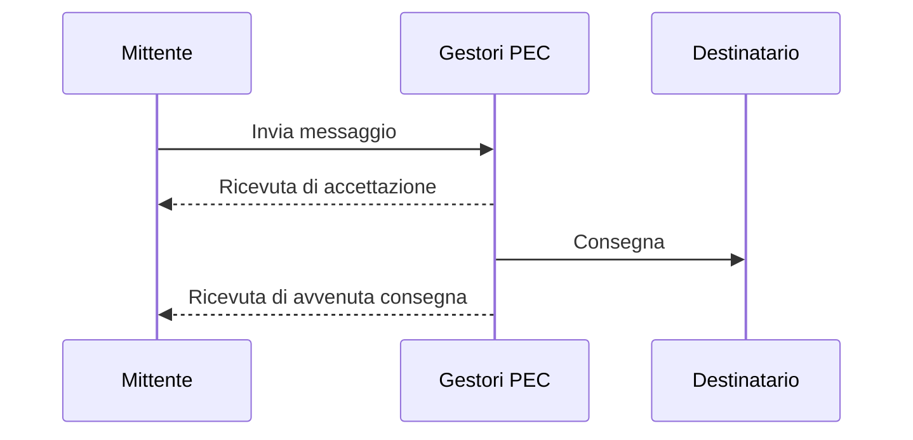
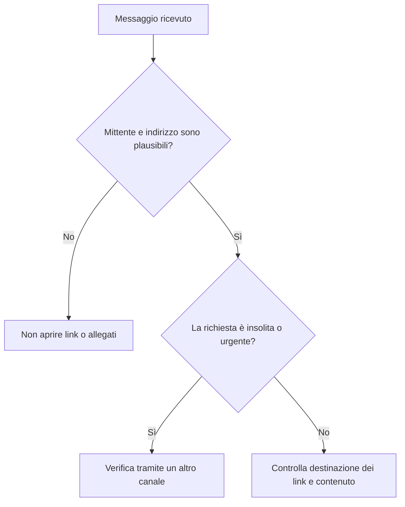

# Identità, comunicazioni e cittadinanza digitale

## Posta elettronica, PEC e firma digitale

La posta elettronica ordinaria trasmette messaggi, ma non fornisce automaticamente una prova legale equivalente a una raccomandata. La **PEC** (posta elettronica certificata) genera ricevute che attestano invio e consegna tra caselle certificate. Una ricevuta di consegna non dimostra però che il destinatario abbia letto il contenuto.

La **firma digitale** è un particolare tipo di firma elettronica basata su crittografia asimmetrica e certificati. Permette di verificare:

- l'identità del firmatario;
- l'integrità del documento;
- il legame tra firma e documento.

PEC e firma digitale hanno funzioni diverse: la PEC certifica la trasmissione, la firma digitale riguarda autenticità e integrità del documento.

## Dati personali e GDPR

Un dato personale è un'informazione riferibile a una persona identificata o identificabile. Il GDPR richiede, tra gli altri principi, finalità determinate, minimizzazione dei dati, esattezza, sicurezza e conservazione limitata nel tempo.

Prima di pubblicare o condividere dati:

1. verifica che siano davvero necessari;
2. controlla chi potrà accedervi;
3. evita di diffondere dati di altre persone senza una base valida;
4. usa password uniche e autenticazione a più fattori;
5. segnala rapidamente accessi o divulgazioni anomale.

## Cookie

Un cookie è un piccolo dato che un sito chiede al browser di conservare. Può mantenere una sessione di accesso, ricordare preferenze o contribuire a misurazioni e profilazione. I cookie non sono tutti equivalenti: scopo, durata e soggetto che li imposta determinano rischi e regole applicabili.

## Verificare un messaggio

Urgenza artificiale, richiesta di password, allegati inattesi e indirizzi quasi identici a quelli autentici sono segnali tipici di phishing.

## Attività

1. Confronta email ordinaria, PEC e documento firmato digitalmente.
2. Elenca i dati strettamente necessari per iscriversi a un laboratorio scolastico.
3. Analizza un banner cookie: le scelte sono comprensibili e simmetriche?
