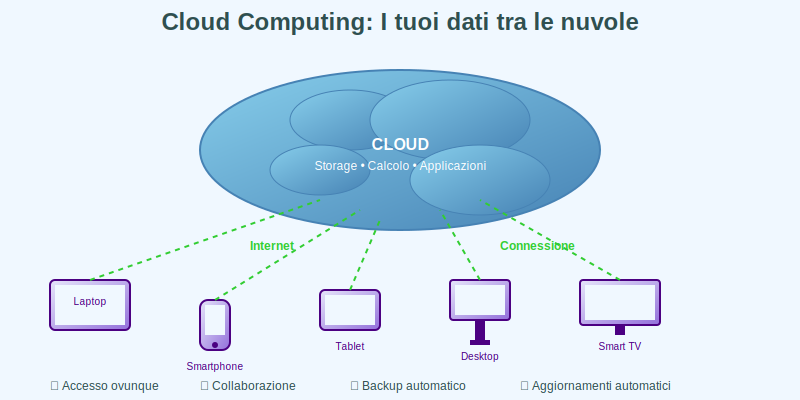
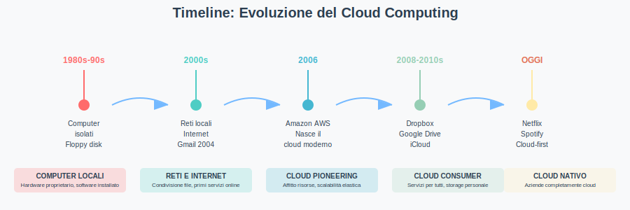
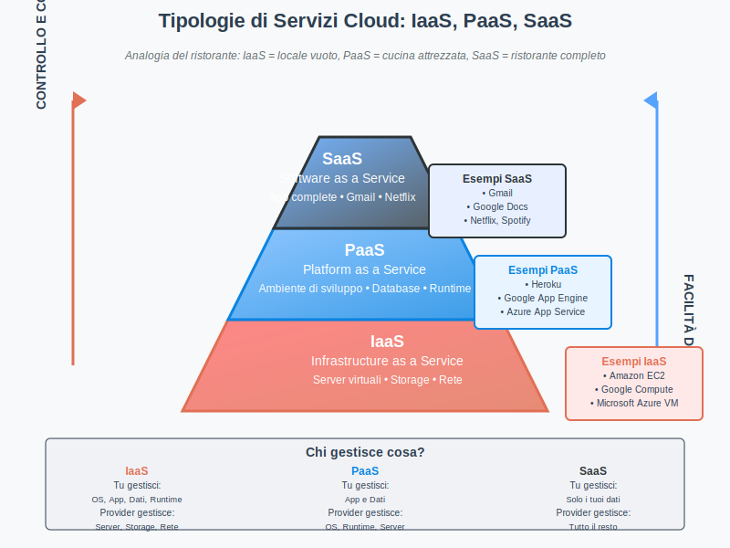
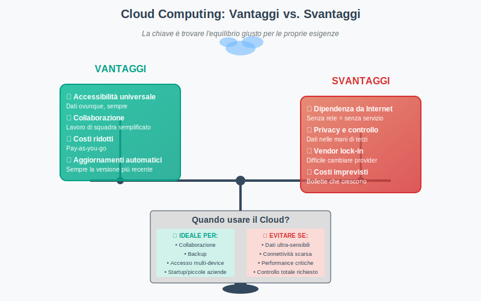
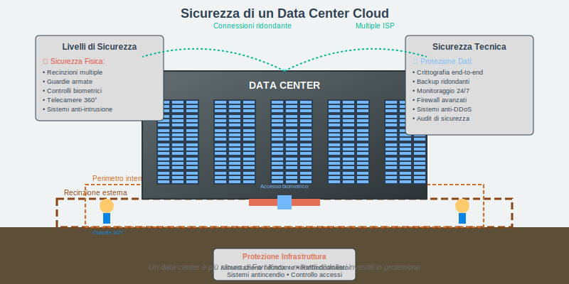
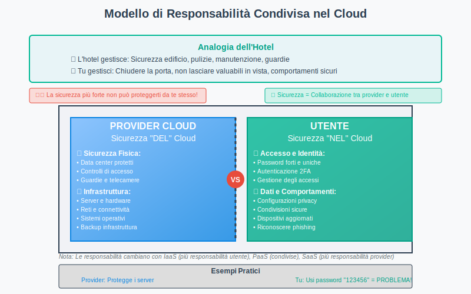

# ☁️ Il Cloud Computing: I tuoi dati tra le nuvole

*Figura 1: L'evoluzione dell'informatica: dai computer isolati al cloud computing distribuito*

### **🏗️ Modulo 1: Cos'è il Cloud Computing** 

#### 1.1 Definizione e concetti fondamentali

Il termine "cloud computing" può sembrare misterioso, ma in realtà descrive qualcosa che probabilmente utilizzate già ogni giorno senza rendervene conto. Ogni volta che salvate una foto su Google Photos, scrivete un documento su Google Docs, o ascoltate musica su Spotify, state utilizzando il cloud computing. Ma cosa significa esattamente?

Il cloud computing è un sistema che permette di accedere a risorse informatiche attraverso Internet, invece di utilizzare solo quelle del vostro computer. Immaginate di non dover più installare programmi sul vostro computer perché li utilizzate direttamente online, o di non dover più preoccuparvi di dove salvare i vostri file perché sono sempre disponibili da qualsiasi dispositivo. Questa è la magia del cloud: trasforma Internet in un computer gigantesco che tutti possono utilizzare.

Il nome "cloud" (nuvola) non è casuale. Quando i tecnici disegnano diagrammi di rete, spesso rappresentano Internet con una nuvola, perché non importa conoscere tutti i dettagli di come funziona internamente: quello che conta è che sia sempre disponibile e accessibile. Proprio come le nuvole nel cielo, il cloud computing ci circonda costantemente e possiamo "attingere" da esso quando ne abbiamo bisogno.

Una curiosità interessante è che il concetto di cloud computing non è così nuovo come sembra. Già negli anni '60, il computer scientist John McCarthy predisse che "il calcolo potrebbe un giorno essere organizzato come un servizio pubblico", proprio come l'elettricità o l'acqua. Ci sono voluti cinquant'anni, ma la sua visione si è realizzata.

#### 1.2 L'evoluzione: dal computer locale al cloud

Per capire meglio il cloud, facciamo un viaggio nel tempo. Negli anni '80 e '90, ogni computer era come un'isola: aveva i suoi programmi installati, i suoi file salvati, e non comunicava molto con gli altri. Se volevate condividere un file, dovevate copiarlo su un floppy disk (quei dischetti che oggi sembrano così antiquati!) e portarlo fisicamente all'altro computer.

Poi sono arrivate le reti locali negli uffici e nelle scuole. Improvvisamente i computer potevano "parlare" tra loro, condividere file e utilizzare stampanti comuni. Era già un grande passo avanti, ma tutto rimaneva confinato nello stesso edificio. Internet ha cambiato tutto: improvvisamente il vostro computer poteva comunicare con computer dall'altra parte del mondo.

Il vero punto di svolta è arrivato nel 2006, quando Amazon ha lanciato i suoi primi servizi cloud. L'idea era rivoluzionaria: invece di vendere solo libri online, Amazon offriva la possibilità di "affittare" pezzi dei loro potentissimi computer. Era come se un gigante tecnologico aprisse le porte dei suoi laboratori e dicesse: "Usate pure i nostri supercomputer, pagate solo per quello che consumate".

Da quel momento, l'evoluzione è stata rapidissima. Google ha lanciato Gmail nel 2004, permettendo di gestire la posta elettronica senza installare programmi. Dropbox, nato nel 2008, ha reso banale condividere file tra dispositivi diversi. Oggi, aziende nate completamente nel cloud come Netflix o Spotify servono milioni di utenti senza possedere praticamente nessun computer fisico: affittano tutto da Amazon, Google o Microsoft.

*Figura 2: Timeline dell'evoluzione del cloud computing: dai computer isolati ai servizi cloud moderni*

#### 1.3 Analogie e metafore per capire il cloud

Per spiegare il cloud a qualcuno che non è esperto di tecnologia, gli informatici hanno sviluppato diverse analogie molto efficaci. La più famosa è quella dell'elettricità: quando accendete una lampadina, non vi preoccupate di sapere dove viene prodotta l'elettricità, come arriva a casa vostra, o come funziona la centrale elettrica. Semplicemente premete l'interruttore e la luce si accende. Il cloud funziona allo stesso modo: premete un'icona e il servizio funziona, senza dover sapere dove si trovano fisicamente i computer che lo fanno funzionare.

Un'altra analogia molto efficace è quella dell'acqua del rubinetto. Quando aprite il rubinetto, l'acqua esce sempre, è pulita e potabile. Non dovete scavare un pozzo, installare sistemi di depurazione, o preoccuparvi della manutenzione delle tubature. Qualcun altro gestisce tutta l'infrastruttura, voi pagate solo per quello che consumate. Il cloud è esattamente così: qualcun altro gestisce i computer, i programmi e la manutenzione, voi utilizzate semplicemente il servizio.

Una terza analogia che funziona bene con i giovani è quella dei trasporti pubblici. Invece di comprare un'auto (che costa molto, richiede manutenzione, assicurazione, parcheggio), potreste utilizzare autobus, treni o servizi di car sharing. Pagate solo quando li usate, non dovete preoccuparvi della manutenzione, e spesso raggiungete la destinazione più velocemente. Il cloud è il "trasporto pubblico" dell'informatica: condiviso, efficiente, e spesso più conveniente delle soluzioni private.

**🤔 Domande di verifica Modulo 1:**

1. Pensate alla vostra giornata tipo: quanti servizi cloud utilizzate senza rendervene conto? Fate una lista e spiegate perché secondo voi sono diventati così popolari.

2. Immaginate di dover spiegare il cloud computing a un vostro nonno che ha sempre usato solo computer tradizionali. Quale analogia usereste e perché?

3. Secondo voi, quali sono stati i fattori tecnologici e sociali che hanno reso possibile la diffusione del cloud computing negli ultimi vent'anni?

4. Confrontate l'evoluzione del cloud computing con un'altra tecnologia che conoscete bene (esempio: telefoni cellulari, automobili, televisioni). Quali similitudini trovate nel processo di adozione?

---

### **🔧 Modulo 2: Tipologie di servizi cloud**

Il cloud computing si divide in tre categorie principali, spesso rappresentate come una "pila" di servizi:

*Figura 3: La piramide dei servizi cloud - dal controllo tecnico massimo (IaaS) alla semplicità d'uso massima (SaaS)*

#### 2.1 Infrastructure as a Service (IaaS)

IaaS, o Infrastructure as a Service, rappresenta il livello più "basso" e tecnico del cloud computing. Immaginate di voler aprire un ristorante: con IaaS è come se affittaste un locale vuoto con allacciamenti per acqua, gas ed elettricità già predisposti, ma doveste portare tutto il resto da soli: tavoli, sedie, cucina, stoviglie, e ovviamente assumere cuochi e camerieri. Nel mondo informatico, IaaS vi fornisce server virtuali, spazio di archiviazione e connettività di rete, ma dovete installare e gestire tutto il software da soli.

Questo tipo di servizio è particolarmente apprezzato dalle aziende che hanno competenze tecniche avanzate e vogliono mantenere il controllo completo sui loro sistemi. Con IaaS potete scegliere esattamente quale sistema operativo installare, quale database utilizzare, come configurare la sicurezza, e avete accesso completo a tutte le impostazioni. È come avere un computer potentissimo, ma invece di comprarlo lo affittate e lo gestite attraverso Internet.

Una delle caratteristiche più interessanti di IaaS è la scalabilità elastica. Se la vostra applicazione web diventa improvvisamente popolare e arrivano migliaia di utenti contemporaneamente, potete aggiungere server aggiuntivi in pochi minuti, e quando il traffico diminuisce, potete rimuoverli altrettanto rapidamente. Questo sarebbe impossibile con server fisici tradizionali, dove comprare e installare nuovo hardware richiederebbe settimane.

Amazon Web Services (AWS) è stato il pioniere di questo mercato, ma oggi ci sono molti concorrenti come Google Cloud Platform, Microsoft Azure, e DigitalOcean. Una curiosità: AWS è nato perché Amazon aveva costruito un'infrastruttura informatica così potente per gestire il suo negozio online che hanno deciso di affittarne una parte ad altri. Oggi AWS genera più profitti di tutto il business dell'e-commerce di Amazon!

#### 2.2 Platform as a Service (PaaS)

PaaS, o Platform as a Service, è un gradino più in alto rispetto a IaaS in termini di semplicità d'uso. Continuando con l'analogia del ristorante, PaaS è come affittare un locale che ha già cucina professionale, frigoriferi, sistema di ventilazione e tutto l'equipaggiamento necessario funzionante. Voi dovete solo portare gli ingredienti e cucinare: non dovete preoccuparvi di installare fornelli o riparare il sistema di aerazione.

Nel mondo informatico, PaaS vi fornisce un ambiente di sviluppo completo dove potete creare e far funzionare le vostre applicazioni senza preoccuparvi dell'infrastruttura sottostante. Il sistema operativo, il database, il web server, gli strumenti di sviluppo: tutto è già configurato e pronto all'uso. Voi dovete solo concentrarvi sulla scrittura del codice della vostra applicazione.

Questo approccio è particolarmente popolare tra gli sviluppatori e le startup, perché permette di passare dall'idea al prodotto funzionante in tempi record. Invece di perdere giorni o settimane a configurare server e database, potete iniziare subito a programmare. Platform come Heroku, Google App Engine, o Microsoft Azure App Service hanno permesso a migliaia di giovani sviluppatori di creare applicazioni innovative senza dover investire in infrastruttura costosa.

Una caratteristica interessante di molte piattaforme PaaS è che si integrano automaticamente con strumenti di sviluppo moderni. Per esempio, potete collegare il vostro account GitHub (dove tenete il codice sorgente) alla piattaforma PaaS, e ogni volta che modificate il codice, l'applicazione si aggiorna automaticamente online. È come avere un assistente digitale che si occupa di tutti gli aspetti tecnici mentre voi vi concentrate sulla creatività.

#### 2.3 Software as a Service (SaaS)

SaaS, o Software as a Service, è il livello più alto e user-friendly del cloud computing. Tornando all'analogia del ristorante, SaaS è come andare a mangiare in un ristorante già aperto: vi sedete, ordinate, mangiate, pagate e ve ne andate. Tutto il resto è gestito da qualcun altro: non dovete preoccuparvi di comprare ingredienti, cucinare, lavare i piatti, o gestire il personale.

Nel mondo digitale, SaaS sono quelle applicazioni che utilizzate direttamente attraverso il browser web senza dover installare nulla sul vostro computer. Gmail per le email, Google Docs per scrivere documenti, Spotify per ascoltare musica, Netflix per guardare film: tutti questi sono esempi di SaaS. L'applicazione "vive" sui server del provider, voi semplicemente la utilizzate attraverso Internet.

Quello che rende SaaS così rivoluzionario è la democratizzazione dell'accesso a software potenti. Prima del cloud, software professionali come Photoshop o pacchetti Office costavano centinaia di euro e richiedevano computer potenti. Oggi, con servizi come Canva per il design grafico o Office 365 online, potete accedere a funzionalità simili da qualsiasi dispositivo, spesso pagando pochi euro al mese o addirittura gratuitamente.

Un aspetto affascinante di SaaS è come ha cambiato il concetto stesso di "possedere" software. Invece di comprare una scatola con un CD (ricordate?), oggi "affittate" l'accesso al software, che viene costantemente aggiornato e migliorato senza che voi dobbiate fare nulla. È come passare dal comprare libri al leggere su Kindle Unlimited: invece di possedere singoli titoli, avete accesso a una libreria gigantesca che si arricchisce continuamente.

#### 2.4 Esempi pratici di ogni tipologia

Per capire meglio le differenze tra IaaS, PaaS e SaaS, immaginiamo che vogliate creare un social network per la vostra scuola. Con IaaS, dovreste affittare server virtuali da Amazon o Google, installare il sistema operativo Linux, configurare un database MySQL, installare un web server Apache, occuparvi della sicurezza, dei backup, degli aggiornamenti, e poi finalmente iniziare a programmare. Avreste controllo totale, ma anche responsabilità totale.

Con PaaS, usereste una piattaforma come Heroku o Google App Engine. Carichereste il vostro codice e la piattaforma si occuperebbe automaticamente di far funzionare tutto il resto: server, database, backup, scalabilità. Potreste concentrarvi interamente sulle funzionalità del vostro social network: come visualizzare i profili, come gestire le amicizie, come moderare i contenuti.

Con SaaS, invece, non programmereste affatto: usereste un servizio esistente come Discord, WhatsApp, o Facebook Groups, magari personalizzandolo con il logo della scuola e alcune regole specifiche. Massima semplicità, ma anche minimo controllo: dovete accettare le funzionalità che il provider mette a disposizione.

Curiosamente, molte aziende moderne utilizzano tutti e tre gli approcci contemporaneamente. Netflix, per esempio, usa IaaS di Amazon per i server che gestiscono lo streaming video (perché hanno bisogno di controllo totale sulle performance), PaaS per sviluppare rapidamente nuove funzionalità dell'app, e SaaS per gestire email, documenti interni, e contabilità. È come un'orchestra dove ogni strumento ha il suo ruolo specifico.

**🤔 Domande di verifica Modulo 2:**

1. Spiegate con parole vostre la differenza tra IaaS, PaaS e SaaS utilizzando un'analogia diversa da quelle del ristorante presentate nel testo. Quale delle tre tipologie preferireste utilizzare e perché?

2. Fate una lista di tutti i servizi SaaS che utilizzate in una settimana tipica. Sareste disposti a pagare per questi servizi se non fossero gratuiti? Quanto pensereste sia giusto pagare?

3. Immaginate di dover creare un'app per organizzare eventi nella vostra città. Descrivete come approccereste il progetto utilizzando ciascuna delle tre tipologie di cloud service, evidenziando vantaggi e svantaggi di ogni approccio.

4. Secondo voi, quale delle tre tipologie (IaaS, PaaS, SaaS) crescerà di più nei prossimi anni? Motivate la vostra risposta considerando le tendenze tecnologiche e sociali che osservate.

---

### **🌟 Modulo 3: Vantaggi e svantaggi del cloud**

*Figura 6: Bilancia vantaggi vs. svantaggi del cloud computing - una valutazione equilibrata*

#### 3.1 I benefici del cloud computing

Il cloud computing ha rivoluzionato il modo in cui utilizziamo la tecnologia, portando benefici che vanno ben oltre il semplice risparmio economico. Uno dei vantaggi più evidenti è l'accessibilità universale: i vostri documenti, foto, e applicazioni sono disponibili ovunque ci sia una connessione Internet. Non dovete più preoccuparvi di aver lasciato un file importante sul computer di casa quando siete a scuola, o di non poter mostrare le foto delle vacanze perché sono su un altro dispositivo. Il cloud trasforma ogni dispositivo connesso in una finestra verso tutti i vostri contenuti digitali.

La collaborazione è stata completamente trasformata dal cloud. Prima, lavorare insieme su un progetto significava inviarsi file via email, con il risultato di avere decine di versioni diverse dello stesso documento e la costante confusione su quale fosse quella più aggiornata. Oggi, con Google Docs, Microsoft 365, o altri strumenti cloud, più persone possono lavorare sullo stesso documento contemporaneamente, vedendo le modifiche degli altri in tempo reale. È come avere un tavolo di lavoro digitale condiviso dove tutti possono contribuire simultaneamente.

Dal punto di vista economico, il cloud ha democratizzato l'accesso a tecnologie potenti. Una startup oggi può avere accesso agli stessi strumenti tecnologici di una multinazionale, pagando solo per quello che utilizza. Non servono più investimenti enormi in server e infrastrutture: potete iniziare in piccolo e crescere gradualmente. È come passare dal dover comprare un'intera tipografia per stampare un volantino al poter stampare solo le copie che servono quando servono.

Gli aggiornamenti automatici sono un altro beneficio spesso sottovalutato. Quando utilizzate software tradizionale, dovete ricordarvi di aggiornarlo manualmente, spesso rinviando per pigrizia o dimenticanza. Con il cloud, gli aggiornamenti avvengono automaticamente e trasparentemente. Ogni volta che aprite Gmail o Netflix, state utilizzando la versione più recente del software, con tutte le ultime funzionalità e patch di sicurezza. È come avere un'auto che si ripara e si migliora da sola durante la notte.

#### 3.2 Rischi e limitazioni da considerare

Tuttavia, il cloud computing non è una soluzione magica senza problemi. La dipendenza dalla connettività Internet è probabilmente la limitazione più frustrante nella vita quotidiana. Se la vostra connessione è lenta, instabile, o completamente assente, molti servizi cloud diventano inutilizzabili. Immaginate di essere in treno, voler lavorare su un documento importante, e scoprire che il WiFi non funziona e avete finito i giga del cellulare. Questa dipendenza può essere particolarmente problematica in zone rurali o paesi con infrastrutture Internet poco sviluppate.

I costi possono diventare un'arma a doppio taglio. Mentre inizialmente sembrano convenienti, l'uso intensivo del cloud può portare a bollette salate e spesso inaspettate. È facile sottovalutare quanto spazio di archiviazione state utilizzando o quante risorse consuma la vostra applicazione. Inoltre, esiste il rischio del "vendor lock-in": una volta che avete organizzato tutto il vostro lavoro attorno a un particolare servizio cloud, cambiare provider può diventare estremamente costoso e complesso, un po' come traslocare in una nuova città dove parlano una lingua diversa.

Le questioni di privacy e controllo dei dati sono forse le più delicate. Quando caricate le vostre foto su Google Photos o i vostri documenti su iCloud, tecnicamente state affidando i vostri dati personali a un'azienda privata. Queste aziende hanno politiche sulla privacy, ma possono cambiarle, potrebbero essere obbligate da governi a fornire accesso ai dati, o potrebbero subire attacchi informatici. È un po' come affidare i vostri beni più preziosi a una banca: generalmente sono più sicuri che a casa vostra, ma non avete controllo totale su cosa succede.

La dipendenza tecnologica è un aspetto più sottile ma importante. Più ci affidiamo al cloud, più perdiamo competenze e autonomia tecnologica. Se siete abituati che tutto funzioni sempre perfettamente, quando qualcosa va storto potreste sentirvi completamente smarriti. È come essere abituati al navigatore GPS e poi dover trovare una strada con una mappa cartacea: teoricamente sapete come fare, ma praticamente vi sentite persi.

#### 3.3 Quando usare e quando evitare il cloud

Decidere se utilizzare il cloud non è una scelta binaria tra "tutto cloud" o "niente cloud", ma piuttosto una valutazione attenta di cosa è meglio mettere nel cloud e cosa tenere locale. Il cloud è ideale per tutto ciò che riguarda la collaborazione, la condivisione, e l'accesso da dispositivi multipli. Se lavorate su progetti di gruppo, se utilizzate diversi dispositivi durante la giornata, o se avete bisogno di accedere ai vostri file da luoghi diversi, il cloud è probabilmente la scelta migliore.

È anche perfetto per backup e archiviazione a lungo termine. Tenere una copia dei vostri documenti e foto importanti nel cloud è come avere una cassetta di sicurezza digitale: anche se il vostro computer si rompe, viene rubato, o subisce danni, i vostri ricordi e file importanti sono al sicuro. Molte persone hanno imparato questa lezione nel modo più duro, perdendo anni di foto perché erano salvate solo su un computer che si è rotto.

Tuttavia, ci sono situazioni in cui il cloud non è la scelta migliore. Se gestite informazioni estremamente sensibili o confidenziali, potreste preferire mantenerle sotto il vostro controllo diretto. Se vivete in zone con connettività Internet inaffidabile, fare affidamento esclusivamente sul cloud può essere frustrante. Se avete esigenze di performance estreme o latenza critica, le soluzioni locali potrebbero essere più appropriate.

L'approccio più intelligente è spesso quello ibrido: utilizzare il cloud per quello che fa meglio (collaborazione, backup, accessibilità) e soluzioni locali per quello che richiedono controllo totale o performance massime. È come organizzare la vostra vita tra casa e ufficio: alcune cose stanno meglio in un posto, altre nell'altro, e la chiave è trovare l'equilibrio giusto per le vostre esigenze specifiche.

**🤔 Domande di verifica Modulo 3:**

1. Analizzate la vostra vita digitale attuale: quali attività beneficerebbero maggiormente dal passaggio al cloud e quali preferireste mantenere locali? Motivate le vostre scelte.

2. Immaginate di dover convincere una persona scettica sui benefici del cloud computing. Quali esempi concreti e analogie usereste per dimostrare i vantaggi pratici?

3. Considerando i rischi discussi, progettate una strategia personale per minimizzare i problemi del cloud mantenendone i benefici. Cosa fareste per proteggervi dal vendor lock-in e dai problemi di connettività?

4. Pensate a un settore specifico (sanità, educazione, banche, entertainment). Quali sono i vantaggi e i rischi specifici del cloud computing in quel settore? Come bilancereste innovazione e sicurezza?

---

### **🛡️ Modulo 4: Sicurezza e privacy nel cloud**

#### 4.1 Come vengono protetti i tuoi dati

La sicurezza nel cloud è un argomento che genera molte preoccupazioni, spesso alimentate da notizie di attacchi informatici o violazioni di dati. Tuttavia, la realtà è che i vostri dati nel cloud sono probabilmente più sicuri di quanto non sarebbero sul vostro computer di casa o della scuola. I grandi provider cloud investono miliardi di dollari ogni anno in sicurezza, molto più di quanto potrebbe permettersi qualsiasi singola organizzazione o individuo.

I data center dei principali provider cloud sono vere e proprie fortezze tecnologiche. Immaginate edifici senza finestre, circondate da recinzioni multiple, con guardie armate 24 ore su 24, sistemi di riconoscimento biometrico per l'accesso, e telecamere di sorveglianza ovunque. All'interno, i server sono protetti da sistemi antincendio avanzati, alimentazione elettrica ridondante, e sistemi di raffreddamento che mantengono la temperatura perfetta. È come confrontare la sicurezza di Fort Knox con quella della vostra camera da letto.

*Figura 5: Livelli di sicurezza in un data center cloud - dalla protezione fisica ai sistemi di backup*

Dal punto di vista tecnico, i dati sono protetti attraverso la crittografia, una tecnologia che trasforma le informazioni in codici incomprensibili per chi non ha la chiave corretta. I vostri dati vengono criptati quando viaggiano da casa vostra ai server (crittografia in transito) e rimangono criptati anche quando sono archiviati sui server (crittografia a riposo). È come se ogni vostro file fosse chiuso in una cassaforte digitale con una combinazione che solo voi e il provider conoscete.

I sistemi di backup e ridondanza sono un altro livello di protezione spesso invisibile agli utenti. I vostri dati non esistono in una sola copia su un singolo server, ma sono automaticamente duplicati su server diversi, spesso in data center geograficamente distanti. Se un server si guasta, un data center viene colpito da un disastro naturale, o si verifica qualsiasi altro problema, i vostri dati sono comunque al sicuro in altre location. È come avere copie dei vostri documenti importanti in casseforti diverse sparse per il mondo.

#### 4.2 Responsabilità condivisa tra utente e provider

La sicurezza nel cloud funziona secondo un modello di "responsabilità condivisa" che è importante capire per evitare malintesi pericolosi. Il provider cloud si occupa della sicurezza "del" cloud: protegge i data center, i server, le reti, i sistemi operativi, e l'infrastruttura fisica. Voi siete responsabili della sicurezza "nel" cloud: le password, le impostazioni di privacy, chi ha accesso ai vostri dati, e come utilizzate i servizi.

*Figura 4: Modello di responsabilità condivisa - cosa gestisce il provider cloud vs. cosa gestite voi*

Questa divisione di responsabilità è simile a quella tra voi e l'hotel quando viaggiate. L'hotel è responsabile della sicurezza generale dell'edificio: guardie, telecamere, sistemi di allarme, serrature sicure alle porte. Voi siete responsabili di chiudere la porta della vostra camera, non lasciare oggetti di valore in vista, e non dare la chiave a sconosciuti. Se lasciate la porta aperta e vi rubano il portafoglio, non è colpa dell'hotel, anche se i loro sistemi di sicurezza generali funzionano perfettamente.

Nel contesto digitale, questo significa che anche se Google, Microsoft, o Amazon hanno sistemi di sicurezza eccellenti, se utilizzate "123456" come password o cliccate su link sospetti in email di phishing, i vostri account possono essere compromessi. La sicurezza più forte del mondo non può proteggervi da voi stessi se non adottate comportamenti sicuri.

Un aspetto particolare di questa responsabilità condivisa riguarda le impostazioni di privacy. Molti servizi cloud offrono controlli granulari su chi può vedere i vostri contenuti, ma spesso le impostazioni predefinite sono più permissive di quanto gli utenti realizzino. È vostra responsabilità capire e configurare correttamente queste impostazioni. È come avere una casa con serrature eccellenti ma dover decidere voi a chi dare le chiavi.

#### 4.3 Consigli per un uso sicuro del cloud

La prima e più importante regola per usare il cloud in sicurezza è utilizzare password forti e uniche per ogni servizio. Una password forte dovrebbe essere lunga (almeno 12 caratteri), contenere una combinazione di lettere maiuscole e minuscole, numeri e simboli, e non dovrebbe essere legata a informazioni personali facilmente indovinabili. Soprattutto, ogni servizio dovrebbe avere una password diversa: se un servizio viene violato, gli altri rimangono protetti.

Gestire decine di password diverse può sembrare impossibile, ma esistono strumenti chiamati "password manager" che rendono tutto molto più semplice. Questi programmi generano automaticamente password forti e le memorizzano in modo sicuro, così voi dovete ricordare solo una password principale. È come avere un mazzo di chiavi digitale gestito da un assistente personale molto attento e affidabile.

L'autenticazione a due fattori (2FA) è un'altra protezione fondamentale che dovreste attivare su tutti i vostri account importanti. Con la 2FA, anche se qualcuno scopre la vostra password, non può accedere al vostro account senza anche il secondo fattore, che di solito è un codice inviato al vostro telefono o generato da un'app speciale. È come avere una porta con due serrature diverse: anche se un ladro riesce ad aprire la prima, deve ancora superare la seconda.

Mantenete sempre aggiornati i vostri dispositivi e le app che utilizzate per accedere ai servizi cloud. Gli aggiornamenti non sono solo nuove funzionalità, ma spesso contengono patch di sicurezza per vulnerabilità scoperte di recente. Un dispositivo non aggiornato è come una casa con una finestra rotta: anche se tutte le porte sono ben chiuse, c'è comunque un modo per entrare.

Fate attenzione a quello che condividete e con chi. Molti servizi cloud rendono facile condividere file e cartelle, ma un link condiviso può essere inoltrato ad altre persone senza che voi lo sappiate. Usate link con scadenza quando possibile, e controllate periodicamente chi ha accesso ai vostri file condivisi. Inoltre, fate attenzione alle reti WiFi pubbliche: evitate di accedere a informazioni sensibili quando siete connessi al WiFi del bar o dell'aeroporto, perché potrebbero non essere sicure.

**🤔 Domande di verifica Modulo 4:**

1. Confrontate la sicurezza dei vostri dati su un servizio cloud rispetto alla sicurezza sul vostro computer personale. Quali sono i pro e i contro di ciascuna opzione?

2. Spiegate il concetto di "responsabilità condivisa" utilizzando un'analogia diversa da quella dell'hotel. Come applichereste questo concetto nella vostra vita digitale quotidiana?

3. Create un piano di sicurezza personale per l'uso del cloud che includa password management, autenticazione a due fattori, e best practices per la condivisione. Cosa cambiereste nelle vostre abitudini attuali?

4. Analizzate un caso reale di violazione di dati di un servizio cloud. Cosa è andato storto? Come avrebbero potuto proteggersi meglio sia il provider che gli utenti?

---
