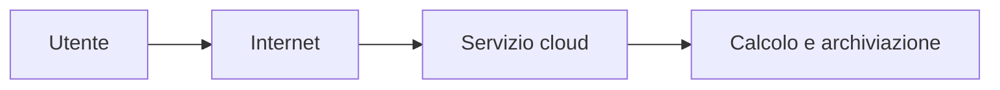
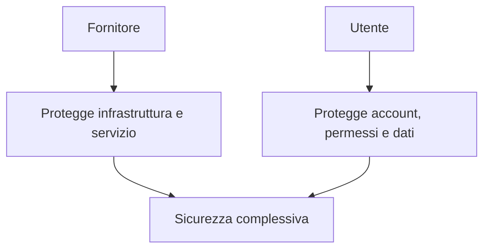

# Cloud computing

## 1. Che cos'è

Nel cloud computing, programmi e dati vengono forniti attraverso una rete da computer remoti.

Quando usiamo una casella di posta Web o un documento condiviso, il lavoro non dipende soltanto dal dispositivo che abbiamo davanti.

```mermaid
flowchart LR
    U["Utente"] --> N["Internet"]
    N --> S["Servizio cloud"]
    S --> D["Calcolo e archiviazione"]
```

## 2. Servizi principali

### 2.1 Software come servizio

Il **Software as a Service (SaaS)** offre un'applicazione pronta attraverso il browser o un'app. Esempi: posta Web, documenti collaborativi e videoconferenze.

### 2.2 Piattaforma come servizio

Il **Platform as a Service (PaaS)** offre agli sviluppatori un ambiente nel quale pubblicare applicazioni senza gestire direttamente tutti i server.

### 2.3 Infrastruttura come servizio

L'**Infrastructure as a Service (IaaS)** offre risorse come macchine virtuali, archiviazione e reti. Chi lo usa deve configurare sistema e applicazioni.

| Modello | Il fornitore offre | L'utente gestisce |
|---|---|---|
| SaaS | applicazione completa | dati e impostazioni |
| PaaS | piattaforma di esecuzione | applicazione e dati |
| IaaS | risorse virtuali | sistema, applicazioni e dati |

## 3. Vantaggi

- accesso da dispositivi diversi;
- collaborazione;
- risorse adattabili alle necessità;
- aggiornamenti centralizzati;
- minore necessità di gestire server locali.

## 4. Limiti e rischi

- dipendenza dalla connessione;
- costi che possono cambiare con l'uso;
- possibile dipendenza da un fornitore;
- controllo limitato sull'infrastruttura;
- problemi di privacy e localizzazione dei dati;
- perdita dell'accesso se account o servizio non sono disponibili.

Il cloud non elimina il bisogno di backup. Sincronizzare un file non sempre protegge da cancellazioni o modifiche indesiderate.

## 5. Responsabilità condivisa

```mermaid
flowchart TD
    F["Fornitore"] --> A["Protegge infrastruttura e servizio"]
    U["Utente"] --> B["Protegge account, permessi e dati"]
    A --> S["Sicurezza complessiva"]
    B --> S
```

L'utente deve:

- usare autenticazione a più fattori;
- controllare i permessi;
- non condividere collegamenti pubblici senza necessità;
- verificare quali dati siano adatti al servizio;
- mantenere copie recuperabili dei file importanti.

## 6. Laboratorio

1. Crea una cartella condivisa.
2. Assegna a tre persone permessi differenti.
3. Modifica un documento e osserva la cronologia.
4. Recupera una versione precedente.
5. Scarica una copia in formato aperto o PDF.
6. Spiega che cosa succederebbe senza connessione.
