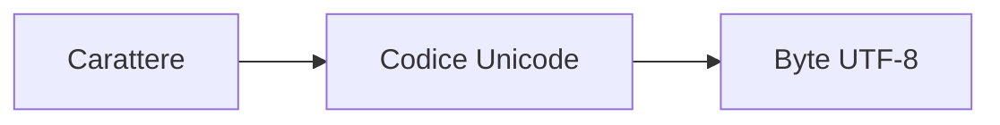

# Codifica dell'informazione

## 1. Informazione e rappresentazione

Un computer elabora simboli rappresentati mediante bit. La stessa sequenza di bit può assumere significati diversi in base alla codifica usata.

Per esempio, otto bit possono rappresentare un numero, un carattere oppure una parte di un'immagine.

## 2. Bit e byte

Un **bit** può assumere valore `0` oppure `1`. Con `n` bit si possono rappresentare `2^n` combinazioni.

| Bit | Combinazioni |
|---:|---:|
| 1 | 2 |
| 2 | 4 |
| 4 | 16 |
| 8 | 256 |

Un **byte** è formato da 8 bit.

## 3. Unità di misura

| Unità decimale | Valore |
|---|---:|
| kB | 1.000 byte |
| MB | 1.000.000 byte |
| GB | 1.000.000.000 byte |

| Unità binaria | Valore |
|---|---:|
| KiB | 1.024 byte |
| MiB | 1.048.576 byte |
| GiB | 1.073.741.824 byte |

La lettera minuscola `b` indica il bit; la maiuscola `B` indica il byte. Una connessione da `80 Mb/s` non trasferisce necessariamente `80 MB` ogni secondo.

## 4. Testo

Una codifica dei caratteri associa un numero a ogni simbolo.

ASCII rappresenta un insieme limitato di caratteri. Unicode è stato progettato per rappresentare alfabeti, simboli ed emoji. UTF-8 è una codifica Unicode molto usata sul Web.



Se un file viene letto con la codifica sbagliata, possono apparire simboli incomprensibili.

## 5. Immagini digitali

Un'immagine raster è una griglia di **pixel**. Ogni pixel contiene informazioni sul colore.

La risoluzione indica il numero di pixel:

```text
larghezza × altezza
```

Un'immagine da `1920 × 1080` contiene:

```text
1920 × 1080 = 2.073.600 pixel
```

### 5.1 Colori

Nel modello RGB il colore è descritto con componenti rosso, verde e blu. Con 8 bit per componente si ottengono 24 bit per pixel e circa 16,7 milioni di combinazioni.

### 5.2 Dimensione non compressa

```text
dimensione = larghezza × altezza × bit per pixel
```

Il risultato in bit deve essere diviso per 8 per ottenere i byte.

## 6. Compressione delle immagini

- **senza perdita**: il dato originale può essere ricostruito; esempio PNG;
- **con perdita**: alcune informazioni vengono eliminate; esempio JPEG.

JPEG è adatto soprattutto alle fotografie. PNG è spesso migliore per schermate, diagrammi e immagini con aree uniformi. La scelta dipende dal contenuto e dall'uso.

## 7. Audio digitale

Per digitalizzare un suono si misura il segnale a intervalli regolari.

- **frequenza di campionamento**: numero di campioni al secondo;
- **profondità in bit**: numero di bit usato per ogni campione;
- **canali**: per esempio mono o stereo;
- **durata**.

Dimensione teorica non compressa:

```text
campioni al secondo × bit per campione × canali × secondi
```

Il teorema del campionamento afferma, in condizioni ideali, che la frequenza di campionamento deve essere maggiore del doppio della frequenza massima presente nel segnale.

## 8. Compressione audio

- WAV può contenere audio non compresso;
- FLAC comprime senza perdita;
- MP3 e AAC usano normalmente compressione con perdita.

Un bitrate maggiore conserva in genere più informazione, ma produce file più grandi. Il risultato dipende anche dal codec e dal contenuto.

## 9. Laboratorio

1. Salva la stessa immagine in PNG e JPEG.
2. Confronta dimensione e qualità.
3. Riduci la risoluzione e osserva il risultato.
4. Calcola la dimensione teorica di dieci secondi di audio stereo.
5. Confronta il valore teorico con un file compresso.
6. Spiega perché due file con la stessa estensione possono avere dimensioni diverse.
