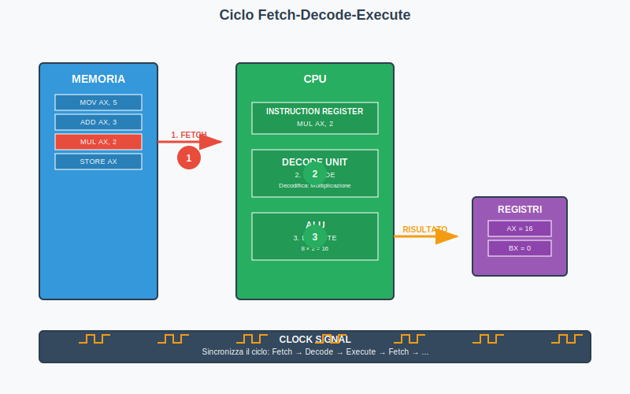
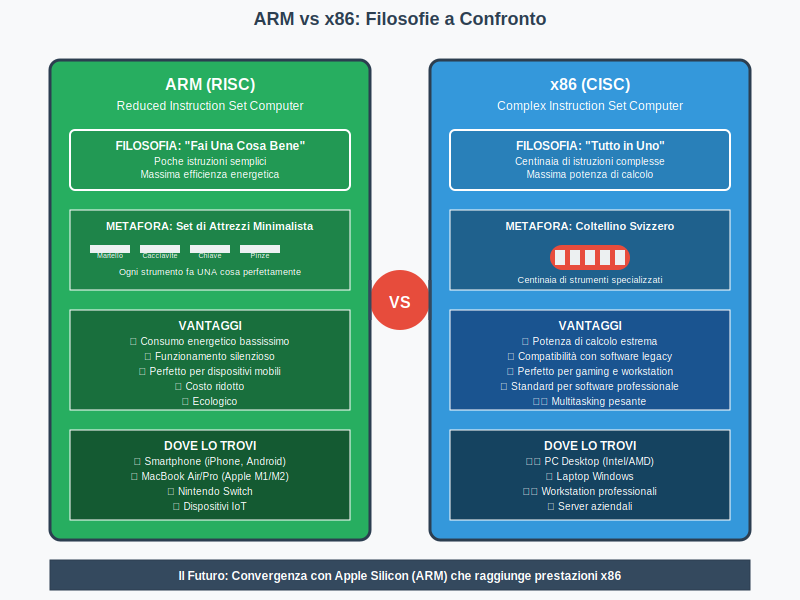
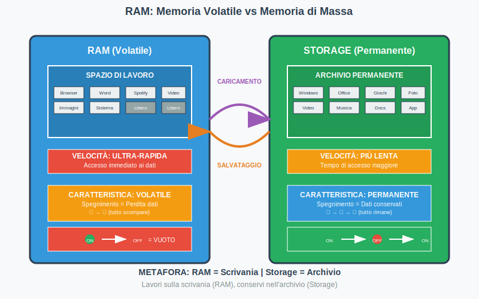
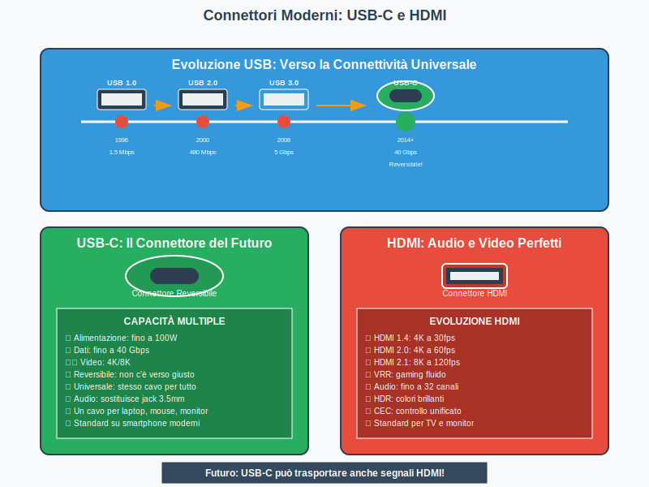

# Come è fatto un computer

*Figura 1: L'evoluzione del computer dai mainframe degli anni '40 ai dispositivi mobili moderni*

## 🔍 **Modulo 1: Il mondo dei computer** 

### 1.1 Diverse tipologie di computer 🖥️📱⌚

*Figura 2: I principali tipi di computer e le loro caratteristiche distintive*

#### 1.1.1 Computer desktop: le workstation di casa e ufficio

I computer desktop rappresentano ancora oggi il cuore pulsante di molti uffici e case in tutto il mondo. Questi giganti tecnologici, che occupano una scrivania con le loro torri imponenti, monitor generosi e tastiere comode, sono progettati per offrire la massima potenza di calcolo senza compromessi. La loro forza principale risiede nella modularità: ogni componente può essere sostituito, aggiornato o potenziato secondo le necessità. Quando un videomaker ha bisogno di più memoria per montare i suoi film, può semplicemente aggiungere RAM; quando un gamer vuole giocare agli ultimi titoli in 4K, può installare una scheda grafica più potente. I desktop sono come automobili da corsa: veloci, potenti, ma non proprio pratici da portare in giro! La loro capacità di dissipare il calore attraverso ventole e sistemi di raffreddamento sofisticati permette ai processori di funzionare a piena potenza per ore senza rallentare.

#### 1.1.2 Laptop e notebook: potenza portatile

I laptop hanno rivoluzionato il modo di lavorare e studiare, trasformando qualsiasi caffetteria in un ufficio temporaneo e ogni treno in un'aula studio. Questi computer portatili racchiudono in un sottile chassis tutto ciò che serve per essere produttivi: schermo, tastiera, trackpad, batteria e naturalmente tutti i componenti di elaborazione. La sfida principale nella progettazione di un laptop è trovare il giusto equilibrio tra prestazioni, autonomia e portabilità. Pensate a un laptop come a uno zaino da escursionismo: dovete decidere cosa è davvero essenziale portare con voi! I moderni laptop ultrabook pesano meno di un chilogrammo ma offrono prestazioni che fino a pochi anni fa erano impensabili in un dispositivo così compatto. La tecnologia delle batterie agli ioni di litio e i processori sempre più efficienti permettono autonomie di 10-15 ore, sufficienti per una giornata lavorativa completa.

#### 1.1.3 Tablet: tra smartphone e computer

I tablet occupano una posizione unica nell'ecosistema tecnologico, situandosi in quella terra di mezzo tra la comodità di uno smartphone e la produttività di un computer tradizionale. Con i loro schermi touch da 8-13 pollici, i tablet eccellono nelle attività che richiedono interazione diretta: disegnare, prendere appunti a mano, leggere libri digitali o guardare film comodamente seduti sul divano. La rivoluzione dei tablet è iniziata nel 2010 con l'iPad di Apple, che ha dimostrato come un dispositivo senza tastiera fisica potesse essere incredibilmente intuitivo da usare. Oggi i tablet più avanzati, come l'iPad Pro o i Surface di Microsoft, sfidano apertamente i laptop tradizionali in termini di potenza di calcolo. Molti professionisti creativi li usano come tele digitali per dipingere o come lavagne interattive per presentazioni. La loro natura touchscreen li rende particolarmente apprezzati dai bambini e dagli anziani, che trovano più naturale toccare direttamente quello che vogliono fare piuttosto che usare mouse e tastiera.

#### 1.1.4 Smartphone: computer tascabili

È difficile credere che quel piccolo dispositivo che portate in tasca sia più potente dei computer che hanno mandato l'uomo sulla Luna! Gli smartphone moderni sono veri e propri supercomputer in miniatura, capaci di elaborare miliardi di operazioni al secondo, scattare foto professionali, registrare video in 4K, navigare su internet a velocità fulminee e far girare giochi con grafica tridimensionale mozzafiato. La magia degli smartphone risiede nella loro incredibile integrazione: in uno spazio non più grande di una saponetta trovano posto processore, memoria, schermo, fotocamere multiple, sensori di movimento, GPS, antenna per le comunicazioni wireless e una batteria che alimenta tutto per un giorno intero. Gli smartphone hanno democratizzato l'accesso alla tecnologia, permettendo a miliardi di persone in tutto il mondo di avere accesso a internet, social media, fotografia digitale e applicazioni di ogni tipo. Curiosità: il processore di un iPhone moderno contiene oltre 15 miliardi di transistor, ognuno più piccolo di un virus!

#### 1.1.5 Computer embedded: dai microonde alle auto

I computer embedded sono i ninja del mondo tecnologico: lavorano silenziosamente ovunque intorno a noi, spesso senza che ce ne accorgiamo. Il vostro forno a microonde contiene un piccolo computer che gestisce i tempi di cottura e la potenza; la vostra automobile moderna può avere fino a 100 computer embedded che controllano tutto, dal sistema di navigazione GPS ai freni ABS, dal climatizzatore automatico ai sensori di parcheggio. Questi computer specializzati sono progettati per fare una cosa sola, ma farla perfettamente e in modo affidabile per anni. A differenza dei computer tradizionali, che devono essere versatili e modificabili, i computer embedded sono ottimizzati per compiti specifici e spesso funzionano in condizioni estreme: alte temperature nel motore di un'auto, vibrazioni in una lavatrice, o umidità in una lavastoviglie. La loro semplicità apparente nasconde una complessità incredibile: il computer che gestisce il sistema di iniezione del carburante della vostra auto deve prendere decisioni in millisecondi per ottimizzare consumi ed emissioni.

#### 1.1.6 Supercomputer: quando serve potenza estrema

Quando la scienza si scontra con problemi che richiedono una potenza di calcolo astronomica, entrano in gioco i supercomputer: mostri tecnologici che occupano intere stanze e consumano elettricità come una piccola città! Questi giganti sono composti da migliaia di processori che lavorano in parallelo, coordinandosi per risolvere equazioni matematiche incredibilmente complesse. I supercomputer vengono utilizzati per prevedere il tempo atmosferico analizzando miliardi di dati meteorologici, per simulare esplosioni nucleari senza doverle far esplodere davvero, per studiare il comportamento delle proteine nella ricerca medica, e persino per creare i mondi virtuali e gli effetti speciali dei film di Hollywood. Il supercomputer più potente al mondo può eseguire oltre un miliardo di miliardi di operazioni al secondo! Per darvi un'idea della loro potenza, se ogni persona sulla Terra facesse un calcolo al secondo per un anno intero, non raggiungeremmo nemmeno quello che un supercomputer moderno fa in un solo secondo. Curiosità: alcuni supercomputer sono così potenti che la loro accensione può causare blackout locali se la rete elettrica non è preparata adeguatamente.

#### 1.1.7 Server: i computer che non si fermano mai

I server sono i lavoratori instancabili del mondo digitale, computer specializzati progettati per funzionare 24 ore su 24, 7 giorni su 7, senza mai spegnersi. Quando caricate una foto su Instagram, guardate un video su YouTube, o inviate un messaggio su WhatsApp, state interagendo con server potentissimi nascosti in enormi data center in giro per il mondo. Questi computer sono costruiti con componenti ridondanti: se un disco rigido si rompe, ce n'è un altro pronto a sostituirlo; se una fonte di alimentazione smette di funzionare, un'altra prende immediatamente il controllo. I server più importanti hanno persino processori di backup che si attivano automaticamente in caso di guasto! La loro affidabilità è misurata in "nove": un server con una disponibilità del 99,999% (cinque nove) può permettersi di essere offline solo 5 minuti all'anno! I data center che ospitano questi server sono vere e proprie fortezze tecnologiche, con sistemi di raffreddamento industriali, generatori diesel di emergenza, e misure di sicurezza che farebbero invidia a una banca. Pensate che Google ha data center così grandi che hanno le loro stazioni elettriche dedicate!

### 1.2 Cosa accomuna tutti i computer? 🤔

#### 1.2.1 Il concetto di elaborazione digitale

L'elaborazione digitale è il linguaggio universale che accomuna tutti i computer del mondo, dal più piccolo chip in un orologio intelligente al più potente supercomputer della NASA. Ma cosa significa realmente "digitale"? Immaginate di dover descrivere un tramonto usando solo due parole: "acceso" e "spento". Sembra impossibile, vero? Eppure i computer fanno esattamente questo: trasformano ogni informazione complessa in sequenze infinite di 1 e 0, di "acceso" e "spento". Questo processo di traduzione è l'essenza dell'elaborazione digitale. Quando scattate una foto con il telefono, il sensore della fotocamera misura l'intensità della luce in milioni di punti e converte ogni misurazione in numeri digitali. Quando ascoltate la vostra canzone preferita, il computer sta riproducendo migliaia di numeri al secondo che rappresentano le vibrazioni sonore. La bellezza dell'elaborazione digitale sta nella sua precisione assoluta: una volta che un'informazione è stata convertita in numeri, può essere copiata infinite volte senza perdere qualità, trasmessa attraverso internet senza errori, e manipolata con precisione matematica. Questa universalità ha permesso la rivoluzione digitale che ha trasformato il mondo negli ultimi 50 anni.

#### 1.2.2 Input, elaborazione, output, memorizzazione

Tutti i computer, indipendentemente dalla loro forma o dimensione, seguono sempre lo stesso schema fondamentale che potremmo chiamare "la ricetta universale dell'informatica": ricevere informazioni (input), elaborarle secondo delle istruzioni precise, produrre un risultato (output), e conservare tutto per usi futuri (memorizzazione). Pensate a cucinare una torta: prendete gli ingredienti (input), li mescolate seguendo la ricetta (elaborazione), ottenete la torta (output), e magari scrivete note sulla ricetta per la prossima volta (memorizzazione). Quando usate una calcolatrice, inserite i numeri tramite i tasti (input), il processore esegue l'operazione matematica (elaborazione), il risultato appare sul display (output), e spesso la calcolatrice ricorda l'ultimo calcolo fatto (memorizzazione). Questo schema si ripete identico anche nelle operazioni più complesse: quando Netflix vi suggerisce un film, ha raccolto informazioni sui vostri gusti (input), le ha analizzate con algoritmi sofisticati (elaborazione), vi propone consigli personalizzati (output), e memorizza le vostre preferenze per migliorare i suggerimenti futuri (memorizzazione). La genialità di questo schema è nella sua semplicità: qualunque problema complesso può essere scomposto in questi quattro passaggi fondamentali.

#### 1.2.3 Dal più piccolo chip al più grande data center

Una delle meraviglie dell'informatica moderna è che gli stessi principi fondamentali si applicano a tutti i livelli di scala immaginabili. Il minuscolo chip che monitora il battito cardiaco nel vostro smartwatch e l'enorme data center di Amazon che gestisce milioni di acquisti online funzionano secondo le stesse regole fondamentali. È come se un orologio da polso e il Big Ben di Londra fossero governati dalle stesse leggi fisiche per misurare il tempo! Nei microprocessori più piccoli, transistor grandi quanto pochi atomi lavorano insieme per elaborare informazioni; nei data center più grandi, migliaia di server coordinano i loro sforzi per fornire servizi a miliardi di persone contemporaneamente. Questa scalabilità è possibile grazie alla natura modulare dell'informatica: i computer possono essere collegati insieme per formare sistemi più potenti, proprio come i mattoncini Lego possono essere combinati per costruire strutture sempre più complesse. Un computer moderno è fatto di miliardi di componenti microscopici che collaborano perfettamente, mentre internet è fatto di miliardi di computer che collaborano su scala planetaria. Questa armonia tra il microscopico e il gigantesco rappresenta una delle più grandi conquiste tecnologiche dell'umanità.

### 🤔 **Verifica Modulo 1**

**Domande di comprensione:**

1. Spiega con parole tue la differenza principale tra un computer desktop e un laptop. In quali situazioni sceglieresti l'uno piuttosto che l'altro?

2. Perché gli smartphone possono essere considerati dei "computer tascabili"? Fai almeno tre esempi di operazioni che il tuo smartphone può fare e che erano tipiche dei computer tradizionali.

3. Cosa sono i computer embedded e dove li possiamo trovare nella vita quotidiana? Fai almeno quattro esempi concreti.

4. Che differenza c'è tra un server e un computer normale? Perché i server devono funzionare 24 ore su 24?

5. Spiega il concetto di "elaborazione digitale" usando un esempio diverso da quelli del libro.

6. Il ciclo "input-elaborazione-output-memorizzazione" è universale. Descrivi questo ciclo per un'attività che fai spesso (per esempio: guardare un video su YouTube, usare Instagram, giocare a un videogame).

---

## 🧠 **Modulo 2: L'architettura del computer**

*Figura 3: L'architettura di Von Neumann con i componenti principali e i flussi di dati*

### 2.1 L'architettura di von Neumann 🏗️

#### 2.1.1 John von Neumann e la rivoluzione dell'informatica

John von Neumann è stato uno dei geni più brillanti del XX secolo, un matematico ungherese-americano che ha rivoluzionato per sempre il modo in cui i computer funzionano. Prima delle sue intuizioni rivoluzionarie negli anni '40, i computer erano macchine rigide e specializzate: ogni computer poteva fare solo una cosa specifica, come calcolare traiettorie di proiettili o decifrare codici segreti. Se volevate che facesse qualcosa di diverso, dovevate letteralmente ricablare tutta la macchina! Von Neumann ebbe un'idea geniale: e se invece di cambiare l'hardware, cambiassimo solo le istruzioni? Propose che i programmi (le istruzioni che dicono al computer cosa fare) fossero memorizzati nella stessa memoria dei dati, proprio come facciamo oggi quando installiamo un'app sul telefono. Questa idea, apparentemente semplice, ha reso possibile tutto quello che facciamo oggi con i computer: scaricare nuovi programmi, aggiornarli, cancellarli, e persino scriverne di nuovi. Senza von Neumann, ogni volta che volevate giocare a un videogame diverso dovreste comprare un computer completamente nuovo! La sua architettura è così fondamentale che praticamente ogni computer moderno, dal vostro smartphone al supercomputer più potente del mondo, segue ancora i suoi principi base.

#### 2.1.2 I quattro componenti fondamentali

L'architettura di von Neumann si basa su quattro componenti essenziali che lavorano insieme come un'orchestra perfettamente coordinata. Il primo è la **CPU (Central Processing Unit)**, il "cervello" del computer che esegue tutte le operazioni matematiche e logiche, un po' come il direttore d'orchestra che coordina tutti gli altri musicisti. Il secondo componente è la **memoria**, che custodisce sia i dati che i programmi, proprio come la partitura musicale che contiene tutte le note che i musicisti devono suonare. Il terzo elemento sono i **dispositivi di input**, che permettono al mondo esterno di comunicare con il computer: tastiere, mouse, microfoni, telecamere sono come gli strumenti che catturano i suoni dell'ambiente e li trasformano in musica. Infine, abbiamo i **dispositivi di output**, che permettono al computer di comunicare con noi: monitor, stampanti, altoparlanti sono come gli amplificatori che proiettano la musica verso il pubblico. La genialità di questa architettura sta nella sua semplicità e flessibilità: questi quattro componenti possono essere combinati e potenziati in infinite variazioni, ma il principio di base rimane sempre lo stesso.

#### 2.1.3 Perché questa architettura domina ancora oggi

Potreste chiedervi: se l'architettura di von Neumann è stata inventata più di 80 anni fa, perché la usiamo ancora oggi? La risposta è che von Neumann ha colto qualcosa di fondamentale su come l'informazione può essere elaborata in modo efficiente. La sua architettura è come la ruota: un'invenzione così perfetta e universale che non ha bisogno di essere reinventata! Il principio del "programma memorizzato" ha permesso l'incredibile flessibilità dei computer moderni: lo stesso hardware può trasformarsi in una console per videogame, un editor di video, un simulatore di volo, o un laboratorio di ricerca scientifica, semplicemente cambiando il software. Questo ha reso possibile l'industria del software come la conosciamo oggi, dove milioni di programmatori in tutto il mondo possono creare applicazioni per miliardi di dispositivi diversi. Inoltre, la separazione chiara tra hardware e software ha permesso lo sviluppo parallelo di entrambi: mentre gli ingegneri hardware rendono i processori sempre più veloci, i programmatori possono concentrarsi sulla creazione di software sempre più sofisticati, senza doversi preoccupare dei dettagli tecnici dell'hardware sottostante.

#### 2.1.4 CPU, memoria, input/output: il trio perfetto

Il funzionamento armonioso di CPU, memoria e dispositivi di input/output rappresenta una delle collaborazioni più eleganti dell'ingegneria moderna. Immaginate la CPU come uno chef incredibilmente veloce e preciso, capace di eseguire miliardi di "ricette" (istruzioni) al secondo. La memoria è come una dispensa gigantesca e organizzatissima, dove ogni ingrediente (dato) ha il suo posto specifico e può essere trovato istantaneamente. I dispositivi di input sono come i fornitori che portano continuamente nuovi ingredienti freschi nella cucina, mentre i dispositivi di output sono come i camerieri che servono i piatti finiti ai clienti. La coordinazione tra questi tre elementi deve essere perfetta: se la memoria fosse troppo lenta, lo chef dovrebbe aspettare troppo per ricevere gli ingredienti; se i dispositivi di input fossero troppo lenti, la cucina rimarrebbe senza materie prime; se i dispositivi di output fossero inadeguati, anche il piatto più delizioso arriverebbe freddo al tavolo. Questa metafora culinaria aiuta a capire perché le prestazioni di un computer dipendono dall'equilibrio tra tutti i suoi componenti: il componente più lento determina la velocità dell'intero sistema, proprio come una catena è forte quanto il suo anello più debole.

### 2.2 Come "pensano" i computer 💭

#### 2.2.1 Il ciclo fetch-decode-execute

*Figura 7: Il ciclo fondamentale del processore che si ripete miliardi di volte al secondo*

Il ciclo fetch-decode-execute è il battito cardiaco di ogni computer, un processo che si ripete miliardi di volte al secondo con una precisione cronometrica assoluta. Come il cuore umano che pompa sangue in tutto il corpo, questo ciclo pompa informazioni attraverso il computer in un ritmo incessante. La prima fase, **fetch** (recupera), è come quando andate in biblioteca e prendete un libro specifico dallo scaffale: la CPU va nella memoria, trova l'istruzione successiva da eseguire e la porta nel processore. È un'operazione apparentemente semplice, ma richiede una coordinazione perfetta: la CPU deve sapere esattamente dove cercare, la memoria deve rispondere rapidamente, e l'informazione deve viaggiare attraverso circuiti microscopici alla velocità della luce. La seconda fase, **decode** (decodifica), è come aprire il libro e leggere le istruzioni: la CPU esamina l'istruzione appena recuperata e capisce cosa deve fare - se deve sommare due numeri, spostare un dato, confrontare valori, o fare qualcos'altro. Infine, la fase **execute** (esegui) è quando la CPU fa effettivamente quello che l'istruzione richiede, come quando seguite la ricetta che avete letto. Questo ciclo è talmente fondamentale che viene chiamato "ciclo macchina" ed è la base di tutto quello che un computer può fare.

#### 2.2.2 Dalla corrente elettrica ai calcoli complessi

Una delle meraviglie più incredibili della tecnologia moderna è come riusciamo a trasformare semplici impulsi elettrici in operazioni logiche e matematiche sofisticate. All'interno di un processore, milioni di transistor microscopici agiscono come interruttori ultraveloci, accendendosi e spegnendosi miliardi di volte al secondo per rappresentare i famosi 1 e 0 del linguaggio binario. È come se aveste una città immensa fatta solo di semafori che cambiano colore in perfetta sincronia per trasmettere messaggi complessi! Quando digitate "2+2" su una calcolatrice, quello che succede a livello fisico è incredibilmente affascinante: la vostra pressione sui tasti genera piccole correnti elettriche che vengono convertite in impulsi digitali, questi impulsi fanno accendere e spegnere specifici gruppi di transistor secondo schemi prestabiliti, e il risultato finale di tutti questi interruttori che scattano è il numero "4" che appare sul display. La trasformazione da elettricità a matematica avviene attraverso l'algebra di Boole, un sistema logico che permette di eseguire qualsiasi operazione complessa combinando semplici operazioni logiche come AND, OR e NOT. Pensate che il processore del vostro smartphone esegue letteralmente miliardi di queste operazioni elementari ogni secondo per permettervi di guardare un video su TikTok!

#### 2.2.3 Il ruolo della memoria nel processo

La memoria è molto di più di un semplice magazzino per i dati: è il partner strategico della CPU in ogni operazione che il computer esegue. Senza memoria, la CPU sarebbe come un genio matematico con amnesia immediata, capace di fare calcoli incredibili ma incapace di ricordare i risultati per più di un istante! La relazione tra CPU e memoria è una danza continua di richieste e risposte: la CPU chiede costantemente dati e istruzioni, e la memoria deve fornirli con una velocità che tenga il passo con l'appetito vorace del processore. Per ottimizzare questa collaborazione, i computer moderni utilizzano una gerarchia complessa di memorie: la cache ultra-veloce che tiene a portata di mano i dati più utilizzati, la RAM che fornisce spazio di lavoro immediato, e la memoria di massa che conserva tutto a lungo termine. È come avere una scrivania ben organizzata dove tenete a portata di mano i documenti che usate spesso (cache), un cassetto per i progetti in corso (RAM), e un archivio per tutto il resto (memoria di massa). La sfida principale è predire quali dati serviranno prossimamente: i processori moderni utilizzano algoritmi sofisticati per "indovinare" quali informazioni recuperare in anticipo dalla memoria, un po' come un assistente perfetto che vi prepara già i documenti di cui avrete bisogno prima ancora che glieli chiediate.

### 🤔 **Verifica Modulo 2**

**Domande di comprensione:**

1. Chi era John von Neumann e perché la sua architettura è stata così rivoluzionaria? Cosa cambiò rispetto ai computer precedenti?

2. Quali sono i quattro componenti fondamentali dell'architettura di von Neumann? Spiega il ruolo di ciascuno usando una metafora diversa da quelle del libro.

3. Perché l'architettura di von Neumann è ancora utilizzata oggi dopo 80 anni? Quali vantaggi offre?

4. Descrivi il ciclo fetch-decode-execute usando un esempio concreto di un'operazione che fai spesso sul computer (per esempio: aprire un'app, salvare un file, inviare un messaggio).

5. Come fa un computer a trasformare la corrente elettrica in calcoli matematici? Spiega il concetto in modo semplice.

6. Perché la memoria è così importante per il funzionamento del computer? Cosa succederebbe se non ci fosse?

---

## ⚡ **Modulo 3: Il cuore del computer - Il processore**

*Figura 4: Struttura interna del processore con le unità funzionali principali*

### 3.1 Il processore (CPU): il cervello elettronico 🧠

#### 3.1.1 Cosa fa realmente un processore

Il processore è il componente più affascinante e complesso di qualsiasi computer, un piccolo miracolo dell'ingegneria che racchiude in pochi centimetri quadrati la potenza di calcolo che solo 50 anni fa richiedeva computer grandi quanto un'intera stanza! Ma cosa fa realmente questo piccolo chip? Il processore è essenzialmente un esecutore di istruzioni incredibilmente veloce e preciso: riceve comandi in linguaggio binario e li trasforma in azioni concrete, esattamente come un traduttore simultaneo che converte istantaneamente una lingua in un'altra. Quando cliccate sull'icona di un'app sul vostro smartphone, il processore riceve milioni di istruzioni che gli dicono di caricare i dati dell'app dalla memoria, prepararli per la visualizzazione, disegnarli sullo schermo, e rimanere in ascolto per i vostri prossimi comandi. Tutto questo avviene in frazioni di secondo! Il processore è anche un maestro del multitasking: mentre state guardando un video su YouTube, lo stesso chip sta contemporaneamente gestendo la connessione WiFi, mantenendo attivi i messaggi di WhatsApp, aggiornando le notifiche delle altre app, e svolgendo centinaia di altre attività invisibili che mantengono il sistema funzionante. La velocità e l'efficienza con cui riesce a fare tutto questo è veramente impressionante.

#### 3.1.2 Clock, core, cache: le caratteristiche essenziali

Le prestazioni di un processore dipendono da tre caratteristiche fondamentali che lavorano insieme come gli ingranaggi di un orologio svizzero di precisione. Il **clock** (orologio) è il metronomo del processore, un segnale elettronico che batte con una regolarità perfetta e sincronizza tutte le operazioni del chip. Quando sentite parlare di un processore a 3 GHz, significa che il suo orologio interno batte 3 miliardi di volte al secondo! A ogni battito, il processore può eseguire una o più operazioni elementari. È come avere un cuore che batte 3 miliardi di volte al secondo! I **core** (nuclei) sono come avere più cervelli che lavorano in parallelo: un processore quad-core ha quattro unità di elaborazione indipendenti che possono gestire compiti diversi simultaneamente. Immaginate di avere quattro chef in una cucina invece di uno solo: possono preparare quattro piatti diversi contemporaneamente, rendendo tutto il processo molto più efficiente. La **cache** è una memoria ultra-veloce integrata direttamente nel processore, come avere una scrivania perfettamente organizzata dove tenete a portata di mano tutti gli strumenti che usate più spesso. Più cache ha un processore, meno tempo perde ad aspettare che i dati arrivino dalla memoria principale.

#### 3.1.3 GHz, core multipli: cosa significano questi numeri

Quando guardate le specifiche di un computer, vi imbattete in numeri che sembrano usciti da un film di fantascienza: "Intel Core i7 3.2 GHz 8-core" o "Apple M2 3.5 GHz 8-core". Ma cosa significano realmente questi numeri e come influenzano le prestazioni che sperimentate quotidianamente? I **GHz (gigahertz)** indicano quanto velocemente batte l'orologio del processore: 3 GHz significa 3 miliardi di battiti al secondo. Tuttavia, più GHz non sempre significa prestazioni migliori! È come confrontare due corridori: uno che fa passi più frequenti ma più corti, e uno che fa passi meno frequenti ma più lunghi. Il secondo potrebbe comunque arrivare prima al traguardo! I processori moderni sono diventati così efficienti che riescono a fare più lavoro a ogni battito di clock. I **core multipli** rappresentano invece il numero di "cervelli" indipendenti del processore: un processore 8-core può letteralmente pensare a otto cose diverse contemporaneamente. Questo è particolarmente utile per attività che possono essere divise in parti parallele, come renderizzare un video, giocare a videogame complessi, o far girare molte app simultaneamente. Curiosità: il vostro smartphone probabilmente ha più core del computer che ha mandato l'uomo sulla Luna!

#### 3.1.4 Come scegliere un processore per le proprie esigenze

Scegliere il processore giusto è come scegliere l'auto giusta: non esiste una risposta universale, ma dipende da cosa dovete farci e quanto volete spendere. Se usate il computer principalmente per navigare su internet, scrivere documenti e guardare video, un processore di fascia media sarà più che sufficiente, proprio come una citycar è perfetta per andare al lavoro in città. Se invece siete gamer appassionati, editor video, o studenti di ingegneria che devono far girare simulazioni complesse, avrete bisogno di un processore più potente, come chi ha bisogno di un'auto sportiva per correre in pista. La scelta tra più core o frequenza più alta dipende dal tipo di software che utilizzate: i videogame spesso preferiscono processori con core singoli molto veloci, mentre il video editing trae beneficio da molti core che possono elaborare frame diversi in parallelo. Un consiglio pratico: non fatevi abbagliare solo dai numeri più alti! Un processore recente a 2.5 GHz potrebbe essere molto più veloce di uno vecchio a 3.5 GHz, grazie ai miglioramenti nell'architettura e nell'efficienza. È come confrontare un'auto moderna da 150 cavalli con una vecchia muscle car da 300 cavalli: quella moderna sarà probabilmente più veloce, più efficiente e più affidabile.

### 3.2 La battaglia dei processori: ARM vs x86/64 ⚔️

*Figura 8: Confronto tra le filosofie ARM (RISC) e x86 (CISC) con vantaggi e applicazioni*

#### 3.2.1 Intel e AMD: l'impero x86/64 (CISC)

L'architettura x86, dominata dai giganti Intel e AMD, ha regnato sovrana nel mondo dei computer desktop e laptop per oltre quattro decenni, costruendo un impero tecnologico che sembrava inattaccabile. Questa architettura segue la filosofia CISC (Complex Instruction Set Computer), che significa "computer con set di istruzioni complesse". Immaginate l'architettura x86 come una cassetta degli attrezzi svizzera ultra-sofisticata: ha centinaia di strumenti diversi, ognuno progettato per fare un lavoro molto specifico e complesso. Quando un programmatore dice al processore di fare qualcosa di complicato, come moltiplicare due numeri decimali con virgola, il processore x86 ha un "attrezzo" specifico che sa esattamente come farlo in un colpo solo. Questa ricchezza di istruzioni ha reso i processori x86 incredibilmente versatili e potenti, capaci di eseguire software complesso con efficienza impressionante. Intel e AMD hanno perfezionato questa architettura per decenni, aggiungendo costantemente nuove istruzioni e ottimizzazioni. Il risultato è che oggi un processore x86 moderno può far girare programmi scritti 30 anni fa, garantendo una compatibilità straordinaria che ha permesso all'ecosistema Windows e ai software professionali di prosperare.

#### 3.2.2 ARM: la rivoluzione mobile (RISC)

ARM rappresenta una filosofia completamente diversa: invece di avere centinaia di strumenti specializzati, preferisce avere pochi strumenti semplici ma incredibilmente efficienti. Seguendo la filosofia RISC (Reduced Instruction Set Computer), i processori ARM sono come un set di attrezzi minimalista ma perfetto: ogni strumento fa una cosa sola, ma la fa alla perfezione e consumando pochissima energia. Questa differenza filosofica ha reso ARM il re indiscusso del mondo mobile: quando dovete far funzionare un computer per un giorno intero con una batteria piccola come quella di uno smartphone, l'efficienza energetica diventa più importante della potenza bruta. I processori ARM eccellono nel fare molte operazioni semplici molto velocemente, piuttosto che poche operazioni complesse. È come la differenza tra un maratoneta snello e efficiente e un sollevatore di pesi potente ma che si stanca presto. Questa efficienza ha permesso agli smartphone di diventare computer veri e propri senza bisogno di ventole di raffreddamento o batterie enormi. Oggi ARM non si limita più ai dispositivi mobili: sta conquistando anche laptop, tablet, e persino server, dimostrando che l'efficienza può essere più importante della potenza bruta.

#### 3.2.3 Perché il vostro smartphone ha un processore diverso dal PC

La scelta del processore in un dispositivo non è casuale, ma riflette le priorità e i vincoli specifici di quel dispositivo. Il vostro smartphone usa un processore ARM perché deve affrontare sfide uniche: deve funzionare tutto il giorno con una batteria minuscola, deve rimanere freddo abbastanza da non scottarvi la mano, deve essere abbastanza piccolo da stare in tasca, e deve essere abbastanza economico da rendere lo smartphone accessibile. Un processore x86, per quanto potente, consumerebbe la batteria in poche ore e genererebbe così tanto calore da richiedere ventole di raffreddamento! Al contrario, il vostro computer desktop o laptop usa spesso processori x86 perché ha priorità diverse: può permettersi batterie più grandi (o addirittura essere sempre collegato alla corrente), ha spazio per sistemi di raffreddamento, e privilegia la compatibilità con decenni di software esistente piuttosto che l'efficienza energetica. È come confrontare una bicicletta con un'auto: entrambe vi portano da A a B, ma sono ottimizzate per contesti completamente diversi. La bicicletta (ARM) è efficiente, silenziosa e perfetta per tragitti brevi, mentre l'auto (x86) è potente, versatile e perfetta per lunghi viaggi con molto carico.

#### 3.2.4 Efficienza energetica vs potenza bruta

Il confronto tra ARM e x86 rappresenta uno dei dilemmi più affascinanti dell'ingegneria moderna: è meglio essere incredibilmente potenti o incredibilmente efficienti? I processori x86 sono come motori V8: quando serve potenza massima, sono imbattibili. Possono eseguire software pesantissimo, gestire decine di applicazioni contemporaneamente, e affrontare calcoli complessi senza fare una piega. Ma tutto questo ha un costo: consumano molta energia, generano molto calore, e richiedono sistemi di raffreddamento sofisticati. I processori ARM, d'altra parte, sono come motori elettrici: silenti, efficienti, e perfetti per l'uso quotidiano. Consumano una frazione dell'energia di un processore x86 equivalente, permettendo ai dispositivi di funzionare per ore o giorni senza ricarica. Questa differenza è diventata cruciale nell'era della mobilità: preferiamo un laptop che dura 15 ore con prestazioni buone, o uno che dura 3 ore con prestazioni eccellenti? La risposta dipende dalle vostre esigenze, ma sempre più persone stanno scegliendo l'efficienza. Inoltre, l'efficienza energetica si traduce in sostenibilità ambientale: data center pieni di processori ARM consumano molto meno elettricità, riducendo l'impatto ambientale della tecnologia.

#### 3.2.5 Il futuro: Apple M1/M2 e la convergenza

Apple ha rivoluzionato il settore con i suoi chip M1 e M2, dimostrando che la guerra tra ARM e x86 potrebbe avere un vincitore inaspettato. I processori Apple Silicon rappresentano una convergenza rivoluzionaria: combinano l'efficienza energetica di ARM con una potenza di calcolo che rivaleggia con i migliori processori x86. È come se qualcuno fosse riuscito a creare un'auto elettrica che consuma pochissimo ma accelera come una supercar! Il segreto di Apple è stata l'integrazione: invece di comprare processori da altri, li progetta internamente ottimizzandoli specificamente per i propri sistemi operativi e software. Risultato? Un MacBook Air con chip M2 può durare 18 ore di uso intensivo rimanendo completamente silenzioso (niente ventole!), pur offrendo prestazioni che superano molti laptop Windows tradizionali. Questa rivoluzione sta spingendo anche Intel e AMD a ripensare le loro strategie, mentre Microsoft sta lavorando per rendere Windows più efficiente sui processori ARM. Il futuro probabilmente vedrà una convergenza dove l'efficienza energetica diventerà importante quanto la potenza bruta, e dove la differenza tra processori mobile e desktop si assottiglierà sempre più. Tra qualche anno, potremmo avere dispositivi che si trasformano seamlessly da smartphone a computer desktop, proprio come in alcuni film di fantascienza!

### 🤔 **Verifica Modulo 3**

**Domande di comprensione:**

1. Spiega cosa fa realmente un processore usando una metafora diversa da quelle del libro. Perché è considerato il "cervello" del computer?

2. Cosa significano i termini clock, core e cache? Come influenzano le prestazioni di un computer?

3. Un processore da 4 GHz è sempre più veloce di uno da 3 GHz? Spiega perché sì o perché no.

4. Qual è la differenza tra architettura CISC (x86) e RISC (ARM)? Usa una metafora per spiegare le due filosofie.

5. Perché gli smartphone usano processori ARM mentre i computer desktop usano spesso x86? Quali sono i vantaggi di ciascuna architettura?

6. Cosa rende i chip Apple M1/M2 così speciali? Come stanno cambiando il panorama dei processori?

7. Se dovessi scegliere un computer per editing video professionale, preferiresti più core o frequenza più alta? Motiva la tua risposta.

---

## 💾 **Modulo 4: La memoria del computer**

*Figura 5: La gerarchia della memoria con velocità, capacità e costi relativi*

### 4.1 I diversi tipi di memoria 🗄️

#### 4.1.1 RAM: la memoria veloce e volatile

*Figura 9: Differenze tra RAM (memoria volatile) e Storage (memoria permanente)*

La RAM (Random Access Memory) è il palcoscenico dove si svolge tutto lo spettacolo del vostro computer, uno spazio di lavoro temporaneo dove programmi e dati danzano insieme in un balletto elettronico frenetico. Immaginate la RAM come la scrivania di uno studente durante un esame: sopra ci sono tutti i libri aperti, i fogli di lavoro, le calcolatrici e tutto quello che serve per completare il compito. Quando spegnete il computer, è come se qualcuno spazzasse via tutto dalla scrivania: niente rimane, tutto svanisce nel nulla. Questa caratteristica "volatile" della RAM può sembrare uno svantaggio, ma è in realtà la sua forza: può essere riscritta miliardi di volte senza deteriorarsi, e ogni volta riparte fresca come se fosse nuova. La velocità della RAM è incredibile: può fornire dati al processore migliaia di volte più velocemente di un disco rigido tradizionale. Quando aprite un programma, questo viene copiato dal disco alla RAM perché il processore possa accedervi rapidamente. Più RAM avete, più programmi potete tenere aperti contemporaneamente senza che il computer rallenti. È per questo che 16GB di RAM sono diventati quasi standard nei computer moderni: permettono di far girare browser con decine di tab, editor di video, giochi e software di produttività tutti insieme senza problemi.

#### 5.2.1 USB: l'evoluzione da USB 1.0 a USB-C

*Figura 10: Evoluzione dei connettori USB e caratteristiche di HDMI per la connettività moderna*

*Figura 6: Principali dispositivi di input e output con il flusso dei dati attraverso la CPU*

La storia dell'USB (Universal Serial Bus) è una delle più grandi storie di successo della standardizzazione tecnologica. Prima dell'USB, collegare dispositivi al computer era un incubo: ogni dispositivo aveva il suo connettore specifico, i suoi driver speciali, e spesso richiedeva di spegnere e riaccendere il computer per essere riconosciuto. L'USB ha rivoluzionato tutto questo con una filosofia semplice ma geniale: "Plug and Play" - collega e usa. L'evoluzione dell'USB negli ultimi 25 anni racconta la storia dell'innovazione tecnologica accelerata. L'USB 1.0 del 1996 trasferiva dati a 1.5 Mbps, sufficiente per mouse e tastiere; l'USB 2.0 del 2000 raggiunse 480 Mbps, perfetto per chiavette e dischi esterni; l'USB 3.0 del 2008 fece un salto quantico a 5 Gbps, permettendo il trasferimento di file video in tempi ragionevoli. Ma la vera rivoluzione è arrivata con l'USB-C: un connettore reversibile (finalmente non dovete più provare tre volte per infilarlo nel verso giusto!), che può trasferire dati fino a 40 Gbps, alimentare dispositivi fino a 100W, e persino trasmettere video 4K. USB-C sta diventando il connettore universale che l'industria sognava da decenni: lo stesso cavo può caricare il vostro laptop, trasferire file al disco esterno, e collegare il monitor esterno.

#### 5.2.2 HDMI: video e audio in alta definizione

HDMI (High-Definition Multimedia Interface) ha trasformato il modo in cui colleghiamo dispositivi audio-video, eliminando il groviglio di cavi colorati che caratterizzava l'era precedente. Prima dell'HDMI, collegare un lettore DVD alla TV richiedeva tre cavi separati per il video (rosso, verde, blu) più due per l'audio stereo (rosso e bianco), e spesso il risultato non era nemmeno perfetto! HDMI ha risolto tutto questo con un singolo cavo elegante che trasporta video e audio digitale in qualità perfetta, senza perdite o interferenze. Ma HDMI è molto più di un semplice sostituto dei vecchi cavi: supporta risoluzioni fino al 8K, audio surround multicanale, e persino funzionalità smart come il controllo remoto unificato (CEC) che permette di controllare più dispositivi con un solo telecomando. La versione più recente, HDMI 2.1, può trasferire dati a velocità incredibili (48 Gbps), sufficienti per video 8K a 120 fotogrammi al secondo - una qualità così alta che supera la capacità dell'occhio umano di percepire i dettagli! HDMI ha anche introdotto importanti funzionalità per il gaming, come il Variable Refresh Rate che elimina lo stuttering nei videogiochi, rendendo l'esperienza di gioco molto più fluida e coinvolgente.

### 🤔 **Verifica Moduli 4-5**

**Domande di comprensione:**

1. Spiega la differenza tra RAM e memoria di massa usando una metafora della vita quotidiana.

2. Perché la RAM è definita "volatile" e perché questa caratteristica è actually un vantaggio?

3. Descrivi l'evoluzione dell'USB dalle prime versioni all'USB-C. Quali problemi ha risolto ogni versione?

4. Perché HDMI è stato una rivoluzione rispetto ai sistemi di collegamento precedenti?

5. Se dovessi comprare un computer nuovo, come decideresti quanta RAM serve per le tue esigenze?

6. Spiega perché USB-C è considerato il "connettore del futuro".

---
