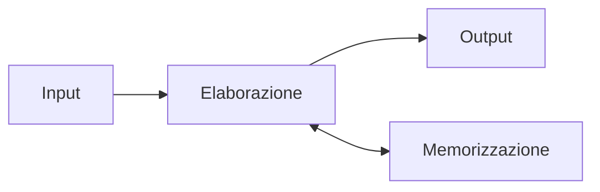
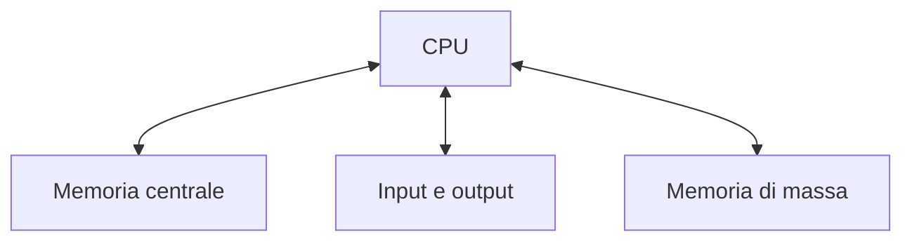

# Come è fatto un computer

## 1. Un sistema che elabora informazioni

Un computer riceve dati, li elabora seguendo istruzioni, produce risultati e può conservarli.

```mermaid
flowchart LR
    I["Input"] --> E["Elaborazione"]
    E --> O["Output"]
    E <--> M["Memorizzazione"]
```

Lo stesso schema vale per computer, smartphone, console e molti dispositivi incorporati in automobili o elettrodomestici.

## 2. Architettura di von Neumann

Nell'architettura di von Neumann, dati e programmi sono conservati nella memoria. La CPU preleva ed esegue le istruzioni.

Componenti essenziali:

- **CPU**: esegue istruzioni;
- **memoria centrale**: conserva temporaneamente dati e programmi in uso;
- **memoria di massa**: conserva file a lungo termine;
- **dispositivi di input e output**;
- **bus**: collegamenti che trasportano dati, indirizzi e segnali di controllo.

```mermaid
flowchart TD
    CPU["CPU"] <--> RAM["Memoria centrale"]
    CPU <--> IO["Input e output"]
    CPU <--> DISK["Memoria di massa"]
```

## 3. CPU

La CPU contiene unità che:

- leggono e interpretano istruzioni;
- eseguono operazioni aritmetiche e logiche;
- coordinano il trasferimento dei dati;
- usano registri e cache per accedere rapidamente alle informazioni.

Il ciclo base è:

```mermaid
flowchart LR
    F["Preleva"] --> D["Decodifica"]
    D --> X["Esegue"]
    X --> F
```

La frequenza di clock, il numero di core e la cache contribuiscono alle prestazioni, ma nessun valore da solo stabilisce quale processore sia più veloce.

## 4. Memoria

### 4.1 RAM

La RAM contiene dati e programmi in uso. È veloce, ma normalmente perde il contenuto quando manca l'alimentazione.

### 4.2 SSD e disco rigido

SSD e dischi rigidi conservano i file anche quando il computer è spento. Un SSD non ha parti meccaniche in movimento ed è normalmente più rapido di un disco magnetico.

### 4.3 Cache e registri

Registri e cache sono memorie molto vicine alla CPU. Hanno capacità ridotta, ma tempi di accesso brevi.

| Memoria | Velocità relativa | Capacità relativa | Conserva i dati senza corrente |
|---|---|---|---|
| registri | molto alta | minima | no |
| cache | molto alta | piccola | no |
| RAM | alta | media | no |
| SSD/disco | più bassa | grande | sì |

## 5. Input e output

Esempi di input:

- tastiera;
- mouse;
- microfono;
- fotocamera;
- sensori.

Esempi di output:

- schermo;
- stampante;
- altoparlanti;
- attuatori.

Un touchscreen svolge entrambe le funzioni: mostra informazioni e rileva il tocco.

## 6. Scheda madre e collegamenti

La scheda madre collega CPU, RAM, dispositivi di memoria e periferiche. Comprende socket, slot e connettori.

È utile riconoscere:

- USB per periferiche e, in alcuni casi, alimentazione o video;
- HDMI o DisplayPort per audio e video;
- Ethernet per la rete cablata;
- connettori interni per memoria e dispositivi.

Lo stesso tipo di connettore non garantisce sempre le stesse funzioni. Prima di acquistare o collegare un dispositivo si controllano le specifiche.

## 7. Scegliere un computer

La scelta dipende dall'uso:

- documenti e navigazione richiedono risorse moderate;
- montaggio video, grafica e simulazioni richiedono più CPU, RAM o GPU;
- un portatile deve bilanciare autonomia, peso e prestazioni;
- la possibilità di riparare o aggiornare il dispositivo ne prolunga la vita.

Non bisogna confrontare i computer usando soltanto frequenza o quantità di memoria.

## 8. Laboratorio

1. Apri le informazioni di sistema del computer.
2. Identifica CPU, RAM, sistema operativo e spazio di archiviazione.
3. Osserva i processi in esecuzione.
4. Collega ogni componente alla sua funzione.
5. Prepara una configurazione motivata per tre utenti: studente, grafico e laboratorio scientifico.
