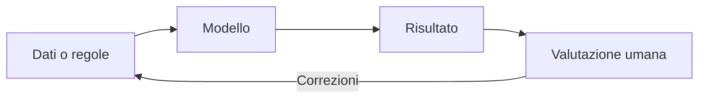
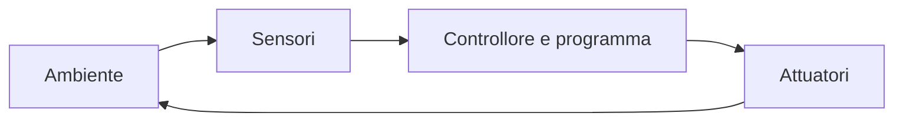

# Introduzione all'intelligenza artificiale e alla robotica

## Che cos'è l'intelligenza artificiale

L'intelligenza artificiale (IA) studia sistemi capaci di svolgere compiti che richiedono abilità associate all'intelligenza, come riconoscere immagini, comprendere testi, pianificare o formulare previsioni. Un sistema di IA non “pensa” necessariamente come una persona: esegue un modello costruito e verificato da esseri umani.



L'approccio **simbolico** usa regole e rappresentazioni esplicite; quello **connessionista** usa reti neurali che apprendono parametri dai dati. I sistemi ibridi combinano più tecniche. Si parla oggi di IA **debole**, progettata per compiti delimitati; l'IA forte, con capacità generali paragonabili a quelle umane, rimane un'ipotesi.

## Reti neurali: l'idea essenziale

Una rete neurale artificiale combina valori numerici in strati. Durante l'addestramento modifica i propri pesi per ridurre l'errore tra previsione e risultato atteso. Non è una copia fedele del cervello e può sbagliare quando i dati sono insufficienti, distorti o diversi da quelli usati per addestrarla.

## Etica e uso responsabile

Prima di usare un risultato prodotto dall'IA bisogna chiedersi:

- quali dati sono stati usati e se rappresentano le persone coinvolte;
- quale errore è accettabile e chi subirebbe le conseguenze;
- se il risultato è spiegabile e verificabile;
- quali dati personali vengono raccolti;
- chi è responsabile della decisione finale.

Un **bias** è una distorsione sistematica. Può provenire dai dati, dalle scelte progettuali o dal modo in cui il sistema viene usato. Non basta quindi dire che “lo ha deciso l'algoritmo”: nelle decisioni importanti occorrono controllo umano e possibilità di contestazione.

## Dal pensiero computazionale al robot

Un robot percepisce l'ambiente tramite **sensori**, elabora informazioni con un controllore e agisce tramite **attuatori**.



Esempi di sensori sono pulsante, sensore di distanza e temperatura; motore, LED e display sono attuatori. Il ciclo percezione-decisione-azione costituisce una forma di retroazione.

## Un semplice controllo in Python

Il seguente programma simula un robot che deve fermarsi davanti a un ostacolo:

```python
def comando_movimento(distanza_cm):
    if distanza_cm < 0:
        raise ValueError("La distanza non può essere negativa")
    if distanza_cm < 20:
        return "STOP"
    return "AVANTI"


misure = [60, 35, 18]
for distanza in misure:
    print(distanza, "cm:", comando_movimento(distanza))
```

Su una scheda reale, la distanza verrebbe letta da un sensore e il comando controllerebbe i motori.

## Attività

1. Classifica cinque dispositivi come sensori, attuatori o entrambi.
2. Indica un beneficio e un rischio dell'IA nella scuola.
3. Progetta il diagramma di un robot che accenda una luce quando l'ambiente è buio.
4. Spiega perché una previsione statistica non coincide con una certezza.

