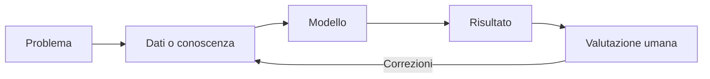
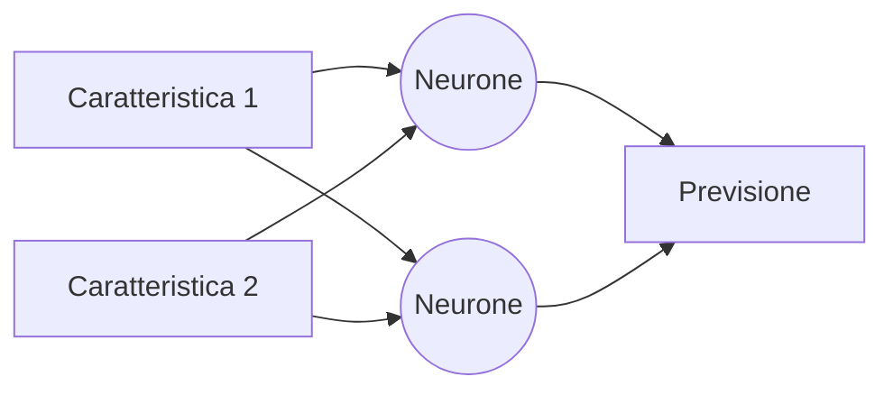
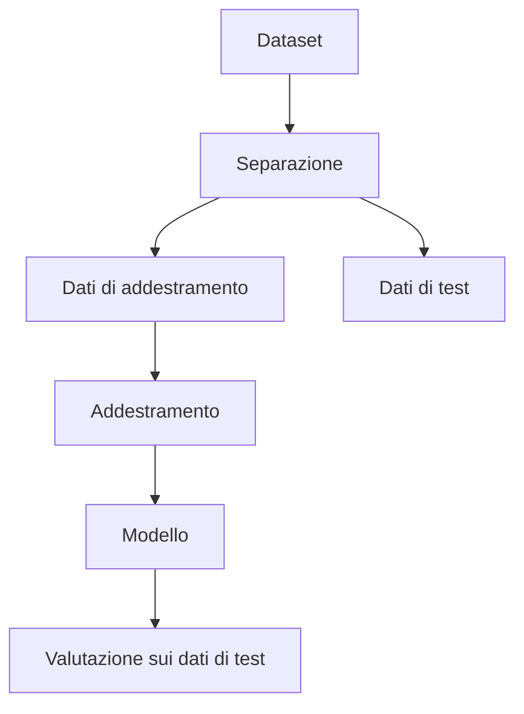
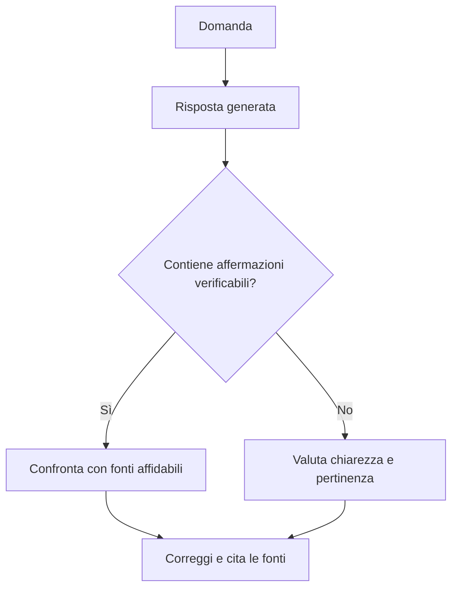

# Introduzione all'intelligenza artificiale

## Obiettivi del percorso

Al termine del percorso lo studente saprà:

- distinguere automazione, algoritmo e intelligenza artificiale;
- riconoscere IA simbolica, machine learning e approcci ibridi;
- descrivere in modo elementare addestramento, inferenza ed errore;
- valutare criticamente risultati, limiti e rischi di un sistema di IA;
- riconoscere bias, problemi di privacy e contenuti sintetici;
- usare strumenti di IA in modo trasparente, verificabile e responsabile.

## Percorso annuale di 30 ore

| Unità | Teoria | Laboratorio | Totale |
|---|---:|---:|---:|
| 1. Che cos'è l'IA e come si è sviluppata | 3 h | 1 h | 4 h |
| 2. Dati, regole e apprendimento automatico | 3 h | 3 h | 6 h |
| 3. Reti neurali e riconoscimento di pattern | 2 h | 3 h | 5 h |
| 4. IA generativa e modelli linguistici | 2 h | 3 h | 5 h |
| 5. Bias, privacy, trasparenza e impatto sociale | 4 h | 2 h | 6 h |
| 6. Progetto e presentazione finale | 1 h | 3 h | 4 h |
| **Totale** | **15 h** | **15 h** | **30 h** |

Le attività possono essere svolte con strumenti visuali e dataset preparati dal docente, senza richiedere competenze avanzate di programmazione.

## 1. Che cos'è l'intelligenza artificiale

L'intelligenza artificiale (IA) studia sistemi capaci di svolgere compiti che richiedono abilità associate all'intelligenza: riconoscere immagini, comprendere testi, pianificare, classificare o formulare previsioni.

Un sistema di IA non “pensa” necessariamente come una persona. Elabora rappresentazioni matematiche oppure applica regole costruite da esseri umani. È importante distinguere:

- **algoritmo tradizionale**: segue istruzioni definite dal programmatore;
- **sistema di machine learning**: ricava parametri da esempi;
- **automazione**: esegue autonomamente una procedura, anche senza IA;
- **robot**: agisce nel mondo fisico e può usare o non usare l'IA.



### Tappe essenziali

- 1950: Alan Turing propone un criterio operativo per discutere il comportamento intelligente delle macchine.
- 1956: il convegno di Dartmouth consolida il termine “intelligenza artificiale”.
- Anni Settanta e Ottanta: si sviluppano sistemi esperti basati su regole.
- Dagli anni Novanta: aumentano dati e potenza di calcolo; cresce l'apprendimento automatico.
- Dal 2010: il deep learning migliora riconoscimento di immagini, voce e linguaggio.
- Dal 2022: i sistemi generativi diventano accessibili al grande pubblico.

Questa cronologia non rappresenta una crescita continua: periodi di entusiasmo si sono alternati a fasi di riduzione degli investimenti, dette “inverni dell'IA”.

### Attività

Classifica dieci applicazioni quotidiane distinguendo automazione, IA e robotica. Per ogni caso motiva la scelta.

## 2. Approcci all'IA

### IA simbolica

L'IA simbolica rappresenta conoscenze mediante fatti, simboli e regole esplicite.

```text
SE temperatura > 38 E tosse = vero
ALLORA suggerisci un controllo medico
```

Il risultato è interpretabile, ma costruire e mantenere molte regole può diventare difficile. Inoltre una regola didattica come quella precedente non costituisce una diagnosi.

### Approccio connessionista

L'approccio connessionista usa reti neurali artificiali formate da unità numeriche collegate. I pesi delle connessioni vengono modificati durante l'addestramento per ridurre l'errore.



Una rete neurale è ispirata molto liberamente ad alcuni concetti biologici, ma non è una copia del cervello.

### Approcci ibridi

Un sistema ibrido combina componenti diverse. Per esempio, un modello può riconoscere oggetti in una fotografia e un insieme di regole può impedire determinate azioni.

## 3. Machine learning

Nel machine learning si distinguono tre fasi:

1. **preparazione dei dati**;
2. **addestramento**, durante il quale il modello modifica i parametri;
3. **inferenza**, durante la quale il modello elabora nuovi dati.



Valutare il modello sugli stessi dati usati per addestrarlo produce una stima poco attendibile. Il modello potrebbe averli memorizzati senza imparare una regola utile: è il fenomeno dell'**overfitting**.

### Apprendimento supervisionato

Ogni esempio possiede un'etichetta. Alcuni compiti tipici:

- **classificazione**: prevedere una categoria;
- **regressione**: prevedere un valore numerico.

### Apprendimento non supervisionato

I dati non hanno etichette predefinite. Il sistema cerca strutture, raggruppamenti o anomalie. I gruppi ottenuti non possiedono automaticamente un significato: devono essere interpretati.

### Apprendimento per rinforzo

Un agente interagisce con un ambiente e riceve ricompense o penalità. Impara una strategia che massimizza la ricompensa nel tempo. Una ricompensa progettata male può produrre comportamenti indesiderati.

### Laboratorio: classificatore umano

1. Scegli due categorie di oggetti.
2. Definisci caratteristiche misurabili.
3. Costruisci una tabella di almeno venti esempi.
4. Proponi una regola di classificazione.
5. Verificala su cinque nuovi esempi.
6. Calcola la percentuale di risposte corrette e analizza gli errori.

## 4. Qualità dei dati e metriche

I dati possono essere incompleti, obsoleti, duplicati, sbilanciati o raccolti in un contesto diverso da quello di utilizzo.

Una semplice accuratezza è:

```text
accuratezza = previsioni corrette / previsioni totali
```

L'accuratezza da sola può ingannare. Se 99 messaggi su 100 sono legittimi, un sistema che risponde sempre “legittimo” raggiunge il 99%, ma non riconosce alcun messaggio fraudolento.

La **matrice di confusione** distingue:

| | Previsto positivo | Previsto negativo |
|---|---:|---:|
| Reale positivo | vero positivo | falso negativo |
| Reale negativo | falso positivo | vero negativo |

### Laboratorio

Con una matrice fornita dal docente, calcola accuratezza e numero dei diversi errori. Discuti quale errore sia più grave in un filtro antispam e in uno screening medico.

## 5. IA generativa

Un sistema generativo produce nuovi testi, immagini, audio o altri dati sulla base di regolarità apprese. Un modello linguistico genera una continuazione probabile del testo; non consulta automaticamente una fonte attendibile e non garantisce la verità delle risposte.

### Prompt e verifica

Un prompt efficace specifica:

- obiettivo;
- contesto;
- destinatario;
- vincoli;
- formato desiderato;
- criteri con cui controllare il risultato.



Una risposta fluida può essere falsa. Le cosiddette **allucinazioni** sono contenuti plausibili ma non fondati. L'utente rimane responsabile della verifica.

### Laboratorio comparativo

Formula la stessa richiesta in tre modi, confronta i risultati e registra:

- informazioni corrette;
- affermazioni da verificare;
- omissioni;
- eventuali stereotipi;
- miglioramenti prodotti dal nuovo prompt.

Non inserire dati personali, credenziali o materiali riservati.

## 6. Etica dell'IA

### Bias e discriminazione

Un **bias** è una distorsione sistematica. Può provenire dai dati, dalle etichette, dagli obiettivi scelti, dal modello o dal contesto d'uso. Non basta quindi affermare che “lo ha deciso l'algoritmo”.

### Privacy

La raccolta di dati deve essere proporzionata allo scopo. Anche dati apparentemente anonimi possono talvolta permettere la reidentificazione quando vengono combinati.

### Trasparenza e responsabilità

Chi subisce una decisione importante dovrebbe sapere che è stato usato un sistema automatizzato, quali elementi hanno influito e come chiedere una revisione. La responsabilità non può essere trasferita alla macchina.

### Impatto sul lavoro e sull'ambiente

L'IA può automatizzare singoli compiti, trasformare professioni e crearne di nuove. Addestramento e utilizzo dei modelli richiedono inoltre energia, apparecchiature e acqua per il raffreddamento: il costo ambientale va confrontato con i benefici reali.

### Scheda di analisi etica

Per un caso di studio rispondi:

1. Qual è lo scopo?
2. Chi beneficia del sistema?
3. Chi può subire un danno?
4. Quali dati utilizza?
5. Quali errori può commettere?
6. È possibile contestare il risultato?
7. Esiste una soluzione più semplice e meno invasiva?

## 7. Progetto finale

In gruppi, analizzate un'applicazione dell'IA nella scuola, nella medicina, nei trasporti o nell'ambiente. Il prodotto finale deve contenere:

- descrizione del problema;
- dati necessari;
- schema di funzionamento;
- benefici attesi;
- errori possibili;
- analisi di bias, privacy e responsabilità;
- almeno tre fonti controllabili;
- presentazione orale con domande della classe.

## Verifica conclusiva

1. Spiega la differenza tra programma tradizionale e machine learning.
2. Distingui addestramento e inferenza.
3. Perché occorre separare dati di addestramento e dati di test?
4. Descrivi un caso nel quale l'accuratezza non sia sufficiente.
5. Che cosa rende un contenuto generativo poco affidabile?
6. Individua due possibili fonti di bias.
7. Proponi una regola per l'uso trasparente dell'IA in un compito scolastico.

