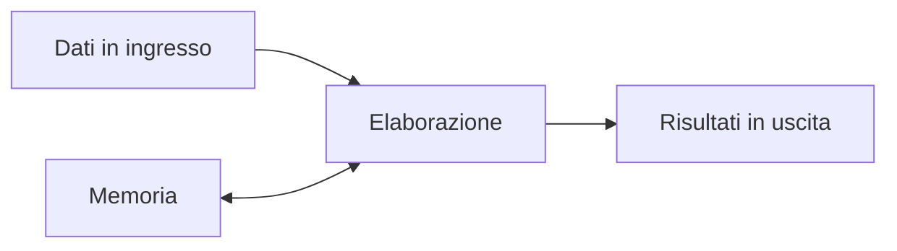
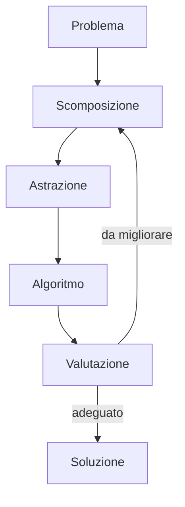

# Introduzione all'informatica

L'informatica non coincide con il semplice uso di un computer. Studia metodi per
rappresentare informazioni, risolvere problemi e automatizzare attività mediante
sistemi capaci di eseguire istruzioni.

## 1. Obiettivi

Al termine del capitolo saprai:

- distinguere informatica e uso degli strumenti digitali;
- riconoscere dati, algoritmi e programmi;
- descrivere alcune tappe essenziali della storia del calcolo;
- individuare applicazioni dell'informatica in ambiti diversi;
- analizzare in modo critico possibilità e limiti di un sistema informatico.

## 2. Informazione e calcolo

La parola **informatica** deriva dall'unione dei concetti di informazione e
automazione. Un sistema informatico riceve dati, li elabora seguendo regole e
produce risultati.



I dati possono essere numeri, testi, immagini, suoni o misure. Per essere elaborati
da un computer devono essere rappresentati in una forma precisa. Nei capitoli
successivi vedremo che, a livello fisico, questa rappresentazione si basa su due
simboli: `0` e `1`.

## 3. Algoritmi e programmi

Un **algoritmo** è una sequenza finita e non ambigua di passi che risolve una
classe di problemi. Una ricetta è simile a un algoritmo, ma le istruzioni rivolte
a un computer devono essere molto più precise.

Un **programma** è la traduzione di uno o più algoritmi in un linguaggio che il
computer può eseguire.

Esempio: per stabilire il maggiore tra due numeri si può descrivere l'algoritmo:

```text
LEGGI a e b
SE a > b
    SCRIVI a
ALTRIMENTI
    SCRIVI b
```

Lo stesso algoritmo può essere espresso con linguaggi di programmazione diversi.
La soluzione del problema viene prima della scelta del linguaggio.

## 4. Hardware, software e persone

Un sistema informatico comprende più elementi:

- **hardware**: le parti fisiche, come processore, memoria e dispositivi;
- **software**: programmi e dati;
- **persone**: chi progetta, gestisce e utilizza il sistema;
- **procedure**: regole che stabiliscono come usarlo in modo corretto e sicuro.

Un computer potente con dati scorretti o procedure sbagliate può produrre risultati
inutili. L'informatica riguarda quindi l'intero sistema, non soltanto la macchina.

## 5. Alcune tappe essenziali

| Periodo | Sviluppo | Perché è importante |
|---|---|---|
| antichità | strumenti di conteggio | aiutano a rappresentare ed eseguire calcoli |
| XVII secolo | calcolatrici meccaniche | automatizzano operazioni aritmetiche |
| XIX secolo | macchina analitica di Babbage | anticipa memoria, elaborazione e programma |
| anni Quaranta | primi calcolatori elettronici | rendono il calcolo automatico molto più veloce |
| anni Settanta | microprocessore | concentra la CPU in un circuito integrato |
| anni Novanta | diffusione del Web | facilita la pubblicazione e il collegamento di informazioni |
| XXI secolo | dispositivi mobili, cloud e IA | distribuiscono calcolo e dati in molti contesti |

Questa linea del tempo è intenzionalmente sintetica. La storia dell'informatica non
è opera di una sola persona: nasce dal contributo di matematici, ingegneri,
programmatori, tecnici e istituzioni di paesi diversi.

## 6. Dove si usa l'informatica

L'informatica interviene quando occorre gestire informazioni o controllare un
processo. Alcuni esempi sono:

- analisi di dati scientifici;
- simulazione di fenomeni fisici;
- comunicazione attraverso reti;
- gestione di archivi sanitari;
- controllo di robot e macchine;
- creazione di testi, immagini e prodotti multimediali;
- protezione di dati e comunicazioni;
- supporto alle decisioni mediante modelli matematici.

In ogni applicazione bisogna chiedersi quali dati vengono raccolti, chi decide le
regole, quanto è affidabile il risultato e quali conseguenze può avere un errore.

## 7. Pensiero computazionale

Il **pensiero computazionale** è un modo di affrontare problemi complessi. Comprende:

1. **scomposizione**: dividere il problema in parti più semplici;
2. **riconoscimento di regolarità**: individuare somiglianze tra casi;
3. **astrazione**: conservare gli aspetti importanti e trascurare dettagli inutili;
4. **progettazione di algoritmi**: descrivere una procedura precisa;
5. **valutazione**: controllare se la soluzione è corretta e adeguata.



Questo metodo è utile anche senza un computer: per organizzare un esperimento,
pianificare un'attività o confrontare diverse strategie.

## 8. Possibilità e limiti

Un computer esegue molto rapidamente le operazioni previste, ma non garantisce che
il problema sia stato formulato correttamente. Un risultato può essere errato se:

- i dati sono incompleti o inaccurati;
- l'algoritmo contiene un errore;
- il modello semplifica troppo la realtà;
- il programma viene usato in un contesto diverso da quello previsto;
- chi interpreta il risultato gli attribuisce un significato eccessivo.

Per questo le competenze informatiche comprendono sia la costruzione di strumenti
sia la capacità di valutarli criticamente.

## 9. Attività iniziale

Scegli un sistema digitale usato a scuola, per esempio il registro elettronico o
la piattaforma didattica. Prepara una tabella con:

1. dati in ingresso;
2. elaborazioni principali;
3. risultati prodotti;
4. persone coinvolte;
5. possibili errori o rischi.

Confronta poi la tua analisi con quella di un compagno.

## 10. Verifica

1. Perché informatica e uso del computer non sono sinonimi?
2. Qual è la differenza tra algoritmo e programma?
3. Fornisci un esempio di dato, elaborazione e risultato.
4. Quali elementi, oltre all'hardware, formano un sistema informatico?
5. Applica le fasi del pensiero computazionale a un problema quotidiano.
6. Spiega perché un risultato prodotto da un computer non è automaticamente corretto.
