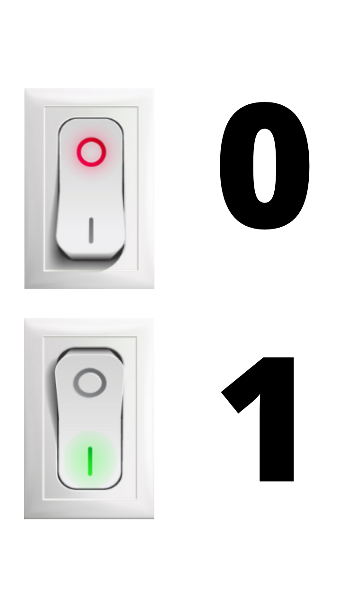
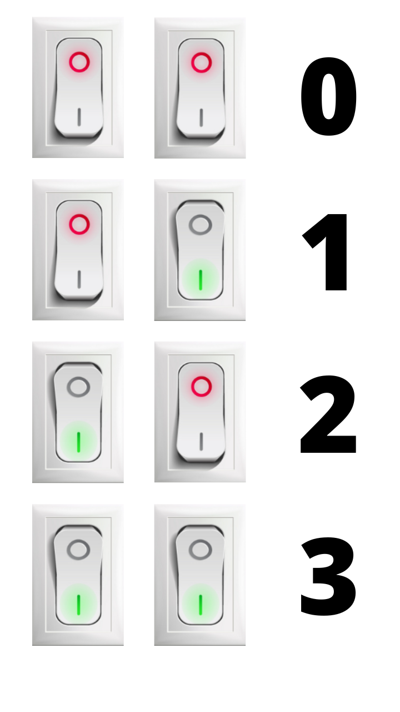
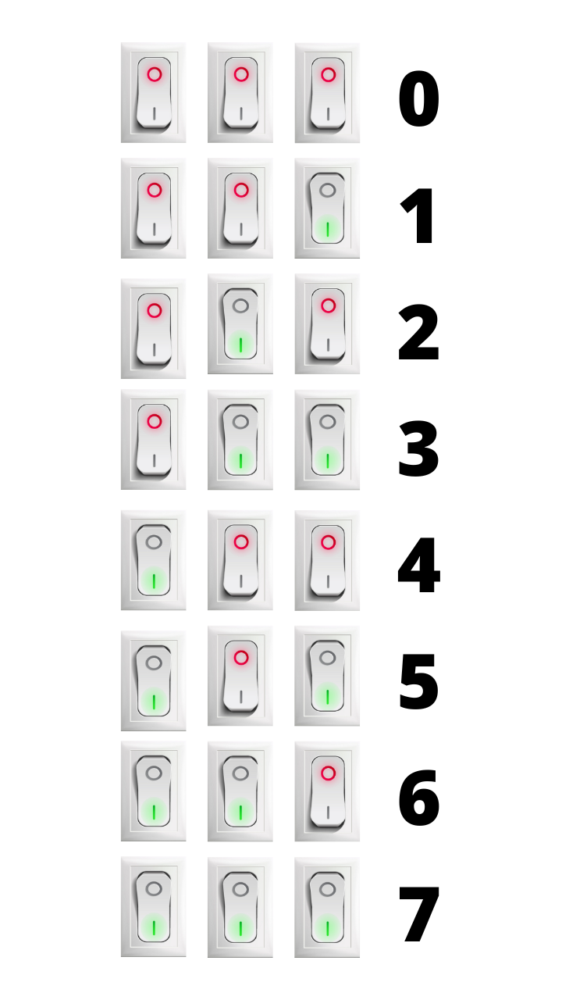

# I sistemi di numerazione

## Introduzione

Benvenuti nel mondo affascinante dei sistemi di numerazione! In informatica, i numeri non sono solo numeri: sono il linguaggio fondamentale con cui computer e dispositivi digitali comunicano tra loro. Mentre noi umani usiamo naturalmente il sistema decimale (base 10), i computer "pensano" in binario (base 2). Comprendere questi sistemi numerici è essenziale per capire come funzionano davvero le tecnologie che usiamo ogni giorno.

In questo corso di 4 ore esploreremo i principali sistemi di numerazione utilizzati in informatica, impareremo a convertire numeri tra diverse basi e scopriremo strumenti pratici per effettuare questi calcoli. Alla fine, vedrete i numeri con occhi completamente nuovi!

---

## 1. Il sistema decimale: il nostro punto di partenza

### 1.1 Come funziona il sistema decimale

Il sistema decimale è così naturale per noi che raramente ci fermiamo a pensare al suo funzionamento. Utilizziamo 10 cifre (0, 1, 2, 3, 4, 5, 6, 7, 8, 9) e ogni posizione in un numero rappresenta una potenza di 10.

Prendiamo il numero 3429:

- 3 × 10³ = 3 × 1000 = 3000
- 4 × 10² = 4 × 100 = 400  
- 2 × 10¹ = 2 × 10 = 20
- 9 × 10⁰ = 9 × 1 = 9
- **Totale: 3000 + 400 + 20 + 9 = 3429**

### 1.2 Il concetto di base numerica

Una **base numerica** determina quante cifre diverse possiamo usare e il valore di ogni posizione. Nel sistema decimale:

- **Base**: 10
- **Cifre disponibili**: 0, 1, 2, 3, 4, 5, 6, 7, 8, 9
- **Valore delle posizioni**: ...10³, 10², 10¹, 10⁰

Questo principio si applica a qualsiasi base numerica, cambiando solo il numero di cifre disponibili e il valore delle posizioni.

### 1.3 Perché altri sistemi di numerazione?

Potreste chiedervi: "Se il decimale funziona così bene, perché usare altri sistemi?" La risposta sta nella natura dell'elettronica digitale. I computer utilizzano componenti elettronici che possono essere in due stati: acceso (1) o spento (0). Questo rende il sistema binario perfetto per rappresentare informazioni digitali.

---

## 2. Il sistema binario: il linguaggio dei computer

### 2.1 Perché il binario è perfetto per i computer!

I computer utilizzano circuiti elettronici che riconoscono due stati:

- **0**: Assenza di tensione elettrica (spento)
- **1**: Presenza di tensione elettrica (acceso)

Possiamo immaginare questi circuiti come una serie di piccoli interruttori. Hai mai notato che su molti interruttori presenti sugli elettromestici, sono presenti due simboli uan  **O** e una **I**: si tratta in realtà di uno zero (stato spento), e di un 1 (stato acceso).



Questa semplicità rende il sistema binario incredibilmente affidabile e veloce per i calcoli elettronici.

Con un solo interruttore, possiamo rappresentare solo 0 e 1. Ma se usiamo due interrutori possiamo rappresentare il doppio: guarda l'immagine sottostante.



Se usiamo 3 interuttori possiamo rappresentarne ancora di più, come mostrato nell'immagine qui sotto.



Ovviamente, rappresentare tutte le combinazioni possibili di interruttori, non è un metodo comodo per capire come un computer rappresenta i numeri. Vedremo un metodo più pratico nel [capitolo 3](#3-conversioni-tra-decimale-e-binario). Ma prima di andare avanti, ancora un dettaglio: d'ora in avanti non parleremo più di interruttori ma useremo un termine più tecnico: **bit**. 

### 2.2 Il bit

La parola **bit** è l'abbreviazione di "**binary digit**" (cifra binaria). È l'unità più piccola di informazione in un computer: può valere solo 0 oppure 1, come un interruttore che può essere solo spento o acceso.

Il bit è una vera e propria unità di misura (come il metro, il grammo o il litro) e quindi ha anche dei multipli.

- **1 Kilobit (Kb)** = 1000 bit (circa mille bit)
- **1 Megabit (Mb)** = 1000 Kb (circa un milione di bit)
- **1 Gigabit (Gb)** = 1000 Mb (circa un miliardo di bit)
- **1 Terabit (Tb)** = 1000 Gb (circa mille miliardi di bit)

Da notare che non esistono sottomultipli proprio perchè il bit è la più piccola unità di informazione, quindi non esiste nulla che sia più piccolo di un bit.


### 2.3 Applicazioni pratiche del binario

Il sistema binario non è solo teoria astratta:

- **Memoria del computer**: Ogni bit di memoria può contenere un 0 o un 1
- **Processori**: Eseguono operazioni su numeri binari
- **Reti di comunicazione**: I dati viaggiano come sequenze di 0 e 1
- **Storage digitale**: Hard disk, SSD, USB memorizzano informazioni in binario

---

## 3. Conversioni tra decimale e binario

### 3.1 Da decimale a binario: il metodo del gioco matematico

Esiste un metodo intuitivo e divertente per convertire numeri decimali in binari, basato su due semplici regole che lo trasformano quasi in un gioco matematico:

**Le due regole d'oro:**

1. **Non si possono scrivere numeri dispari** (tranne l'1)
2. **L'1 deve sempre stare a destra del segno +**

Il procedimento consiste nel scomporre il numero decimale sottraendo progressivamente le potenze di 2, partendo dalla più grande possibile, fino ad arrivare a 0.

### 3.2 Come funziona il metodo: spiegazione passo-passo

**Il procedimento:**

1. Scrivi il numero decimale da convertire
2. Se il numero è **dispari**, scomponilo come: `numero_pari + 1`
3. Se il numero è **pari**, scrivilo come `numero_pari + 0`
4. Dividi a metà l'ultimo `numero_pari` che hai scritto.
5. Ripeti dal punto 2, finché non arrivi a 1
6. Leggi tutte le cifre a destra del segno + **dal basso verso l'alto**

### 3.2.1 Esempio 1: Convertiamo 11 in binario

**Passo per passo:**

```
11  →  
   10 + 1    (11 è dispari, lo scrivo come 10 + 1 )
    4 + 1    (la metà di 10 è 5: 5 è dispari, lo scrivo come 4 + 1)
    2 + 0    (la metà di 4 è 2: 2 è pari, lo scrivo come 2 + 0 )
    0 + 1    (la metà di 2 è 1: sono arrivato alla fine e scrivo 0 + 1)
```

**Leggiamo da destra, dal basso verso l'alto:** 1, 0, 1, 1

**Risultato: 11 decimale = 1011 binario**

### 3.2.2 Esempio aggiuntivo: Convertiamo 19 in binario

**Passo per passo:**

```
19  →  
   18 + 1    (19 è dispari, lo scrivo come 18 + 1)
    8 + 1    (la metà di 18 è 9: 9 è dispari, lo scrivo come 8 + 1)
    4 + 0    (la metà di 8 è 4: 4 è pari, lo scrivo come 4 + 0)
    2 + 0    (la metà di 4 è 2: 2 è pari, lo scrivo come 2 + 0)
    0 + 1    (la metà di 2 è 1: sono arrivato alla fine e scrivo 0 + 1)
```

**Leggiamo da destra, dal basso verso l'alto:** 1, 0, 0, 1, 1

**Risultato: 19 decimale = 10011 binario**

---

### 3.2.3 Esempio aggiuntivo: Convertiamo 30 in binario

**Passo per passo:**

```
30  →  
   30 + 0    (30 è pari, lo scrivo come 30 + 0)
   14 + 1    (la metà di 30 è 15: 15 è dispari, lo scrivo come 14 + 1)
    6 + 1    (la metà di 14 è 7: 7 è dispari, lo scrivo come 6 + 1)
    2 + 1    (la metà di 6 è 3: 3 è dispari, lo scrivo come 2 + 1)
    0 + 1    (la metà di 2 è 1: sono arrivato alla fine e scrivo 0 + 1)
```

**Leggiamo da destra, dal basso verso l'alto:** 1, 1, 1, 1, 0

**Risultato: 30 decimale = 11110 binario**

---

### 3.3 Esempio 2: Convertiamo 25 in binario

**Passo per passo:**

```
25  →  16 + 9   (25 è dispari, la potenza più grande contenuta è 16)
    16 + 9   (9 è dispari, continuo a scomporre)
     8 + 1   (9 contiene 8, rimane 1 - perfetto!)
     4 + 0   (8 non contiene 4, quindi 4 + 0)
     2 + 0   (4 non contiene 2, quindi 2 + 0)
     0 + 1   (2 non contiene altro, l'1 è già a posto)
```

**Leggiamo da destra, dal basso verso l'alto:** 1, 0, 0, 1, 1

**Risultato: 25 decimale = 11001 binario**

---

### 3.4 Esempio 3: Convertiamo 54 in binario

**Passo per passo:**

```
54  →  32 + 22  (54 è pari, ma lo scompongo: la potenza più grande è 32)
    32 + 22  (22 è pari, continuo a scomporre)
    16 + 6   (22 contiene 16, rimane 6)
    16 + 6   (6 è pari, continuo)
     8 + 0   (16 non contiene 8, però 6 va ancora scomposto)
     4 + 2   (6 contiene 4, rimane 2)
     4 + 2   (2 è pari ma non è potenza diretta, lo scompongo)
     2 + 0   (4 non contiene 2, ma il 2 precedente c'è)
     0 + 1   (arriviamo a 1 e concludiamo)
```

**Metodo corretto per il 54:**

```
54 scomposto come:
    32 + 22    → cifra per 2⁵: prendo 32, metto 1
    16 + 6     → cifra per 2⁴: da 22, prendo 16, metto 1
     8 + 0     → cifra per 2³: da 6, non c'è 8, metto 0
     4 + 2     → cifra per 2²: da 6, prendo 4, metto 1
     2 + 0     → cifra per 2¹: da 2, prendo 2, metto 1
     0 + 0     → cifra per 2⁰: rimane 0, metto 0
```

**Leggiamo da destra, dal basso verso l'alto:** 0, 1, 1, 0, 1, 1

**Risultato: 54 decimale = 110110 binario**

**Verifica**: 1×2⁵ + 1×2⁴ + 0×2³ + 1×2² + 1×2¹ + 0×2⁰ = 32 + 16 + 0 + 4 + 2 + 0 = 54 ✓

---

### 3.5 Perché questo metodo funziona?

Questo metodo è efficace perché:

- **Visualizza le potenze di 2**: ogni riga corrisponde a una posizione binaria
- **È intuitivo**: le regole semplici evitano errori
- **È verificabile**: puoi sempre controllare la risposta sommando le potenze di 2
- **È un gioco**: le regole lo rendono divertente e memorabile

### 3.6 Da binario a decimale: il metodo delle potenze

Per convertire un numero binario in decimale, ogni cifra ha un peso diverso a seconda della posizione. Partendo da destra, il primo valore è $2^0$, il secondo $2^1$, il terzo $2^2$ e così via.

#### Esempio: convertiamo 110110 in decimale

- 1 × 2⁵ = 32
- 1 × 2⁴ = 16
- 0 × 2³ = 0
- 1 × 2² = 4
- 1 × 2¹ = 2
- 0 × 2⁰ = 0

Somma: $32 + 16 + 0 + 4 + 2 + 0 = 54$

**Risultato:** $110110_2 = 54_{10}$

#### Esercizi rapidi

1. **Decimale → Binario**:
   - 42 → ?
   - 128 → ?
   - 255 → ?

2. **Binario → Decimale**:
   - 1010 → ?
   - 11111 → ?
   - 10000000 → ?

---

## 4. Il sistema esadecimale: la strada più breve

### 4.1 Introduzione al sistema esadecimale

Il sistema esadecimale (base 16) è particolarmente importante in informatica perché offre un modo compatto per rappresentare numeri binari lunghi.

**Caratteristiche del sistema esadecimale:**

- **Base**: 16
- **Cifre disponibili**: 0, 1, 2, 3, 4, 5, 6, 7, 8, 9, A, B, C, D, E, F
- **Valori delle lettere**: A=10, B=11, C=12, D=13, E=14, F=15

### 4.2 Perché l'esadecimale è utile in informatica

L'esadecimale è prezioso perché:

- **4 bit = 1 cifra esadecimale**: Questo rende le conversioni molto semplici
- **Compattezza**: Un byte (8 bit) si rappresenta con sole 2 cifre esadecimali
- **Leggibilità**: Più facile da leggere rispetto a lunghe sequenze di 0 e 1

### 4.3 Conversioni con l'esadecimale

**Da decimale a esadecimale:**
Usiamo divisioni successive per 16.

**Esempio: 255 in esadecimale**

1. 255 ÷ 16 = 15 resto **15** (F)
2. 15 ÷ 16 = 0 resto **15** (F)

Risultato: **FF**

**Da esadecimale a decimale:**
**Esempio: 2A3 in decimale**

- 3 × 16⁰ = 3 × 1 = 3
- A × 16¹ = 10 × 16 = 160  
- 2 × 16² = 2 × 256 = 512

**Totale: 3 + 160 + 512 = 675**

### 4.4 La relazione speciale tra binario e esadecimale

Ogni cifra esadecimale corrisponde esattamente a 4 bit:

| Esadecimale | Binario | Decimale |
|-------------|---------|----------|
| 0           | 0000    | 0        |
| 1           | 0001    | 1        |
| 2           | 0010    | 2        |
| 3           | 0011    | 3        |
| 4           | 0100    | 4        |
| 5           | 0101    | 5        |
| 6           | 0110    | 6        |
| 7           | 0111    | 7        |
| 8           | 1000    | 8        |
| 9           | 1001    | 9        |
| A           | 1010    | 10       |
| B           | 1011    | 11       |
| C           | 1100    | 12       |
| D           | 1101    | 13       |
| E           | 1110    | 14       |
| F           | 1111    | 15       |

**Esempio pratico:**
Il binario 11010110 diventa:

- 1101 = D
- 0110 = 6
- Risultato: **D6** in esadecimale

### 4.5 Applicazioni dell'esadecimale

L'esadecimale è ampiamente utilizzato per:

- **Indirizzi di memoria**: I programmatori usano indirizzi esadecimali
- **Codici colore**: #FF0000 rappresenta il rosso puro
- **Codici errore**: I sistemi operativi mostrano errori in esadecimale
- **Debugging**: Analisi del contenuto della memoria

---

## 5. Il sistema ottale: un cenno storico e pratico

### 5.1 Introduzione al sistema ottale

Il sistema ottale (base 8) ha avuto importanza storica in informatica, specialmente nei primi computer.

**Caratteristiche del sistema ottale:**

- **Base**: 8
- **Cifre disponibili**: 0, 1, 2, 3, 4, 5, 6, 7
- **Valore delle posizioni**: ...8³, 8², 8¹, 8⁰

### 5.2 Perché il sistema ottale è stato importante

Nei primi computer, l'ottale era popolare perché:

- **3 bit = 1 cifra ottale**: Relazione semplice con il binario
- **Compattezza**: Più compatto del binario, più semplice dell'esadecimale
- **Tradizione Unix**: Molti sistemi Unix usano ancora permessi ottali

### 5.3 Conversioni con l'ottale

**Da decimale a ottale:**
Divisioni successive per 8.

**Esempio: 100 in ottale**

1. 100 ÷ 8 = 12 resto **4**
2. 12 ÷ 8 = 1 resto **4**  
3. 1 ÷ 8 = 0 resto **1**

Risultato: **144** (ottale)

**Relazione binario-ottale:**
Ogni cifra ottale = 3 bit binari

| Ottale | Binario |
|--------|---------|
| 0      | 000     |
| 1      | 001     |
| 2      | 010     |
| 3      | 011     |
| 4      | 100     |
| 5      | 101     |
| 6      | 110     |
| 7      | 111     |

### 5.4 Applicazioni moderne dell'ottale

Anche se meno comune oggi, l'ottale si trova ancora in:

- **Permessi file Unix/Linux**: chmod 755, 644, ecc.
- **Programmazione C**: Letterali ottali (es. \033)
- **Reti informatiche**: Alcune configurazioni legacy

---

## 6. Strumenti pratici: Calcolatrice di Windows

### 6.1 Modalità Programmatore della Calcolatrice

La Calcolatrice di Windows include una modalità "Programmatore" perfetta per i cambi di base.

**Per accedere alla modalità Programmatore:**

1. Aprire la Calcolatrice di Windows
2. Menu ≡ → Programmatore
3. Oppure utilizzare la scorciatoia Alt + 3

### 6.2 Interfaccia della modalità Programmatore

L'interfaccia mostra:

- **Pannello principale**: Display del numero
- **Selezione base**: HEX, DEC, OCT, BIN
- **Rappresentazioni multiple**: Vede il numero in tutte le basi simultaneamente
- **Tastiera adattiva**: Solo i tasti validi per la base selezionata sono attivi

### 6.3 Come effettuare conversioni

**Procedura passo-passo:**

1. **Selezionare la base di partenza** (DEC, BIN, OCT, HEX)
2. **Inserire il numero** utilizzando la tastiera
3. **Cliccare sulla base di destinazione** per vedere la conversione
4. **Il risultato appare immediatamente** nel display

**Esempio pratico:**

- Inserire "255" in modalità DEC
- Cliccare BIN per vedere: 11111111
- Cliccare HEX per vedere: FF
- Cliccare OCT per vedere: 377

### 6.4 Funzioni avanzate della calcolatrice

**Operazioni disponibili:**

- **Operazioni bit-wise**: AND, OR, XOR, NOT
- **Shift**: Spostamento di bit a sinistra/destra  
- **Modalità byte**: Visualizzazione su 8, 16, 32, 64 bit
- **Cronologia**: Mantiene traccia dei calcoli precedenti

### 6.5 Trucchi e consigli pratici

**Scorciatoie da tastiera:**

- F8: DEC
- F9: HEX  
- F10: OCT
- F11: BIN

**Suggerimenti per l'uso efficace:**

- Utilizzare Ctrl+C per copiare risultati
- La modalità QWORD mostra fino a 64 bit
- Utile per verificare i calcoli manuali

---

## 7. Fogli di calcolo: Excel e Google Sheets

### 7.1 Funzioni di conversione in Excel

Excel offre funzioni dedicate per conversioni tra basi numeriche:

**Funzioni principali:**

- `DEC2BIN(numero)`: Decimale → Binario
- `DEC2HEX(numero)`: Decimale → Esadecimale  
- `DEC2OCT(numero)`: Decimale → Ottale
- `BIN2DEC(numero)`: Binario → Decimale
- `HEX2DEC(numero)`: Esadecimale → Decimale
- `OCT2DEC(numero)`: Ottale → Decimale

### 7.2 Esempi pratici in Excel

**Conversioni da decimale:**

```
=DEC2BIN(25)     → Risultato: 11001
=DEC2HEX(255)    → Risultato: FF  
=DEC2OCT(100)    → Risultato: 144
```

**Conversioni verso decimale:**

```
=BIN2DEC("1101")  → Risultato: 13
=HEX2DEC("FF")    → Risultato: 255
=OCT2DEC("144")   → Risultato: 100
```

### 7.3 Conversioni incrociate

Per conversioni dirette tra basi non decimali, si combinano le funzioni:

**Binario → Esadecimale:**

```
=DEC2HEX(BIN2DEC("11111111"))  → Risultato: FF
```

**Esadecimale → Binario:**

```
=DEC2BIN(HEX2DEC("A0"))  → Risultato: 10100000
```

### 7.4 Creare tabelle di conversione

**Esempio di tabella automatica:**

| Decimale | Binario        | Esadecimale | Ottale |
|----------|----------------|-------------|--------|
| 0        | =DEC2BIN(A2)   | =DEC2HEX(A2)| =DEC2OCT(A2) |
| 1        | =DEC2BIN(A3)   | =DEC2HEX(A3)| =DEC2OCT(A3) |
| ...      | ...            | ...         | ... |

### 7.5 Google Sheets: stesse funzioni, cloud-based

Google Sheets utilizza le stesse funzioni di Excel:

- Accessibile da qualsiasi dispositivo
- Collaborazione in tempo reale
- Salvataggio automatico
- Perfetto per lavori di gruppo

### 7.6 Applicazioni pratiche nei fogli di calcolo

**Usi educativi:**

- Creare tabelle di verifica per gli esercizi
- Automatizzare controlli di conversioni manuali
- Generare esercizi casuali per la pratica

**Usi professionali:**

- Analisi di dati binari
- Conversioni per programmazione
- Documentazione di calcoli

---

## 9. Esercizi pratici e laboratorio

### 9.1 Esercizi di conversione guidati

**Livello Base:**

1. Convertire i seguenti numeri decimali in binario:
   - 8 → ?
   - 15 → ?
   - 32 → ?

2. Convertire i seguenti numeri binari in decimale:
   - 1010 → ?
   - 1111 → ?
   - 100000 → ?

**Livello Intermedio:**
3. Convertire in esadecimale:

- 255 (decimale) → ?
- 11111111 (binario) → ?

4. Convertire in ottale:
   - 64 (decimale) → ?
   - 1000000 (binario) → ?

### 9.2 Laboratorio con calcolatrice Windows

**Attività guidata:**

1. Aprire la Calcolatrice in modalità Programmatore
2. Inserire il numero 42 in decimale
3. Convertire in binario, esadecimale e ottale
4. Verificare i risultati manualmente
5. Ripetere con numeri diversi

### 9.3 Laboratorio con Excel/Google Sheets

**Creare un convertitore automatico:**

1. Creare una tabella con colonne: Decimale, Binario, Esadecimale, Ottale
2. Inserire numeri da 0 a 20 nella colonna Decimale
3. Utilizzare le funzioni per completare automaticamente le altre colonne
4. Verificare alcuni risultati manualmente

### 9.4 Sfide avanzate

**Per studenti più veloci:**

1. Trovare il pattern nei primi 16 numeri in tutte le basi
2. Calcolare quanti bit servono per rappresentare 1000 in binario
3. Scoprire perché i programmatori confondono Halloween e Natale (31 Oct = 25 Dec)

---

## 📚 Risorse per l'approfondimento

**Siti web interattivi:**

- [RapidTables Number Converter](https://www.rapidtables.com/convert/number/)
- [Khan Academy: Computer Science](https://www.khanacademy.org/computing/computer-science)

**Libri consigliati:**

- "Code: The Hidden Language of Computer Hardware and Software" di Charles Petzold
- "But How Do It Know?" di J. Clark Scott

---

## 🤔 Domande frequenti

**Q: Perché devo imparare questi sistemi se ci sono calcolatrici?**
A: Comprendere i sistemi numerici vi aiuta a capire come pensano i computer e vi prepara per corsi avanzati di informatica.

**Q: Qual è il sistema più importante da imparare?**
A: Il binario è fondamentale, ma l'esadecimale è molto pratico. Entrambi sono essenziali.

**Q: Questi sistemi si usano davvero nel lavoro?**
A: Assolutamente sì! Programmatori, amministratori di rete, e tecnici li usano quotidianamente.

**Q: È normale trovare difficili le conversioni all'inizio?**
A: Sì, è completamente normale. Con la pratica diventeranno automatiche.

---


<style>
   img{
      max-height: 300px;
      width: auto;
   }
</style>