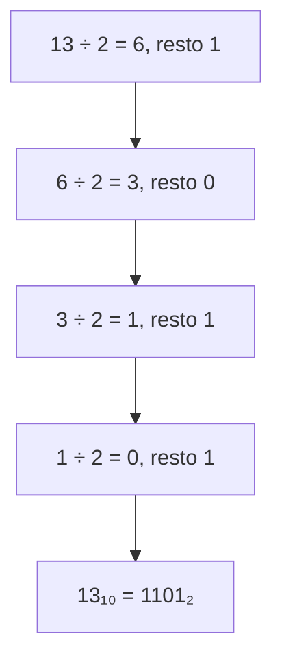

# Sistemi di numerazione

## 1. Numeri e basi

Un sistema di numerazione **posizionale** assegna a ogni cifra un valore che dipende dalla posizione.

Nel numero decimale `352`:

```text
352 = 3 × 10² + 5 × 10¹ + 2 × 10⁰
```

La base 10 usa dieci cifre, da `0` a `9`. Un computer usa soprattutto la base 2, formata dalle cifre `0` e `1`.

## 2. Sistema binario

Le posizioni di un numero binario valgono potenze di 2.

| Posizione | 2⁷ | 2⁶ | 2⁵ | 2⁴ | 2³ | 2² | 2¹ | 2⁰ |
|---|---:|---:|---:|---:|---:|---:|---:|---:|
| Valore | 128 | 64 | 32 | 16 | 8 | 4 | 2 | 1 |

Esempio:

```text
1101₂ = 1 × 8 + 1 × 4 + 0 × 2 + 1 × 1 = 13₁₀
```

## 3. Da decimale a binario

Si divide ripetutamente il numero per 2 e si leggono i resti dal basso verso l'alto.



Un altro metodo consiste nel sottrarre le potenze di 2 più grandi possibili.

## 4. Sistema esadecimale

La base 16 usa le cifre da `0` a `9` e le lettere da `A` a `F`.

| Decimale | Binario | Esadecimale |
|---:|---:|---:|
| 10 | 1010 | A |
| 11 | 1011 | B |
| 12 | 1100 | C |
| 13 | 1101 | D |
| 14 | 1110 | E |
| 15 | 1111 | F |

Una cifra esadecimale corrisponde esattamente a quattro bit:

```text
3A₁₆ = 0011 1010₂
```

L'esadecimale viene usato, per esempio, nei colori delle pagine Web e nella rappresentazione compatta di valori binari.

## 5. Operazioni binarie essenziali

Regole dell'addizione:

```text
0 + 0 = 0
0 + 1 = 1
1 + 0 = 1
1 + 1 = 10
```

Esempio:

```text
  1011
+ 0110
------
 10001
```

## 6. Laboratorio

1. Converti `18`, `27` e `42` in binario.
2. Converti `10110₂`, `111001₂` e `100000₂` in decimale.
3. Converti `2F₁₆` in binario e decimale.
4. Usa la modalità programmatore della calcolatrice per controllare i risultati.
5. Spiega perché una cifra esadecimale rappresenta quattro bit.

## 7. Contenuti facoltativi

Il sistema ottale può essere presentato come approfondimento storico. Non è necessario per raggiungere gli obiettivi fondamentali del corso.
