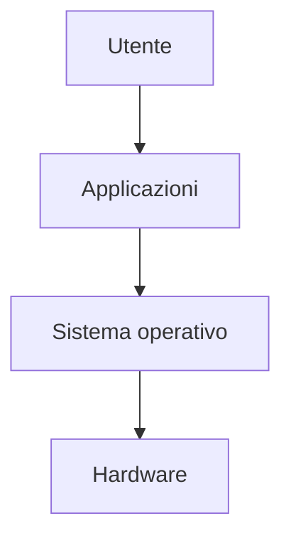

# Il sistema operativo

## 1. Che cos'è

Il **sistema operativo** gestisce le risorse del computer e offre servizi alle applicazioni.



Windows, macOS, GNU/Linux, Android e iOS sono sistemi operativi.

## 2. Funzioni principali

Il sistema operativo:

- avvia e arresta il computer;
- esegue più programmi;
- assegna memoria e tempo della CPU;
- gestisce file e cartelle;
- controlla periferiche;
- gestisce utenti e permessi;
- offre un'interfaccia grafica o testuale;
- applica aggiornamenti e protezioni.

## 3. Programmi e processi

Un **programma** è un insieme di istruzioni conservato in un file. Un **processo** è un programma in esecuzione.

Lo stesso programma può generare più processi. Il sistema operativo decide come distribuire le risorse.

### Laboratorio

Apri il gestore delle attività e osserva:

- applicazioni e processi;
- uso della CPU;
- memoria occupata;
- attività del disco;
- traffico di rete.

Non terminare processi di sistema senza conoscere la loro funzione.

## 4. File e cartelle

Un file possiede:

- nome;
- estensione;
- percorso;
- dimensione;
- data di modifica;
- proprietario e permessi.

Esempio di percorso:

```text
C:\Utenti\Ada\Documenti\relazione.pdf
```

Su sistemi Unix:

```text
/home/ada/documenti/relazione.pdf
```

Operazioni essenziali:

- creare;
- copiare;
- spostare;
- rinominare;
- eliminare e recuperare;
- cercare;
- comprimere;
- decomprimere.

## 5. Utenti e permessi

Un account identifica un utente. I permessi stabiliscono chi possa leggere, modificare o eseguire una risorsa.

Lavorare ogni giorno come amministratore aumenta i rischi. Si usa un account con privilegi elevati soltanto quando è necessario.

## 6. Installare e aggiornare

Prima di installare un programma:

1. controlla la fonte;
2. verifica sistema operativo e requisiti;
3. leggi i permessi richiesti;
4. evita pacchetti modificati provenienti da siti non affidabili;
5. conserva aggiornati programma e sistema.

Disinstallare correttamente un'applicazione è preferibile a cancellarne manualmente la cartella.

## 7. Riga di comando

La riga di comando permette di impartire istruzioni testuali. È utile per automatizzare attività e comprendere percorsi e file.

| Operazione | PowerShell | Linux/macOS |
|---|---|---|
| mostra cartella corrente | `Get-Location` | `pwd` |
| elenca file | `Get-ChildItem` | `ls` |
| cambia cartella | `Set-Location` | `cd` |
| crea cartella | `New-Item -ItemType Directory nome` | `mkdir nome` |

I comandi che eliminano o sovrascrivono dati devono essere usati soltanto su file di prova.

## 8. Backup

Una copia sullo stesso disco non è un vero backup. Una strategia semplice conserva:

- il file di lavoro;
- una copia su un supporto o servizio differente;
- una versione precedente recuperabile.

### Laboratorio

1. Crea una struttura ordinata di cartelle.
2. Comprimi la cartella.
3. Copiala in una posizione di backup.
4. Modifica un file.
5. Recupera la versione precedente.
