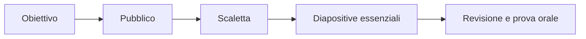

# Documenti, presentazioni e fogli di calcolo

## Organizzare un documento

Un documento efficace usa titoli gerarchici, paragrafi brevi e immagini accompagnate da didascalia. Gli stili sono preferibili alla formattazione manuale: mantengono la coerenza e permettono di generare l'indice.

Prima di condividere un file occorre controllare ortografia, fonti, dati personali, licenze delle immagini e formato: modificabile per collaborare, PDF per distribuire una versione stabile.

## Progettare una presentazione

Una diapositiva sostiene l'esposizione orale e non la sostituisce.

Usa caratteri grandi, contrasto elevato e una sola idea principale per diapositiva. Grafici e schemi devono comunicare un messaggio preciso.

## Il foglio di calcolo

Una cella può contenere testo, numero, data o formula. Una formula comincia con `=`. Il riferimento `A2` è relativo, `$A$2` è assoluto; `$A2` e `A$2` sono misti.

| A | B | C | D |
|---|---:|---:|---:|
| Studente | Prova 1 | Prova 2 | Media |
| Ada | 8 | 7 | `=MEDIA(B2:C2)` |

Per contare le sufficienze si può usare `=CONTA.SE(D2:D30;">=6")`. Le colonne confrontano categorie, le linee mostrano un andamento, un grafico a dispersione evidenzia relazioni tra due variabili.

## Collaborazione e cloud

Nei documenti condivisi si assegnano solo i permessi necessari: lettura, commento o modifica. La cronologia delle versioni aiuta a recuperare modifiche precedenti, ma non sostituisce il backup.

## Attività

1. Crea un documento con titolo, due sezioni, un'immagine con didascalia e una fonte.
2. Trasformalo in una presentazione di non più di cinque diapositive.
3. Inserisci dieci misure in un foglio, calcola media, minimo e massimo e crea un grafico adatto.

