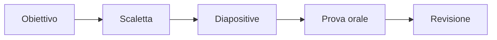

# Documenti, presentazioni e fogli di calcolo

## 1. Documenti

Un documento ben costruito separa contenuto e formattazione. Gli **stili** permettono di applicare lo stesso aspetto a titoli e paragrafi.

### 1.1 Struttura minima

- titolo;
- autore e data;
- sezioni ordinate;
- paragrafi brevi;
- immagini con didascalia;
- fonti;
- eventuale indice.

### 1.2 Formati

- `.odt` e `.docx`: documenti modificabili;
- `.pdf`: distribuzione di una versione stabile;
- `.txt`: testo senza formattazione.

Prima di esportare in PDF si controllano pagine, margini, immagini e collegamenti.

## 2. Presentazioni

Una presentazione sostiene l'esposizione orale. Non deve contenere tutto ciò che il relatore dirà.



Regole pratiche:

- una idea principale per diapositiva;
- caratteri leggibili;
- contrasto sufficiente;
- immagini utili e attribuite;
- pochi effetti;
- grafici accompagnati da un messaggio chiaro.

## 3. Foglio di calcolo

Un foglio è formato da celle organizzate in righe e colonne. Una cella può contenere testo, numero, data o formula.

### 3.1 Formule

Una formula inizia con `=`.

```text
=B2+C2
=MEDIA(B2:D2)
=MIN(B2:B20)
=MAX(B2:B20)
=CONTA.SE(B2:B20;">=6")
```

### 3.2 Riferimenti

- `A2`: riferimento relativo;
- `$A$2`: riferimento assoluto;
- `$A2` o `A$2`: riferimento misto.

Quando una formula viene copiata, i riferimenti relativi cambiano; quelli assoluti restano fissi.

### 3.3 Ordinare e filtrare

L'ordinamento cambia la disposizione delle righe. Il filtro mostra soltanto le righe che rispettano un criterio. Prima di ordinare si seleziona l'intera tabella, per evitare di separare dati collegati.

### 3.4 Grafici

| Obiettivo | Grafico consigliato |
|---|---|
| confrontare categorie | colonne o barre |
| mostrare un andamento | linee |
| osservare una relazione | dispersione |
| mostrare parti di un totale | torta, solo con poche categorie |

Un grafico deve avere titolo, unità di misura e legenda quando necessaria.

## 4. Collaborazione

I permessi più comuni sono:

- lettura;
- commento;
- modifica.

Si assegna il permesso minimo necessario. La cronologia delle versioni permette di controllare e recuperare modifiche, ma non sostituisce il backup.

## 5. Fonti e licenze

Quando si usa un testo, un'immagine o un dataset si indicano autore, titolo, provenienza e licenza.

**Gratuito** non significa **libero da riutilizzare**. Le licenze Creative Commons specificano quali usi siano consentiti. Il software open source rende disponibile il codice secondo una licenza; non coincide semplicemente con software gratuito.

## 6. Progetto

Realizza una breve indagine:

1. raccogli almeno venti dati;
2. organizzali in una tabella;
3. calcola almeno tre indicatori;
4. costruisci un grafico;
5. scrivi una relazione;
6. prepara una presentazione di cinque diapositive;
7. cita le fonti;
8. consegna anche il PDF finale.
