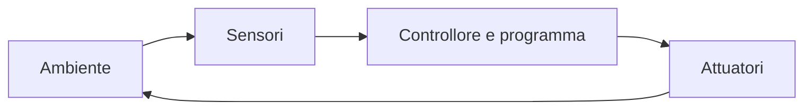
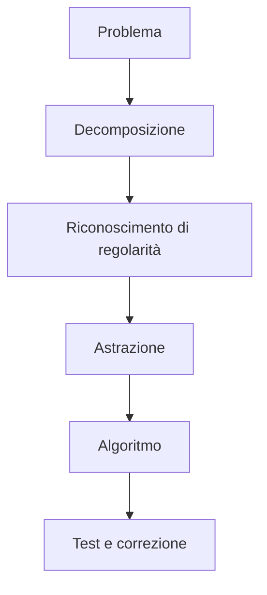
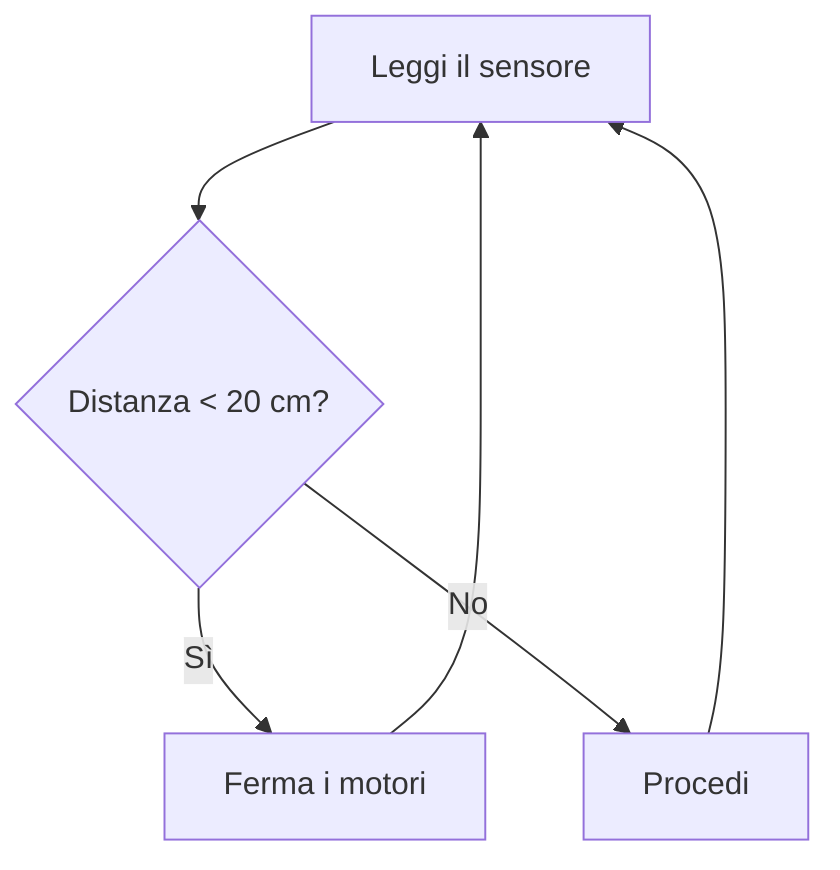
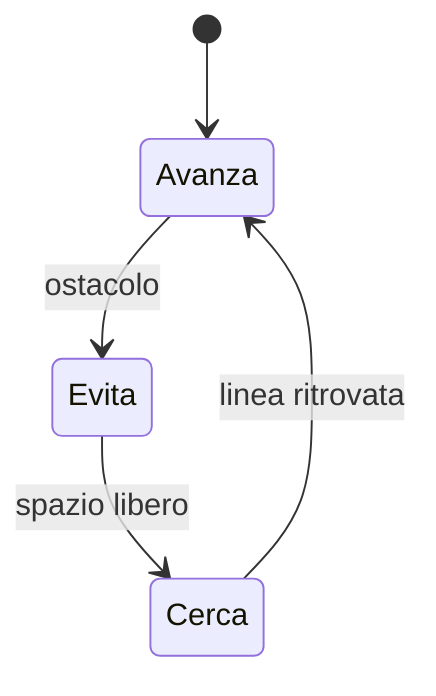
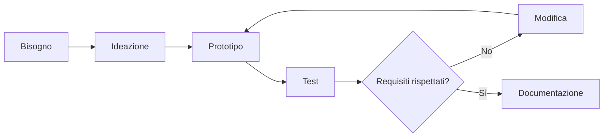

# Pensiero computazionale e robotica

## Obiettivi del percorso

Al termine del percorso lo studente saprà:

- descrivere un robot come sistema composto da struttura, sensori, controllore e attuatori;
- scomporre un problema in dati, azioni e processi;
- costruire e collaudare semplici meccanismi;
- programmare movimenti, luci e reazioni a sensori;
- documentare il progetto e correggere gli errori attraverso prove misurabili;
- lavorare in gruppo rispettando ruoli e norme di sicurezza.

## Percorso annuale di 30 ore

| Unità | Teoria | Laboratorio | Totale |
|---|---:|---:|---:|
| 1. Sistemi, robot e pensiero computazionale | 3 h | 2 h | 5 h |
| 2. Strutture, meccanismi e movimento | 2 h | 4 h | 6 h |
| 3. Sensori, attuatori e controllo | 3 h | 4 h | 7 h |
| 4. Programmazione del robot | 2 h | 5 h | 7 h |
| 5. Progetto, collaudo e documentazione | 1 h | 4 h | 5 h |
| **Totale** | **11 h** | **19 h** | **30 h** |

Le attività sono indipendenti da una marca specifica: possono essere adattate a kit educativi, simulatori o schede disponibili nel laboratorio.

## 1. Che cos'è un robot

Un robot è una macchina programmabile capace di percepire almeno in parte l'ambiente e di compiere azioni. Non tutti i robot hanno forma umana e non tutti usano intelligenza artificiale.



Componenti principali:

- **struttura**: telaio, ruote, giunti e supporti;
- **alimentazione**: batterie o alimentatore;
- **sensori**: misurano grandezze o rilevano eventi;
- **controllore**: esegue il programma;
- **attuatori**: producono movimento, luce o suono;
- **interfaccia**: consente all'utente di impartire comandi.

### Attività di osservazione

Analizza un robot domestico, industriale o educativo. Individua sensori, attuatori, fonte di energia, compito e rischi.

## 2. Pensiero computazionale

Il pensiero computazionale aiuta a formulare problemi in modo che una soluzione possa essere eseguita con precisione.



- **decomposizione**: dividere un compito in parti;
- **pattern**: riconoscere somiglianze;
- **astrazione**: conservare i dettagli utili;
- **algoritmo**: ordinare azioni non ambigue;
- **debugging**: trovare e correggere differenze tra risultato atteso e ottenuto.

### Laboratorio unplugged

Uno studente descrive come raggiungere un punto dell'aula usando soltanto i comandi `AVANTI`, `RUOTA_DESTRA`, `RUOTA_SINISTRA` e `STOP`. Un compagno esegue le istruzioni alla lettera. La classe individua ambiguità e migliora l'algoritmo.

## 3. Strutture e meccanismi

### Movimento

Un motore trasforma energia elettrica in movimento. Ruote e cingoli producono traslazione; ingranaggi e leve modificano velocità, coppia o direzione.

La velocità media è:

```text
velocità media = spazio percorso / tempo impiegato
```

In un robot a due ruote motrici:

| Motore sinistro | Motore destro | Movimento |
|---|---|---|
| avanti | avanti | procede diritto |
| fermo | avanti | curva a sinistra |
| avanti | fermo | curva a destra |
| indietro | avanti | ruota sul posto |

### Stabilità e attrito

La posizione del baricentro, la distanza tra le ruote e l'aderenza influenzano stabilità e precisione. Una struttura rigida non è sempre migliore: deve essere abbastanza resistente senza aumentare inutilmente massa e consumo.

### Laboratorio

Costruisci un veicolo e misura il tempo necessario per percorrere un metro con tre livelli di potenza. Ripeti ogni prova almeno tre volte, calcola la media e rappresenta i risultati in un grafico.

## 4. Sensori

Un sensore trasforma una grandezza fisica in un dato utilizzabile dal controllore.

| Sensore | Grandezza o evento | Possibile uso |
|---|---|---|
| pulsante | pressione | avvio o arresto |
| luce | intensità luminosa | lampada automatica |
| distanza | prossimità | evitare ostacoli |
| temperatura | temperatura | allarme termico |
| giroscopio | rotazione | mantenere l'orientamento |
| encoder | rotazione del motore | misurare percorso e velocità |

### Digitale e analogico

Un ingresso **digitale** distingue stati discreti, per esempio premuto/non premuto. Un ingresso **analogico** restituisce valori in un intervallo. La misura contiene sempre incertezza e può oscillare; per questo si utilizzano soglie, medie o isteresi.



### Laboratorio di calibrazione

Raccogli misure a distanze note, costruisci una tabella tra valore reale e valore letto, determina l'errore assoluto e scegli una soglia affidabile.

## 5. Attuatori

Gli attuatori convertono un comando in un'azione:

- motore in corrente continua: rotazione continua;
- servomotore: raggiungimento di una posizione angolare;
- motore passo-passo: movimento in passi controllati;
- LED e display: segnalazione visiva;
- buzzer: segnalazione acustica.

Un controllore spesso non può alimentare direttamente un motore: può essere necessario un circuito di pilotaggio. Prima di collegare componenti si controllano tensione, corrente e polarità.

## 6. Programmare il comportamento

Un programma robotico è normalmente ciclico:

1. legge i sensori;
2. aggiorna lo stato;
3. decide l'azione;
4. comanda gli attuatori;
5. ripete.

Esempio Python che simula un robot antirimbalzo:

```python
def scegli_azione(distanza_cm):
    if distanza_cm < 0:
        raise ValueError("La distanza non può essere negativa")
    if distanza_cm < 15:
        return "INDIETRO"
    if distanza_cm < 30:
        return "RUOTA_DESTRA"
    return "AVANTI"


misure = [80, 25, 10, 45]
for distanza in misure:
    print(f"{distanza:>3} cm -> {scegli_azione(distanza)}")
```

### Stato e memoria

Per alcuni comportamenti non basta la misura corrente. Un robot può ricordare se sta cercando una linea, evitando un ostacolo o tornando al percorso.



### Laboratorio

Implementa in un ambiente visuale o testuale:

1. movimento per un tempo stabilito;
2. quadrato con quattro lati e quattro rotazioni;
3. arresto mediante pulsante;
4. evitamento di un ostacolo;
5. segnalazione luminosa dello stato.

## 7. Ciclo di progettazione



Un requisito deve essere verificabile. “Il robot funziona bene” è vago; “si arresta ad almeno 15 cm dall'ostacolo in quattro prove su cinque” può essere collaudato.

### Diario di laboratorio

Per ogni prova registra:

- data e componenti;
- versione del programma;
- ipotesi;
- procedura;
- misure;
- risultato atteso e ottenuto;
- errore osservato;
- modifica successiva.

## 8. Sicurezza e collaborazione

- Spegni l'alimentazione prima di modificare i collegamenti.
- Non bloccare manualmente motori in movimento.
- Mantieni ordinata l'area di prova.
- Non usare batterie danneggiate.
- Ferma immediatamente il sistema in caso di surriscaldamento o odore anomalo.
- Assegna ruoli a rotazione: progettista, costruttore, programmatore, collaudatore e documentarista.

## 9. Progetto finale

Realizza un robot che risponda a un bisogno, per esempio:

- veicolo che evita ostacoli;
- sistema di illuminazione automatica;
- dispositivo che segnala una distanza di sicurezza;
- piccolo sistema per monitorare una pianta.

La consegna comprende:

1. definizione del problema e requisiti misurabili;
2. schema di sensori, controllore e attuatori;
3. algoritmo o diagramma di flusso;
4. prototipo;
5. piano di collaudo con almeno cinque prove;
6. tabella dei risultati;
7. analisi degli errori e proposte di miglioramento;
8. presentazione finale.

## Verifica conclusiva

1. Distingui sensore, controllore e attuatore.
2. Spiega la differenza tra ingresso analogico e digitale.
3. Perché un sensore deve essere calibrato?
4. Progetta un algoritmo che accenda un LED quando la luce scende sotto una soglia.
5. Scrivi due requisiti misurabili per un robot antirimbalzo.
6. Descrivi una prova che permetta di valutare la precisione di movimento.

