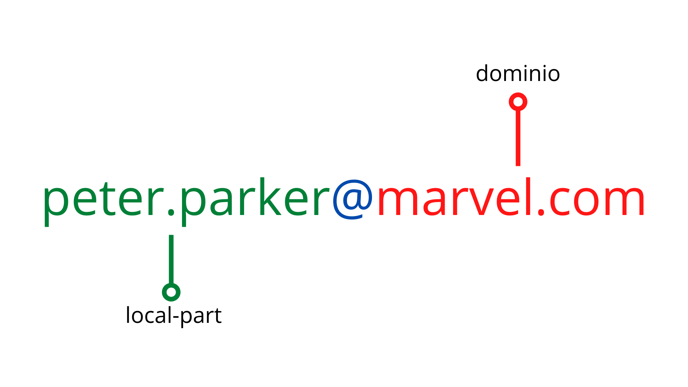

# 🌐 Telecomunicazioni e Reti di Comunicazione

## 📡 **Modulo 1: Le reti di comunicazione** 

### 1.1 Che cos'è una rete di comunicazione 🔗

#### 1.1.1 Definizione e scopo delle reti

Una rete di comunicazione è come un sistema di strade che collega diverse città, permettendo alle persone di viaggiare, scambiare merci e comunicare tra loro, ma nel mondo digitale queste "strade" trasportano informazioni sotto forma di dati invece di automobili e persone. Il concetto fondamentale è semplice: invece di dover fisicamente portare un messaggio da un posto all'altro come facevano i messaggeri a cavallo nel Medioevo, le reti moderne permettono di inviare istantaneamente qualsiasi tipo di informazione - testi, immagini, video, suoni - attraverso collegamenti elettronici, ottici o wireless. L'obiettivo principale di ogni rete è condividere risorse: potete accedere a file memorizzati su computer lontani, utilizzare stampanti collegate in uffici dall'altra parte del mondo, o guardare un video registrato su un server in un altro continente come se fosse memorizzato sul vostro smartphone. Le reti trasformano dispositivi isolati in nodi di un sistema globale interconnesso, dove ogni computer, smartphone, tablet o smartwatch diventa parte di una gigantesca ragnatela digitale che abbraccia l'intero pianeta. È incredibile pensare che quando inviate un messaggio su WhatsApp, quei dati potrebbero attraversare oceani, continenti e decine di dispositivi diversi prima di raggiungere il destinatario, tutto in una frazione di secondo!

#### 1.1.2 Vantaggi e svantaggi delle reti

Le reti di comunicazione hanno rivoluzionato ogni aspetto della società moderna, portando vantaggi straordinari ma anche nuove sfide e rischi che dobbiamo imparare a gestire con saggezza. I vantaggi sono evidenti nella vostra vita quotidiana: potete istantaneamente videochiamare amici dall'altra parte del mondo, accedere a biblioteche digitali con milioni di libri, guardare film in streaming, collaborare in tempo reale su progetti scolastici con compagni di classe, e avere accesso immediato a qualsiasi informazione immaginabile. Le reti hanno democratizzato l'accesso alla conoscenza: oggi un ragazzo in un piccolo paese può seguire corsi delle migliori università del mondo, imparare lingue straniere con madrelingua, o sviluppare competenze professionali che prima erano riservate a pochi privilegiati. Tuttavia, questa interconnessione globale porta anche svantaggi significativi: dipendenza tecnologica che può creare ansia quando la connessione manca, rischi per la privacy con dati personali costantemente raccolti e analizzati, cyberbullismo e disinformazione che si diffondono rapidamente, e la perdita di alcune abilità sociali tradizionali come la conversazione faccia a faccia. Le reti richiedono anche enormi quantità di energia per funzionare, contribuendo ai problemi ambientali, e creano nuove forme di disuguaglianza tra chi ha accesso alla banda larga e chi no.

### 1.2 Tipi di reti per estensione geografica 🗺️

#### 1.2.1 PAN (Personal Area Network)

Le PAN sono le reti più piccole e intime che ci circondano quotidianamente, create dai nostri dispositivi personali che comunicano tra loro in uno spazio molto ristretto, tipicamente entro un raggio di 10 metri, come una bolla tecnologica personale che ci segue ovunque andiamo. Pensate alla vostra routine mattutina: lo smartphone si connette automaticamente agli AirPods via Bluetooth per ascoltare musica, il fitness tracker sul polso sincronizza i dati del sonno con l'app sul telefono, e il laptop si collega al mouse wireless senza fili visibili. Questa è una PAN in azione! La tecnologia più comune per le PAN è il Bluetooth, che permette a dispositivi di "riconoscersi" e collegarsi automaticamente quando sono abbastanza vicini, proprio come persone che si salutano quando si incontrano per strada. Le PAN moderne stanno diventando sempre più sofisticate: alcuni dispositivi possono formare reti mesh dove ogni dispositivo funge da ripetitore per gli altri, estendendo il raggio e migliorando l'affidabilità. Un esempio interessante sono gli AirTags di Apple o i Galaxy SmartTags di Samsung, che creano una rete globale di dispositivi che possono aiutarvi a ritrovare oggetti perduti ovunque nel mondo. Il futuro delle PAN include tecnologie come il Li-Fi (comunicazione tramite luce LED) e reti di sensori indossabili che monitoreranno costantemente la nostra salute e il nostro benessere.

#### 1.2.2 LAN (Local Area Network)

Le LAN rappresentano le reti "di casa" o "del quartiere digitale", coprendo tipicamente un edificio, una scuola, un ufficio o un campus universitario, e sono probabilmente il tipo di rete con cui interagite più frequentemente senza nemmeno rendervene conto. Quando a scuola vi collegate al WiFi dell'istituto, state accedendo alla LAN scolastica che connette tutte le aule, gli uffici amministrativi, la biblioteca e i laboratori informatici, permettendo di condividere risorse come stampanti, proiettori interattivi e server con i materiali didattici. Le LAN domestiche sono altrettanto comuni: il router WiFi di casa crea una LAN che collega smartphone, laptop, smart TV, console da gioco, assistenti vocali come Alexa, e sempre più elettrodomestici "intelligenti" come frigoriferi, lavatrici e sistemi di sicurezza. La velocità delle LAN è tipicamente molto alta (da 100 Mbps a diversi Gbps) perché i dispositivi sono fisicamente vicini e utilizzano cavi Ethernet o segnali WiFi potenti. Un aspetto interessante delle LAN moderne è che possono essere "segmentate" in sotto-reti: ad esempio, la rete degli studenti può essere separata da quella degli insegnanti per motivi di sicurezza, o i dispositivi IoT (Internet of Things) possono essere isolati per proteggere i computer principali da potenziali vulnerabilità. Le LAN sono gestite localmente, il che significa che l'amministratore di rete (spesso l'insegnante di informatica a scuola) ha controllo completo su chi può accedere e cosa può fare.

#### 1.2.3 MAN (Metropolitan Area Network)

Le MAN sono le reti "cittadine" che collegano diverse LAN all'interno di una città o area metropolitana, funzionando come una rete di trasporto pubblico digitale che permette a quartieri diversi di comunicare efficientemente tra loro. Immaginate una grande città come Milano o Roma: ogni quartiere ha le proprie reti locali (scuole, uffici, centri commerciali), ma la MAN è l'infrastruttura che permette a una scuola in centro di comunicare rapidamente con un ospedale in periferia, o a diverse sedi universitarie di condividere risorse bibliotecarie digitali. Le MAN utilizzano tipicamente tecnologie di telecomunicazione avanzate come fibre ottiche ad alta capacità, collegamenti a microonde, o reti WiMAX che possono coprire distanze di decine di chilometri mantenendo velocità elevate. Un esempio concreto di MAN è la rete che collega tutti gli uffici comunali di una città: il municipio centrale, le biblioteche pubbliche, i vigili urbani, gli uffici anagrafici nei vari quartieri, tutti interconnessi per permettere ai cittadini di accedere ai servizi pubblici da qualsiasi punto della città. Le MAN sono spesso gestite da enti pubblici o da grandi provider di telecomunicazioni, e richiedono investimenti significativi in infrastrutture perché devono garantire alta affidabilità e prestazioni costanti per servizi critici come emergenze mediche, sicurezza pubblica e amministrazione civica.

#### 1.2.4 WAN (Wide Area Network)

Le WAN sono le autostrade digitali che attraversano continenti e oceani, collegando paesi e regioni lontane in una rete globale che rende possibile la comunicazione istantanea tra qualsiasi punto del pianeta. Quando inviate un messaggio Instagram a un amico che studia all'estero, o quando guardate un video di YouTube caricato da un creator coreano, state utilizzando una WAN che potrebbe far viaggiare i vostri dati attraverso cavi sottomarini nell'Oceano Pacifico, stazioni satellitari nello spazio, e centinaia di router e switch distribuiti su diversi continenti. Le WAN sono costruite e gestite da grandi compagnie di telecomunicazioni internazionali che investono miliardi di euro in infrastrutture come cavi sottomarini in fibra ottica (alcuni lunghi migliaia di chilometri), stazioni satellitari geostazionarie, e centri di commutazione continentali. La velocità e l'affidabilità delle WAN variano enormemente: collegamenti tra grandi città in paesi sviluppati possono raggiungere velocità di terabit al secondo, mentre aree remote potrebbero dipendere da collegamenti satellitari più lenti ma comunque funzionali. Internet stesso è la WAN più grande e complessa mai costruita dall'umanità, una rete di reti che collega miliardi di dispositivi in tutto il mondo. Le WAN devono affrontare sfide uniche come latenza (il tempo necessario per i dati di attraversare grandi distanze), differenze di fuso orario, regolamentazioni governative diverse, e la necessità di ridondanza per garantire che la comunicazione continui anche se alcuni collegamenti si interrompono.

#### 1.2.5 GAN (Global Area Network)

Le GAN rappresentano l'evoluzione più avanzata delle reti di comunicazione, estendendosi letteralmente oltre i confini terrestri per includere satelliti, stazioni spaziali e future colonie su altri pianeti in un sistema di comunicazione veramente universale. Mentre le WAN si limitano principalmente alla superficie terrestre e all'orbita bassa, le GAN abbracciano l'intero sistema solare e oltre, utilizzando tecnologie di comunicazione spaziale avanzate come laser ad alta potenza, reti di satelliti in costellazione, e sistemi di comunicazione quantistica che potrebbero un giorno permettere comunicazioni istantanee indipendentemente dalla distanza. Progetti come Starlink di SpaceX stanno già creando le fondamenta di una GAN con migliaia di satelliti in orbita bassa che forniscono accesso internet anche nelle regioni più remote della Terra, mentre agenzie spaziali pianificano reti di comunicazione per le future missioni su Marte e sulla Luna. Le GAN devono affrontare sfide uniche come i ritardi di comunicazione dovuti alle enormi distanze (un messaggio dalla Terra a Marte può impiegare fino a 24 minuti), l'interferenza delle radiazioni cosmiche, e la necessità di sistemi completamente autonomi che possano funzionare per anni senza manutenzione umana. Il concetto di GAN si estende anche alle reti neurali artificiali globali e ai sistemi di intelligenza artificiale distribuiti che potrebbero un giorno formare una "mente planetaria" interconnessa. Anche se oggi le GAN sono ancora largamente teoriche o in fase sperimentale, rappresentano il futuro delle comunicazioni umane man mano che la nostra specie diventa una civiltà multi-planetaria.

### 1.3 Componenti fondamentali delle reti 🔧

#### 1.3.1 Dispositivi di rete: router, switch, hub

I dispositivi di rete sono i componenti hardware che rendono possibile il funzionamento delle reti, ognuno con ruoli specifici e caratteristiche uniche, paragonabili agli elementi del sistema circolatorio umano dove arterie, vene e capillari hanno funzioni diverse ma complementari per far fluire il sangue in tutto il corpo.

#### 1.3.2 Mezzi di trasmissione: cavi, fibra ottica, wireless

I mezzi di trasmissione sono i "percorsi fisici" che i dati seguono per viaggiare da un dispositivo all'altro, proprio come le strade, i fiumi e i binari ferroviari permettono alle persone e alle merci di spostarsi nel mondo reale, ma nel caso delle reti digitali trasportano informazioni sotto forma di segnali elettrici, luminosi o elettromagnetici. I cavi in rame, discendenti diretti del vecchio telefono di casa, utilizzano impulsi elettrici per trasmettere dati e sono ancora molto comuni nelle reti Ethernet domestiche e aziendali: quando collegate il computer al router con un cavo di rete, state utilizzando questa tecnologia che può raggiungere velocità di 1-10 Gbps su distanze moderate. La fibra ottica rappresenta invece il futuro delle comunicazioni: sottilissimi fili di vetro purissimo trasportano informazioni sotto forma di impulsi luminosi laser, raggiungendo velocità straordinarie (fino a terabit al secondo) su distanze enormi con perdite minime - è come avere un tubo di luce perfetto che attraversa continenti! Le comunicazioni wireless utilizzano onde elettromagnetiche (radio, microonde, infrarossi) per trasmettere dati attraverso l'aria senza bisogno di connessioni fisiche: il WiFi di casa vostra, il Bluetooth degli auricolari, il 4G dello smartphone, e persino i satelliti GPS funzionano tutti tramite onde invisibili che viaggiano alla velocità della luce. Ogni mezzo ha vantaggi e svantaggi: i cavi sono affidabili ma limitanti, la fibra è velocissima ma costosa da installare, il wireless è conveniente ma può essere interferito da ostacoli fisici o altre trasmissioni.

#### 1.3.3 Protocolli di comunicazione

I protocolli di comunicazione sono le "regole del galateo digitale" che permettono a dispositivi diversi, prodotti da aziende diverse, in paesi diversi, di comprendersi perfettamente quando comunicano attraverso una rete, proprio come le regole del traffico stradale permettono a automobilisti di tutto il mondo di guidare in sicurezza anche in paesi stranieri. Il protocollo più importante è TCP/IP (Transmission Control Protocol/Internet Protocol), che è fondamentalmente la "lingua franca" di Internet: stabilisce come i dati devono essere impacchettati, indirizzati, trasmessi e riassemblati, garantendo che un messaggio inviato da uno smartphone Android in Italia arrivi perfettamente integro a un iPhone negli Stati Uniti. HTTP (HyperText Transfer Protocol) è il protocollo che permette di navigare sul Web: ogni volta che digitate un indirizzo che inizia con "http://" o "https://", state usando questo protocollo per richiedere pagine web a server remoti. Il protocollo SMTP gestisce l'invio delle email, mentre POP3 e IMAP si occupano di riceverle e organizzarle. Esistono centinaia di protocolli specializzati: FTP per trasferire file, DNS per tradurre nomi di siti web in indirizzi numerici, DHCP per assegnare automaticamente indirizzi IP ai dispositivi che si collegano a una rete. Questi protocolli sono stratificati come le bambole russe: protocolli di basso livello gestiscono i dettagli fisici della trasmissione, mentre protocolli di alto livello si occupano delle funzionalità che vedete e utilizzate quotidianamente.

### 🤔 **Domande di verifica Modulo 1**

1. **Spiegate con un'analogia** la differenza tra PAN, LAN, MAN, WAN e GAN, utilizzando esempi concreti dalla vostra vita quotidiana.

2. **Scenari di rete**: Se doveste organizzare la rete informatica per una scuola di 1000 studenti, che tipo di rete usereste e perché? Quali dispositivi di rete servirebbero?

3. **Confronto tecnologico**: Quali sono i vantaggi e svantaggi di cavi in rame, fibra ottica e comunicazioni wireless? In che situazioni usereste ciascuna tecnologia?

4. **Protocolli di comunicazione**: Perché è importante che esistano protocolli standardizzati? Cosa succederebbe se ogni produttore utilizzasse protocolli proprietari diversi?

5. **Rete del futuro**: Come immaginate l'evoluzione delle reti di comunicazione nei prossimi 20 anni? Quali nuove applicazioni potrebbero diventare possibili?

---

## 🌍 **Modulo 2: Internet e le connessioni moderne** 

### 2.1 Come ci connettiamo a Internet 💻

#### 2.1.1 Che cos'è un Internet Service Provider (ISP)

Un Internet Service Provider è sostanzialmente il vostro "fornitore di accesso al mondo digitale", una compagnia che possiede le infrastrutture fisiche e i collegamenti necessari per portare Internet fino a casa vostra, proprio come l'azienda elettrica porta l'elettricità o l'acquedotto porta l'acqua potabile nelle vostre abitazioni. Gli ISP sono anelli fondamentali nella catena che collega il vostro computer alla rete globale: possiedono enormi centri dati pieni di server, cavi sotterranei che attraversano città e paesi, torri per le comunicazioni wireless, e accordi commerciali con altri ISP internazionali per garantire che i vostri dati possano raggiungere qualsiasi destinazione nel mondo. In Italia, provider come TIM, Vodafone, Fastweb e WindTre investono miliardi di euro ogni anno per costruire e mantenere queste infrastrutture: dalle centrali telefoniche di quartiere che portano la fibra ottica fino al vostro palazzo, alle antenne 4G e 5G sui tetti, ai cavi sottomarini che collegano l'Europa all'America attraverso l'Oceano Atlantico. Gli ISP offrono diversi tipi di connessione (ADSL, fibra, 4G, satellite) con velocità e prezzi variabili, e spesso forniscono anche servizi aggiuntivi come email, hosting di siti web, sicurezza informatica e televisione digitale. La scelta dell'ISP influenza direttamente la vostra esperienza online: velocità di download e upload, latenza per i videogiochi, affidabilità durante i temporali, e persino quali contenuti potete accedere, dato che alcuni ISP implementano filtri o limitazioni su certi tipi di traffico dati.

#### 2.1.2 La tecnologia ADSL e le varianti xDSL

L'ADSL (Asymmetric Digital Subscriber Line) è stata la tecnologia che ha democratizzato Internet ad alta velocità, trasformando i vecchi cavi telefonici in rame delle nostre case da semplici trasportatori di voce in autostrade digitali capaci di portare dati a velocità impensabili per l'epoca. La genialità dell'ADSL sta nell'aver trovato il modo di far coesistere telefonate e traffico internet sullo stesso filo di rame: utilizzando frequenze diverse (come stazioni radio diverse che trasmettono su canali diversi), il sistema separa i segnali vocali (frequenze basse) dai dati internet (frequenze più alte) attraverso dispositivi chiamati filtri o splitter. L'aspetto "asimmetrico" della tecnologia riflette l'uso tipico di Internet: la maggior parte degli utenti scarica molto più di quanto carica (pensate a streaming video, download di giochi, navigazione web), quindi l'ADSL dedica più banda al download (tipicamente 7-20 Mbps) rispetto all'upload (0.5-1 Mbps). Le varianti xDSL includono VDSL (Very-high-bit-rate DSL) che può raggiungere 50-100 Mbps sfruttando frequenze ancora più elevate, SHDSL per connessioni simmetriche professionali, e VDSL2 che preparava il terreno per la fibra ottica. La limitazione principale delle tecnologie DSL è la distanza: più siete lontani dalla centrale telefonica, più il segnale si degrada, creando il famoso "digital divide" tra zone urbane ben servite e aree rurali con connessioni lente. Oggi l'ADSL sta gradualmente cedendo il passo alla fibra ottica, ma ha avuto un ruolo storico fondamentale nel portare Internet veloce nelle case di milioni di italiani.

#### 2.1.3 Fibra ottica: FTTH, FTTC, FTTS

La fibra ottica rappresenta la rivoluzione delle telecomunicazioni moderne, sostituendo i vecchi cavi in rame con filamenti di vetro purissimo sottili come capelli umani che trasportano informazioni sotto forma di impulsi luminosi laser, raggiungendo velocità e affidabilità precedentemente impensabili. Le diverse sigle (FTTH, FTTC, FTTS) indicano quanto "vicino" la fibra arriva alla vostra abitazione, un po' come dire se l'autostrada arriva fino al vostro garage o si ferma all'ingresso del quartiere costringendovi a percorrere l'ultimo tratto su strade più lente. FTTH (Fiber To The Home) è la soluzione premium: la fibra ottica arriva direttamente dentro casa vostra, permettendo velocità simmetriche di 1 Gbps o più, latenza bassissima ideale per gaming competitivo e videoconferenze professionali, e prestazioni che non degradano con la distanza o le condizioni atmosferiche. FTTC (Fiber To The Cabinet) è un compromesso economico: la fibra arriva fino all'armadio stradale del vostro quartiere, poi i vecchi cavi in rame completano il percorso fino a casa, limitando le velocità a 100-200 Mbps ma costando molto meno da installare. FTTS (Fiber To The Street) è una variante in cui la fibra si ferma ancora più lontano dalla vostra abitazione. La differenza in termini di esperienza utente è drammatica: con FTTH potete scaricare un film in 4K in pochi minuti, fare streaming simultaneo su più dispositivi senza rallentamenti, e lavorare da casa con videoconferenze cristalline, mentre con FTTC potreste sperimentare rallentamenti durante le ore di punta quando tutti i vicini usano Internet contemporaneamente.

### 2.2 Le reti mobili 📱

#### 2.2.1 Evoluzione delle reti mobili: da 1G a 5G

L'evoluzione delle reti mobili racconta la storia dell'umanità che diventa sempre più connessa e mobile, una progressione tecnologica che in appena quarant'anni ci ha portato dai primi telefoni cellulari grandi come mattoni che permettevano solo chiamate vocali di qualità discutibile, agli smartphone moderni che sono computer tascabili più potenti di quelli che portarono l'uomo sulla Luna. Il 1G degli anni '80 era puramente analogico e permetteva solo chiamate vocali con copertura limitata e qualità audio spesso pessima, ma rappresentava una rivoluzione: per la prima volta nella storia umana potevate chiamare qualcuno senza essere fisicamente collegati a un filo! Il 2G degli anni '90 introdusse la tecnologia digitale e il concetto di SMS, trasformando i telefoni in dispositivi di messaggistica e aprendo la strada ai primi servizi dati come le suonerie scaricabili. Il 3G del nuovo millennio portò Internet mobile con velocità sufficienti per email, navigazione web basilare e persino i primi video a bassa risoluzione, mentre il 4G LTE degli anni 2010 rese possibile lo streaming video HD, i social network sempre connessi, e l'ecosistema di app che oggi diamo per scontato. Ogni generazione ha rappresentato un salto quantico non solo in velocità ma in possibilità: il 2G ha creato la cultura degli SMS, il 3G ha reso possibili i primi smartphone, il 4G ha dato vita all'era delle app e dei social network sempre attivi. Il 5G promette di fare lo stesso per Internet of Things, realtà virtuale, guida autonoma e applicazioni che ancora non riusciamo nemmeno a immaginare.

#### 2.2.2 Come funziona il 4G LTE

Il 4G LTE (Long Term Evolution) è la tecnologia che ha reso possibile l'esplosione degli smartphone moderni e dell'Internet mobile, trasformando i telefoni da semplici dispositivi di comunicazione in finestre sempre aperte sul mondo digitale, capaci di fornire velocità di connessione paragonabili alle ADSL domestiche di qualche anno fa. La "magia" del 4G sta nell'uso intelligente dello spettro radioelettrico: invece di utilizzare una singola frequenza come facevano le tecnologie precedenti, il 4G usa una tecnica chiamata OFDMA (Orthogonal Frequency-Division Multiple Access) che divide la banda disponibile in centinaia di piccoli canali paralleli, permettendo a migliaia di utenti di condividere simultaneamente la stessa antenna senza interferirsi a vicenda. È come trasformare una strada a una corsia in un'autostrada a 100 corsie! Il sistema utilizza anche tecnologie avanzate come MIMO (Multiple Input, Multiple Output) con antenne multiple che inviano e ricevono dati simultaneamente su percorsi diversi, e algoritmi di adattamento che modificano automaticamente potenza e frequenza di trasmissione basandosi sulla qualità del segnale e sulla posizione dell'utente. Quando vi spostate mentre utilizzate il 4G, il sistema coordina automaticamente il "passaggio di consegne" tra antenne diverse senza interrompere la connessione, un processo chiamato handover che avviene centinaia di volte durante un viaggio in auto. Le velocità teoriche del 4G possono raggiungere i 150-300 Mbps in download, ma nella realtà dipendono da fattori come distanza dall'antenna, numero di utenti connessi, condizioni atmosferiche e ostacoli fisici come edifici o colline.

#### 2.2.3 5G: velocità, latenza e nuove possibilità

Il 5G non è semplicemente una versione più veloce del 4G, ma rappresenta una rivoluzione tecnologica che promette di trasformare radicalmente il modo in cui viviamo, lavoriamo e interagiamo con la tecnologia, aprendo possibilità che oggi sembrano fantascienza ma che domani diventeranno routine quotidiana. Le velocità teoriche del 5G possono raggiungere i 10-20 Gbps, cioè 100 volte più veloci del 4G: questo significa scaricare un film in 4K in pochi secondi, ma soprattutto rende possibili applicazioni che richiedono enormi quantità di dati in tempo reale come la realtà virtuale immersiva, la chirurgia robotica a distanza, e i veicoli autonomi che comunicano istantaneamente tra loro e con l'infrastruttura stradale. La vera rivoluzione del 5G è però la latenza ultra-bassa (1-5 millisecondi invece dei 30-50 del 4G): questo tempo di reazione quasi istantaneo è fondamentale per applicazioni critiche come il controllo remoto di macchinari industriali, i sistemi di sicurezza autonomi, e le interfacce neurali che collegano direttamente il cervello umano ai computer. Il 5G utilizza frequenze molto più alte del 4G (onde millimetriche) che permettono velocità straordinarie ma hanno range limitato, richiedendo una rete molto più densa di antenne piccole e intelligenti distribuite capillarmente nelle città. Le nuove possibilità includono città intelligenti dove tutto è connesso e coordinato in tempo reale, fabbriche completamente automatizzate, medicina preventiva con sensori che monitorano costantemente la salute, e esperienze di intrattenimento completamente immersive che mischiano mondo reale e virtuale.

#### 2.2.4 Il futuro: verso il 6G

Il 6G è ancora in fase di ricerca e sviluppo, ma le aspettative sono così ambiziose da sembrare fantascienza: velocità di 1 terabit al secondo (100 volte più veloci del 5G), latenza sub-millisecondo che permette controllo in tempo reale anche su distanze intercontinentali, e integrazione completa tra mondo fisico e digitale attraverso hologrammi, interfacce neurali dirette e realtà mista indistinguibile dalla realtà fisica. I ricercatori immaginano reti 6G che utilizzano intelligenza artificiale avanzata per auto-ottimizzarsi continuamente, satelliti in orbita bassa per copertura globale uniforme, e tecnologie quantistiche per sicurezza assoluta e capacità di calcolo distribuite. Le applicazioni del 6G potrebbero includere "telepresenza" olografica dove persone fisicamente distanti possono interagire come se fossero nella stessa stanza, "gemelli digitali" delle città intere per simulazione e pianificazione urbana, e sistemi di controllo ambientale globali per combattere il cambiamento climatico coordinando automaticamente miliardi di dispositivi. Tuttavia, il 6G solleva anche questioni importanti su privacy, sicurezza, consumo energetico e impatto sociale: una connettività così pervasiva potrebbe creare nuove forme di dipendenza tecnologica e disuguaglianza digitale. Il 6G dovrebbe diventare commercialmente disponibile intorno al 2030, ma la ricerca e standardizzazione iniziano già oggi per affrontare le sfide tecniche e sociali di una società iperconnessa.

### 2.3 Internet vs World Wide Web 🌐

#### 2.3.1 La differenza tra Internet e Web

Una delle confusioni più comuni nel mondo digitale è l'uso intercambiabile dei termini "Internet" e "Web", quando in realtà sono due cose completamente diverse anche se strettamente collegate, un po' come confondere l'intero sistema stradale mondiale con le automobili che ci viaggiano sopra. Internet è l'infrastruttura fisica e logica globale: i cavi sottomarini che attraversano gli oceani, i router che dirigono il traffico dati, i protocolli che permettono ai computer di comunicare, i data center che ospitano i server, e tutti i dispositivi connessi dal vostro smartphone ai supercomputer della NASA. È una rete di reti che esiste dal 1969 e che trasporta molti tipi diversi di traffico: email, videochiamate, aggiornamenti di app, backup su cloud, streaming musicale, e centinaia di altri servizi. Il World Wide Web, inventato da Tim Berners-Lee nel 1989, è invece un servizio che utilizza Internet per funzionare: è il sistema di pagine web collegate tra loro tramite hyperlink, accessibili attraverso browser come Chrome, Firefox o Safari utilizzando indirizzi che iniziano con "http://" o "https://". Quando "navigate su Internet" in realtà state usando il Web, che rappresenta solo una frazione del traffico totale di Internet. Altri servizi che utilizzano Internet ma non fanno parte del Web includono email (che usa i propri protocolli), streaming video diretto, videogiochi online, aggiornamenti del sistema operativo, e comunicazioni machine-to-machine dell'Internet of Things. È come dire che le automobili utilizzano le strade ma non sono le strade stesse!

#### 2.3.2 Come funziona una ricerca su Google

Quando digitate una domanda nella barra di ricerca di Google e premete Invio, scatenate una cascata di operazioni tecnologiche incredibilmente complesse che avvengono in frazioni di secondo, coinvolgendo migliaia di computer distribuiti in tutto il mondo per fornirvi risultati pertinenti tra miliardi di pagine web esistenti. Il primo passo avviene ancora prima che premiate Invio: Google Suggest analizza in tempo reale quello che state digitando e confronta con miliardi di ricerche precedenti per suggerirvi completamenti automatici, utilizzando algoritmi di machine learning che hanno "imparato" cosa cercano tipicamente le persone. Quando confermate la ricerca, la vostra query viene inviata ai data center di Google più vicini geograficamente (per ridurre la latenza), dove algoritmi sofisticatissimi analizzano le vostre parole chiave, interpretano l'intento della ricerca, e consultano un indice gigantesco che contiene informazioni su praticamente ogni pagina web pubblica esistente. Questo indice è costantemente aggiornato da "spider" o "crawler", software automatici che seguono metodicamente ogni link su Internet per scoprire nuove pagine e aggiornamenti. L'algoritmo di ranking (di cui PageRank è solo una componente) valuta centinaia di fattori per ogni pagina: rilevanza del contenuto, autorevolezza del sito, velocità di caricamento, ottimizzazione mobile, freschezza delle informazioni, posizione geografica dell'utente, e persino la vostra cronologia di ricerca personale. I risultati vengono quindi personalizzati per voi e inviati al vostro browser, tutto in meno di mezzo secondo. È un'orchestra tecnologica che coordina hardware, software, algoritmi di intelligenza artificiale e infrastrutture globali per dare l'impressione di una ricerca "istantanea" in quello che è effettivamente l'archivio di informazioni più grande mai creato dall'umanità.

#### 2.3.3 I domini e gli indirizzi IP

I domini e gli indirizzi IP sono i due sistemi di indirizzamento che permettono ai computer di trovarsi e comunicare nella vastità di Internet, funzionando come un doppio sistema di navigazione dove ogni destinazione ha sia un indirizzo numerico preciso che un nome facile da ricordare, proprio come ogni casa ha sia un indirizzo postale esatto che un nome familiare per chi ci abita. Gli indirizzi IP (Internet Protocol) sono sequenze numeriche uniche che identificano ogni dispositivo connesso a Internet: IPv4 utilizza numeri come 172.217.14.110, mentre il più moderno IPv6 usa sequenze più lunghe per gestire l'esplosione di dispositivi connessi. Questi numeri sono perfetti per i computer ma impossibili da ricordare per gli esseri umani, quindi negli anni '80 fu inventato il DNS (Domain Name System), un sistema che traduce nomi comprensibili come "google.com" negli indirizzi IP corrispondenti. I domini hanno una struttura gerarchica: ".com", ".org", ".it" sono domini di primo livello (TLD), "google" è il dominio di secondo livello, e "www" è un sottodominio. Quando digitate un indirizzo web, il vostro computer interroga automaticamente server DNS distribuiti globalmente per ottenere l'indirizzo IP corrispondente, un processo che avviene in millisecondi ma che coinvolge una catena di server DNS dal vostro provider Internet fino ai server autoritativi che gestiscono quel dominio specifico. Il sistema DNS è fondamentale per il funzionamento di Internet: se dovesse smettere di funzionare, potreste ancora raggiungere i siti web digitando direttamente gli indirizzi IP, ma Internet diventerebbe praticamente inutilizzabile per l'utente medio. È come avere sia i nomi delle strade che le coordinate GPS: entrambi vi portano a destinazione, ma uno è molto più facile da usare!

#### 2.3.4 I browser web: le finestre su Internet

I browser web sono probabilmente gli strumenti software più utilizzati al mondo dopo i sistemi operativi, fungendo da intermediari universali tra voi e l'immensa ricchezza di contenuti disponibili sul World Wide Web, trasformando codice HTML complesso, script JavaScript sofisticati, e dati multimediali in pagine web interattive e visivamente accattivanti che potete navigare intuitivamente. Chrome, Firefox, Safari, Edge, e altri browser moderni sono molto più di semplici "visualizzatori di pagine": sono ecosistemi software completi che includono motori di rendering per interpretare il codice web, interpreti JavaScript per eseguire applicazioni web avanzate, sistemi di gestione della sicurezza per proteggere dalle minacce online, e architetture plugin per estendere le funzionalità con componenti aggiuntivi. La "magia" di un browser avviene quando digitate un indirizzo web: il software contatta automaticamente i server DNS per tradurre il nome del sito in indirizzo IP numerico, stabilisce una connessione sicura con il server web di destinazione, richiede la pagina specifica che volete visualizzare, scarica tutti i componenti necessari (testo, immagini, video, script), e infine assembla tutto questo materiale in una pagina web coerente e interattiva sul vostro schermo. I browser moderni gestiscono simultaneamente decine di schede aperte, ognuna con il proprio ambiente di esecuzione isolato per sicurezza, sincronizzano i vostri dati tra dispositivi diversi, e utilizzano tecnologie avanzate come il caching intelligente per accelerare il caricamento delle pagine che visitate frequentemente. L'evoluzione dei browser ha seguito quella del web stesso: dai primi browser testuali degli anni '90 che mostravano solo testo semplice, agli attuali giganti software che supportano realtà virtuale, intelligenza artificiale, e applicazioni web così sofisticate da rivaleggiare con software desktop tradizionali.

### 🤔 **Domande di verifica Modulo 2**

1. **ISP e connettività**: Spiegate il ruolo di un Internet Service Provider e perché è necessario pagare per accedere a Internet, considerando che molti contenuti online sono "gratuiti".

2. **Tecnologie di connessione**: Confrontate ADSL, fibra ottica FTTH, e fibra FTTC in termini di velocità, affidabilità, e costi. Quale scegliereste per casa vostra e perché?

3. **Evoluzione mobile**: Tracciare la linea evolutiva dalle reti 1G al 5G, spiegando qual è stata l'innovazione principale di ogni generazione e il suo impatto sociale.

4. **Internet vs Web**: Molte persone confondono Internet e World Wide Web. Spiegate la differenza utilizzando esempi pratici che un vostro nonno potrebbe capire.

5. **Ricerca Google**: Descrivi tutti i passaggi che avvengono dal momento in cui digiti una query su Google al momento in cui vedi i risultati, includendo il ruolo del DNS.

6. **Browser web**: Spiegate perché esistono browser diversi (Chrome, Firefox, Safari) e quali sono i criteri per scegliere quello migliore per le proprie esigenze.

---

## 📧 **Modulo 3: Servizi di comunicazione digitale** 

### 3.1 La posta elettronica 📬

#### 3.1.1 Come funziona l'email

L'email è probabilmente il servizio Internet più longevo e universale, un sistema di comunicazione asincrona che ha rivoluzionato il modo in cui lavoriamo e comunichiamo, permettendo di inviare messaggi istantanei a qualsiasi persona nel mondo che possieda un indirizzo di posta elettronica, indipendentemente dal fuso orario, dal tipo di dispositivo utilizzato, o dal provider di servizi. Il funzionamento dell'email è sorprendentemente simile al sistema postale tradizionale, ma digitalizzato e accelerato: quando inviate un'email, il vostro client di posta (Gmail, Outlook, Apple Mail) si connette al server SMTP del vostro provider, che funziona come l'ufficio postale di partenza. Il server analizza l'indirizzo del destinatario per determinare su quale server di destinazione recapitare il messaggio, utilizzando il DNS per trovare i server di posta del dominio destinatario (la parte dopo la @ nell'indirizzo email). Il messaggio viene quindi trasmesso attraverso Internet, potenzialmente passando per diversi server intermedi, fino a raggiungere il server di posta del destinatario, dove viene memorizzato in una "casella postale" digitale. Quando il destinatario controlla la posta, il suo client si connette al server usando protocolli come IMAP o POP3 per scaricare i nuovi messaggi. La bellezza dell'email è la sua interoperabilità universale: un utente Gmail può comunicare senza problemi con un utente Yahoo, Outlook, o qualsiasi altro servizio email, perché tutti utilizzano gli stessi protocolli standard sviluppati negli anni '70 e ancora perfettamente funzionanti oggi.

#### 3.1.2 Protocolli: POP3, IMAP, SMTP

I protocolli email sono le "regole di conversazione" standardizzate che permettono a diversi software e servizi di posta elettronica di comunicare efficacemente tra loro, garantendo che un'email inviata da qualsiasi client di posta raggiunga correttamente qualsiasi altro client, indipendentemente dal produttore o dal sistema operativo utilizzato. SMTP (Simple Mail Transfer Protocol) è il protocollo utilizzato per inviare email: quando premete "Invia", il vostro client di posta utilizza SMTP per trasferire il messaggio al server di posta del vostro provider, che a sua volta usa SMTP per consegnarlo al server del destinatario. È un protocollo "push" che spinge attivamente i messaggi verso la loro destinazione, funzionando 24 ore su 24 per garantire la consegna anche se il destinatario non è online. POP3 (Post Office Protocol versione 3) è uno dei protocolli per ricevere email: scarica i messaggi dal server direttamente sul vostro dispositivo e di solito li elimina dal server, rendendo la posta accessibile solo da quel dispositivo specifico. È ideale per chi usa principalmente un computer fisso e vuole avere tutti i messaggi memorizzati localmente. IMAP (Internet Message Access Protocol) è invece un protocollo più moderno che mantiene tutti i messaggi sincronizzati sul server: potete accedere alla stessa casella di posta da smartphone, tablet, computer dell'ufficio e computer di casa, vedendo sempre gli stessi messaggi organizzati nelle stesse cartelle. IMAP permette anche ricerca avanzata, sincronizzazione delle cartelle personalizzate, e accesso offline ai messaggi recenti. La scelta tra POP3 e IMAP dipende dalle vostre abitudini: POP3 per accesso da un singolo dispositivo con storage locale, IMAP per accesso multi-dispositivo con sincronizzazione cloud.

#### 3.1.3 Sicurezza e spam

La sicurezza email è diventata una delle sfide più complesse del mondo digitale moderno, dato che la posta elettronica trasporta informazioni sensibili, documenti riservati, credenziali di accesso, e comunicazioni private che potrebbero causare danni enormi se intercettate da malintenzionati. I sistemi email moderni utilizzano crittografia end-to-end per proteggere i messaggi durante il trasporto: quando inviate un'email, viene automaticamente cifrata prima di lasciare il vostro dispositivo e decifrata solo quando raggiunge il server del destinatario, rendendo praticamente impossibile per chiunque intercetti la comunicazione di leggerne il contenuto. Tuttavia, l'email rimane vulnerabile a diversi tipi di attacchi: phishing (email false che imitano servizi legittimi per rubare credenziali), malware nascosto negli allegati, spoofing dell'indirizzo del mittente, e intercettazione se utilizzate connessioni non sicure.

<iframe width="100%" height="auto" style="aspect-ratio:16/9" src="https://www.youtube.com/embed/pB5SXU6f1NA?si=C17caM_JGbTFgcO1" title="YouTube video player" frameborder="0" allow="accelerometer; autoplay; clipboard-write; encrypted-media; gyroscope; picture-in-picture; web-share" referrerpolicy="strict-origin-when-cross-origin" allowfullscreen></iframe>

Lo spam rappresenta una piaga costante: miliardi di email indesiderate vengono inviate quotidianamente da botnet di computer infetti, promuovendo prodotti dubbi, truffe romantiche, investimenti fraudolenti, e tentativi di phishing. I filtri anti-spam moderni utilizzano intelligenza artificiale per analizzare il contenuto, l'origine, i pattern di invio, e la reputazione del mittente, bloccando oltre il 99% dello spam prima che raggiunga la vostra casella di posta. Per proteggervi efficacemente, utilizzate sempre autenticazione a due fattori sui vostri account email, non cliccate su link sospetti, verificate sempre l'identità del mittente prima di fornire informazioni sensibili, e mantenete aggiornato il software antivirus che scansiona automaticamente gli allegati email.

### 3.2 Altri servizi di comunicazione 💬

#### 3.2.1 Messaggistica istantanea

La messaggistica istantanea ha rivoluzionato la comunicazione umana creando un canale di dialogo continuo e immediato che ha cambiato radicalmente il modo in cui manteniamo le relazioni sociali, lavoriamo in team, e gestiamo la vita quotidiana, trasformando la comunicazione da evento occasionale a flusso costante di micro-interazioni. Piattaforme come WhatsApp, Telegram, Signal, e iMessage hanno sostituito largamente SMS e chiamate telefoniche per molte generazioni, offrendo non solo messaggi di testo ma un ecosistema ricco di funzionalità: messaggi vocali per comunicazioni più espressive, condivisione istantanea di foto e video per condividere momenti in tempo reale, videochiamate per conversazioni faccia a faccia indipendentemente dalla distanza geografica, chat di gruppo per coordinare attività sociali o lavorative, e funzioni avanzate come messaggi che si autodistruggono, crittografia end-to-end per privacy assoluta, e bot intelligenti per automazione e servizi. L'aspetto più rivoluzionario della messaggistica istantanea è la natura "sempre attiva" della comunicazione: le persone non "chiamano" per avere una conversazione, ma mantengono dialoghi continui che si estendono per giorni, settimane, o mesi, creando una sensazione di presenza costante e intimità digitale. Questo ha profonde implicazioni sociali: da un lato facilita enormemente coordinazione e supporto emotivo, dall'altro crea aspettative di risposta immediata e può generare ansia quando qualcuno non risponde rapidamente. La messaggistica istantanea sta evolvendo verso funzionalità sempre più avanzate come traduzione automatica in tempo reale, integrazione con intelligenza artificiale per suggerimenti automatici, e realtà aumentata per esperienze comunicative immersive.

#### 3.2.2 Social network e comunicazione

I social network hanno trasformato la comunicazione da processo privato e diretto a fenomeno pubblico e broadcasting, creando piazze digitali dove miliardi di persone condividono pensieri, esperienze, opinioni e momenti della propria vita con cerchie sociali che vanno da amici intimi a perfetti sconosciuti dall'altra parte del mondo. Facebook, Instagram, Twitter, TikTok, LinkedIn e altre piattaforme hanno ciascuna sviluppato il proprio "linguaggio comunicativo": Facebook per aggiornamenti di vita e discussioni approfondite, Instagram per storytelling visivo attraverso foto e video esteticamente curati, Twitter per conversazioni pubbliche rapide e commenti su eventi in tempo reale, TikTok per creatività video virale e intrattenimento, LinkedIn per networking professionale e contenuti lavorativi. Questi ambienti digitali hanno creato nuove forme di espressione sociale: hashtag per categorizzare e trovare contenuti, emoji per aggiungere sfumature emotive ai testi, stories temporanee per condivisioni più spontanee, live streaming per eventi in diretta, e algoritmi di raccomandazione che personalizzano l'esperienza di ogni utente. I social network fungono anche da amplificatori di comunicazione: un singolo post può raggiungere milioni di persone in poche ore, influenzare opinioni pubbliche, mobilitare movimenti sociali, o lanciare carriere artistiche. Tuttavia, questa amplificazione porta anche rischi: diffusione di disinformazione, cyberbullismo amplificato, echo chambers che rinforzano pregiudizi esistenti, e pressioni sociali legate alla rappresentazione della propria vita online. La comunicazione sui social network richiede nuove competenze digitali: capacità di verificare fonti, gestire la propria privacy e reputazione online, distinguere tra contenuti autentici e manipolati, e mantenere un equilibrio sano tra vita digitale e reale.

#### 3.2.3 Videoconferenze e VoIP

Le tecnologie di videoconferenza e VoIP (Voice over Internet Protocol) hanno democratizzato la comunicazione audio-video globale, trasformando quello che una volta erano costosi servizi professionali in strumenti quotidiani accessibili a chiunque possegga uno smartphone o un computer con connessione Internet. VoIP converte le vostre parole in dati digitali che viaggiano attraverso Internet invece delle tradizionali linee telefoniche, permettendo chiamate internazionali a costo praticamente zero e qualità audio spesso superiore ai telefoni tradizionali: servizi come Skype, WhatsApp Call, e Discord utilizzano questa tecnologia per connettere miliardi di persone quotidianamente. Le videoconferenze aggiungono la dimensione visiva, creando esperienze di comunicazione che simulano la presenza fisica: Zoom, Google Meet, Microsoft Teams, e FaceTime permettono non solo di vedere e sentire gli interlocutori, ma di condividere schermi per presentazioni, collaborare su documenti in tempo reale, e gestire meeting con centinaia di partecipanti simultanei. La pandemia di COVID-19 ha accelerato massivamente l'adozione di queste tecnologie, rendendole strumenti essenziali per lavoro remoto, didattica a distanza, mantenimento delle relazioni familiari, e socializzazione durante i lockdown. Le funzionalità moderne includono sfondi virtuali per privacy e professionalità, trascrizione automatica dei discorsi, traduzione in tempo reale per comunicazione multilingue, registrazione delle sessioni per riferimenti futuri, e integrazione con calendari e sistemi di produttività. Tuttavia, l'uso intensivo di videoconferenze ha anche rivelato nuove sfide: "Zoom fatigue" dovuta all'intensità cognitiva della comunicazione video prolungata, problemi di privacy e sicurezza quando le chiamate non sono adeguatamente protette, e la perdita di sfumature comunicative non verbali che sono naturali nelle interazioni fisiche.

### 🤔 **Domande di verifica Modulo 3**

1. **Email vs messaggistica**: Confrontate email e messaggistica istantanea in termini di formalità, persistenza, e casi d'uso appropriati. Quando usereste l'una o l'altra?

2. **Protocolli email**: Spiegate la differenza tra POP3 e IMAP e in che situazioni usereste ciascuno. Perché SMTP è necessario oltre a questi protocolli?

3. **Social network**: Analizzate come i social network hanno cambiato la natura della comunicazione umana, includendo sia aspetti positivi che negativi.

4. **Sicurezza comunicazioni**: Quali precauzioni dovreste prendere quando comunicate informazioni sensibili via email, messaggi istantanei, o videochiamate?

5. **Futuro della comunicazione**: Come pensate che evolveranno i servizi di comunicazione digitale con l'avvento di realtà virtuale, intelligenza artificiale, e interfacce neurali?

---

## 🕳️ **Modulo 4: I lati nascosti del web** 

### 4.1 Surface Web, Deep Web e Dark Web 🔍

#### 4.1.1 Il web che vediamo: Surface Web

Il Surface Web rappresenta solo la punta visibile dell'iceberg digitale, quella piccola porzione di Internet che potete raggiungere tramite motori di ricerca tradizionali come Google, Bing, o Yahoo, e che costituisce sorprendentemente meno del 5% di tutto il contenuto web esistente. Quando navigate su siti come Wikipedia, YouTube, Facebook, Amazon, o qualsiasi blog accessibile pubblicamente, state esplorando il Surface Web: pagine indicizzate dai motori di ricerca, accessibili senza password o restrizioni speciali, e progettate per essere trovate e visitate dal pubblico generale. Questo strato superficiale del web è quello che la maggior parte delle persone considera "Internet", ma è in realtà solo una frazione minuscola della vastità di informazioni digitali che esistono online. Il Surface Web include tutti i siti di notizie, social network, piattaforme di e-commerce, blog personali, siti governativi pubblici, portali educativi, e qualsiasi altro contenuto che i proprietari vogliono rendere facilmente scopribile. La caratteristica distintiva del Surface Web è la sua indicizzazione: i crawler automatici dei motori di ricerca scansionano costantemente queste pagine, catalogandone il contenuto per renderlo ricercabile attraverso query testuali. Tuttavia, anche nel Surface Web esistono livelli di accessibilità: alcuni contenuti potrebbero essere tecnicamente pubblici ma difficili da trovare senza collegamenti diretti, altri potrebbero richiedere registrazione gratuita, e alcuni potrebbero essere geograficamente limitati a certe regioni del mondo. Il Surface Web è governato da standard web aperti, regolamentazioni governative sui contenuti digitali, e politiche delle piattaforme che determinano cosa può essere pubblicato e scoperto facilmente.

#### 4.1.2 Il Deep Web: contenuti nascosti ma legali

Il Deep Web costituisce la parte più vasta di Internet, stimata tra l'85-95% di tutto il contenuto web esistente, ed è composto da pagine e risorse che non sono indicizzate dai motori di ricerca tradizionali per ragioni tecniche, di sicurezza, o di privacy, ma che sono perfettamente legali e spesso contengono informazioni di valore inestimabile per la società. Immaginate Internet come un iceberg gigantesco: il Surface Web è la piccola punta che emerge dall'acqua, mentre il Deep Web è l'enorme massa sommersa invisibile dalla superficie ma assolutamente reale e importante. Il Deep Web include le vostre email private (Gmail, Outlook), account bancari online protetti da password, cartelle cliniche digitali negli ospedali, database accademici e scientifici accessibili solo tramite abbonamenti universitari, documenti governativi classificati ma non segreti, intranet aziendali, social network privati, e qualsiasi contenuto protetto da sistemi di autenticazione. Per accedere al Deep Web non servono software speciali o tecniche illegali: semplicemente fate login ai vostri account privati, utilizzate credenziali di accesso a database professionali, o accedete a sistemi che richiedono autorizzazione. La ragione per cui questi contenuti non appaiono su Google è tecnica: i motori di ricerca non possono e non devono indicizzare informazioni private, pagine dinamiche generate al momento della richiesta, contenuti protetti da password, o database che richiedono query specifiche per funzionare. Il Deep Web è fondamentale per il funzionamento della società digitale moderna: permette la privacy delle comunicazioni personali, protegge informazioni mediche sensibili, consente ricerca accademica avanzata, e garantisce che servizi finanziari e governativi mantengano la necessaria riservatezza e sicurezza.

#### 4.1.3 Il Dark Web: anonimato e rischi

Il Dark Web rappresenta una piccola frazione del Deep Web (stimata intorno all'1-3% del totale), accessibile solo attraverso software di anonimizzazione speciali come Tor (The Onion Router), e costituisce un ambiente digitale dove l'anonimato degli utenti è prioritario rispetto alla trasparenza e alla tracciabilità che caratterizzano il web normale. Nato originariamente da progetti di ricerca militare americana per proteggere le comunicazioni di dissidenti politici, giornalisti investigativi, e attivisti per i diritti umani in regimi oppressivi, il Dark Web utilizza tecnologie di crittografia avanzate e routing complesso che fanno rimbalzare i dati attraverso diversi server anonimi nel mondo, rendendo praticamente impossibile tracciare chi accede a cosa. Contrariamente alla percezione pubblica influenzata da film e serie TV, il Dark Web non è esclusivamente un covo di criminali: ospita anche forum per whistleblower che espongono corruzione governativa, biblioteche di libri censurati in paesi autoritari, servizi di comunicazione per dissidenti politici, piattaforme per giornalisti che proteggono le fonti, e mercati per acquisti completamente anonimi di prodotti legali. Tuttavia, l'anonimato del Dark Web attrae effettivamente attività illegali: mercati di droga, vendita di dati personali rubati, servizi di hacking, vendita di armi, e contenuti illegali di vario tipo. La navigazione nel Dark Web richiede precauzioni estreme: molti siti contengono malware, truffe sono comuni, e l'accesso a contenuti illegali può avere conseguenze legali severe. Per la maggior parte delle persone, il Dark Web rimane più una curiosità che una necessità: le sue funzionalità di privacy sono preziose per chi vive sotto regimi oppressivi o per professionisti che gestiscono informazioni estremamente sensibili, ma l'utente medio può soddisfare tutte le proprie esigenze digitali nel Surface Web utilizzando strumenti di privacy standard.

### 4.2 Sicurezza e consapevolezza digitale 🛡️

#### 4.2.1 Proteggere la propria privacy online

La protezione della privacy online è diventata una competenza essenziale nel mondo digitale moderno, dove ogni clic, ricerca, acquisto, e interazione viene potenzialmente registrata, analizzata, e utilizzata da aziende, governi, e malintenzionati per scopi che spesso vanno oltre quello che avreste volontariamente autorizzato. La prima linea di difesa è la consapevolezza di cosa condividete: social media come Facebook, Instagram, e TikTok raccolgono enormi quantità di dati personali non solo da quello che postate, ma anche da quanto tempo passate a guardare certi contenuti, con chi interagite, a che ora siete online, e persino i movimenti del vostro smartphone se autorizzate la geolocalizzazione. Utilizzate impostazioni di privacy rigorose su tutti i vostri account: rendete privati i profili social, limitate chi può vedere le vostre informazioni personali, disabilitate il tracciamento della posizione quando non necessario, e revisionate regolarmente le app autorizzate ad accedere ai vostri dati. Per la navigazione web, utilizzate browser configurati per la privacy come Firefox con impostazioni restrittive, o modalità di navigazione privata/incognito che non salvano cronologia e cookie localmente. Estensioni browser come uBlock Origin, Privacy Badger, e Ghostery bloccano tracker pubblicitari e script di monitoraggio che seguono la vostra attività online. Per comunicazioni sensibili, utilizzate servizi crittografati end-to-end come Signal per messaggi, ProtonMail per email, e VPN affidabili per nascondere la vostra posizione e attività di navigazione dal vostro provider Internet. Ricordate che la privacy online richiede vigilanza costante: leggete le politiche sulla privacy dei servizi che utilizzate, aggiornate regolarmente password utilizzando gestori di password sicuri, e rimanete informati sui vostri diritti digitali e su come esercitarli.

#### 4.2.2 Riconoscere le truffe digitali

Le truffe digitali sono diventate incredibilmente sofisticate e pervasive, utilizzando tecnologie avanzate e psicologia comportamentale per ingannare anche persone tecnicamente competenti, rendendo essenziale sviluppare un "sesto senso digitale" per riconoscere e evitare questi tentativi di frode che possono causare danni finanziari e personali devastanti. Il phishing rimane la truffa più comune: email, SMS, o messaggi social che imitano perfettamente servizi legittimi (banche, PayPal, Amazon, social network) per rubare credenziali di accesso o informazioni finanziarie. I segnali di allarme includono urgenza artificiale ("il vostro account sarà chiuso entro 24 ore"), richieste di informazioni che il servizio reale non chiederebbe mai via email (password, codici PIN), indirizzi del mittente sospetti, errori grammaticali o stilistici, e link che portano a siti con URL leggermente diversi dal servizio originale. Le truffe romantiche sui social network e app di dating utilizzano profili falsi per instaurare relazioni emotive e poi chiedere denaro per "emergenze" inventate. Le truffe di investimento promettono guadagni irrealistici in criptovalute, forex, o schemi piramidali mascherati da opportunità di business. Tech support scam coinvolgono chiamate o popup che affermano che il vostro computer è infetto e offrono assistenza remota per installare in realtà malware o rubare dati. Per proteggervi, verificate sempre l'identità di chi vi contatta attraverso canali indipendenti, non cliccate mai su link in messaggi sospetti (andate direttamente al sito ufficiale), utilizzate autenticazione a due fattori su tutti gli account importanti, e ricordate che offerte troppo belle per essere vere generalmente non lo sono. Quando dubbiate, consultate amici esperti o cercate online "nome del servizio + truffa" per vedere se altri hanno segnalato situazioni simili.

#### 4.2.3 Navigazione consapevole e responsabile

La navigazione consapevole e responsabile nell'era digitale richiede lo sviluppo di competenze critiche che vanno ben oltre l'abilità tecnica di utilizzare browser e motori di ricerca, abbracciando invece una comprensione profonda di come le informazioni vengono create, distribuite, monetizzate, e potenzialmente manipolate online per influenzare le vostre opinioni, decisioni, e comportamenti. Il primo pilastro della navigazione responsabile è il fact-checking: verificare sempre le fonti delle informazioni che leggete, confrontare notizie su multiple piattaforme affidabili, controllare la data di pubblicazione (contenuti vecchi spesso riemergono come "notizie"), e diffidare di titoli sensazionalistici progettati per generare clic piuttosto che informare accuratamente. Riconoscete le echo chambers e filter bubbles: algoritmi di raccomandazione vi mostrano contenuti simili a quelli con cui avete già interagito, creando una bolla informativa che rinforza le vostre opinioni esistenti senza esporvi a prospettive diverse o contradittorie. Diversificate attivamente le vostre fonti di informazione, seguite account con opinioni diverse dalle vostre, e cercate periodicamente argomenti che vi interessano su motori di ricerca e piattaforme diverse per vedere come cambiano i risultati. Praticate il consumo consapevole dei contenuti: riconoscete quando state procrastinando con scrolling infinito sui social media, impostate limiti di tempo per app che creano dipendenza, e scegliete attivamente contenuti che arricchiscono la vostra conoscenza invece di consumare passivamente qualsiasi cosa gli algoritmi vi propongono. Rispettate la netiquette: comportatevi online come fareste nella vita reale, non condividete informazioni non verificate, rispettate la privacy altrui, e contribuite a rendere Internet un posto più civile e costruttivo. Infine, ricordate che le vostre azioni online hanno conseguenze nel mondo reale: recensioni false danneggiano piccole imprese, disinformazione può influenzare elezioni e politiche pubbliche, e cyberbullismo causa danni psicologici reali alle persone.

### 🤔 **Domande di verifica Modulo 4**

1. **Livelli del web**: Utilizzando l'analogia dell'iceberg, spiegate Surface Web, Deep Web, e Dark Web, includendo esempi specifici di contenuti in ciascun livello.

2. **Privacy online**: Progettate una strategia completa per proteggere la privacy di un adolescente sui social media, includendo impostazioni specifiche e comportamenti consigliati.

3. **Riconoscimento truffe**: Create una "checklist" per riconoscere email di phishing, truffe romantiche online, e false opportunità di investimento.

4. **Etica digitale**: Discutete il concetto di "cittadinanza digitale responsabile". Quali sono i doveri e i diritti di chi utilizza Internet?

5. **Dark Web**: Il Dark Web viene spesso demonizzato nei media. Presentate sia gli usi legittimi che quelli illegali, spiegando perché l'anonimato online può essere sia importante che pericoloso.

---