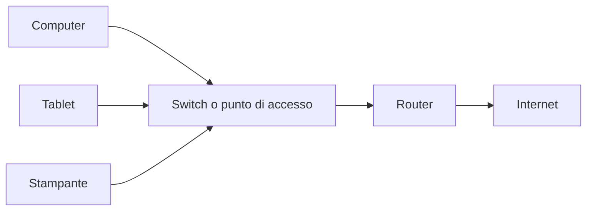
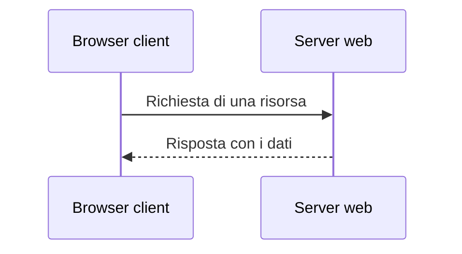
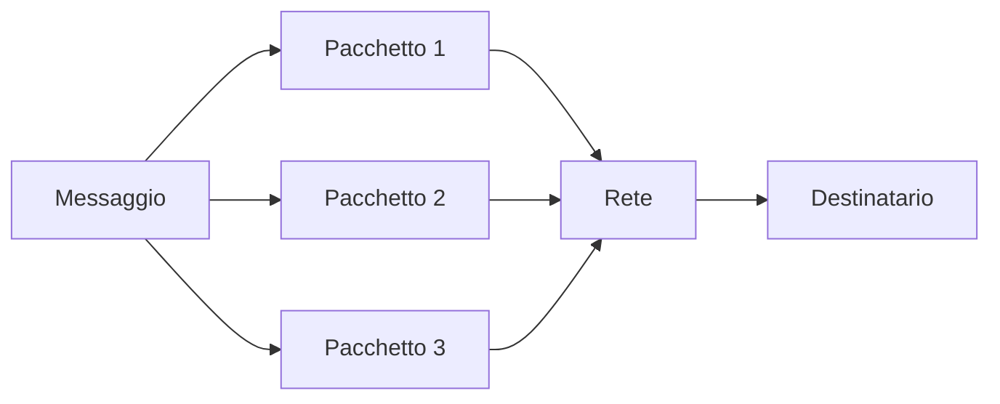
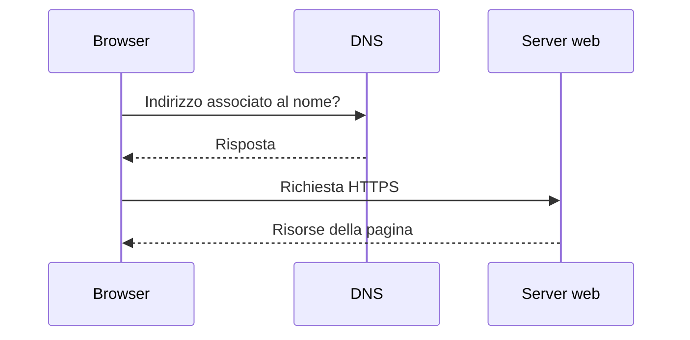

# Reti, Internet e comunicazione

Una rete collega dispositivi che devono scambiare dati o condividere risorse. In
questo capitolo osserviamo i componenti e il funzionamento generale. Protocolli,
indirizzamento e diagnosi verranno approfonditi nel quinto anno.

## 1. Obiettivi

Al termine del capitolo saprai:

- distinguere rete locale e Internet;
- riconoscere i principali dispositivi di rete;
- confrontare collegamenti cablati e senza fili;
- distinguere Internet e Web;
- descrivere il percorso essenziale di una pagina Web;
- applicare semplici regole di sicurezza nella comunicazione.

## 2. Che cos'è una rete

I dispositivi collegati a una rete sono chiamati **nodi**. Possono essere computer,
telefoni, stampanti, sensori o server.

```mermaid
flowchart LR
    C["Computer"] --> S["Switch o punto di accesso"]
    T["Tablet"] --> S
    P["Stampante"] --> S
    S --> R["Router"]
    R --> I["Internet"]
```

Una rete consente di comunicare, condividere file e dispositivi e usare servizi
ospitati su altri computer. Introduce anche rischi: un accesso non autorizzato o un
programma dannoso può propagarsi oltre il singolo dispositivo.

## 3. Rete locale e rete geografica

| Tipo | Estensione indicativa | Esempio |
|---|---|---|
| PAN | pochi metri | telefono e cuffie Bluetooth |
| LAN | stanza o edificio | laboratorio scolastico |
| WAN | territori molto ampi | rete tra sedi lontane |

Internet è una **rete di reti**: collega reti gestite da soggetti diversi grazie a
regole comuni. Essere collegati alla LAN della scuola non significa necessariamente
avere accesso a Internet.

## 4. Dispositivi principali

- la **scheda di rete** collega il dispositivo tramite Ethernet o Wi-Fi;
- lo **switch** collega i nodi della stessa rete locale;
- il **punto di accesso** offre il collegamento Wi-Fi;
- il **router** collega reti diverse e inoltra i dati;
- il **modem** o l'ONT adatta il collegamento alla rete dell'operatore;
- un **server** offre un servizio richiesto da un client.

Nelle abitazioni più funzioni sono spesso riunite nello stesso apparecchio. Il
ruolo, però, rimane distinto.

```mermaid
sequenceDiagram
    participant C as Browser client
    participant S as Server web
    C->>S: Richiesta di una risorsa
    S-->>C: Risposta con i dati
```

## 5. Mezzi di trasmissione

| Mezzo | Punto di forza | Limite tipico |
|---|---|---|
| cavo Ethernet | stabilità e bassa latenza | richiede cablaggio |
| fibra ottica | alta capacità e lunga distanza | installazione specializzata |
| Wi-Fi | mobilità | ostacoli e interferenze |
| rete mobile | collegamento in movimento | copertura e congestione variabili |

“Senza fili” non significa senza infrastruttura: il punto di accesso e le antenne
sono a loro volta collegati alla rete attraverso altri mezzi.

## 6. Protocolli e pacchetti

Un **protocollo** è un insieme di regole condivise per formare e scambiare
messaggi. Prima di attraversare una rete, i dati vengono organizzati in unità più
piccole chiamate **pacchetti**.

```mermaid
flowchart LR
    M["Messaggio"] --> P1["Pacchetto 1"]
    M --> P2["Pacchetto 2"]
    M --> P3["Pacchetto 3"]
    P1 --> R["Rete"]
    P2 --> R
    P3 --> R
    R --> D["Destinatario"]
```

In prima è sufficiente comprendere che i pacchetti contengono dati e informazioni
di controllo. Nel quinto anno studieremo i livelli TCP/IP, gli indirizzi e il modo
in cui i router scelgono il percorso.

## 7. Internet e Web

**Internet** è l'infrastruttura formata da reti e protocolli. Il **World Wide Web**
è uno dei servizi che usa Internet. Posta elettronica, videoconferenza e
messaggistica sono servizi differenti.

Quando si apre una pagina:

1. il browser interpreta l'indirizzo;
2. il DNS associa il nome del sito a un indirizzo di rete;
3. il browser invia una richiesta al server;
4. il server restituisce le risorse;
5. il browser interpreta HTML, CSS, JavaScript e immagini.

```mermaid
sequenceDiagram
    participant B as Browser
    participant D as DNS
    participant W as Server web
    B->>D: Indirizzo associato al nome?
    D-->>B: Risposta
    B->>W: Richiesta HTTPS
    W-->>B: Risorse della pagina
```

HTTPS protegge la comunicazione durante il percorso e aiuta a verificare il server.
Non garantisce che tutte le informazioni pubblicate siano vere o affidabili.

## 8. Banda, velocità e latenza

La **larghezza di banda** indica quanti dati possono essere trasmessi nell'unità di
tempo. La **latenza** indica il ritardo della comunicazione. Scaricare un file
grande richiede buona capacità; una videoconferenza richiede soprattutto latenza
contenuta e stabilità.

La velocità effettiva può cambiare per distanza, ostacoli, congestione e limiti del
servizio remoto. Una sola misura non descrive sempre la qualità della connessione.

## 9. Comunicazione sicura

Prima di aprire un collegamento o un allegato:

- controlla l'indirizzo completo del mittente;
- diffida delle richieste urgenti di password o denaro;
- verifica la destinazione reale del collegamento;
- conferma le richieste insolite con un altro canale;
- non disattivare le protezioni del dispositivo;
- non inviare informazioni personali non necessarie.

Questi comportamenti riducono il rischio di **phishing**, cioè messaggi costruiti
per convincere la vittima a fornire dati o compiere un'azione pericolosa.

## 10. Laboratorio: la rete di un'aula

Immagina un laboratorio con 24 computer, una stampante, un server e dispositivi
Wi-Fi. Prepara:

1. elenco e ruolo dei dispositivi;
2. schema dei collegamenti;
3. scelta tra cavo e Wi-Fi, con motivazione;
4. percorso dei dati dal computer a un sito Web;
5. quattro regole di sicurezza;
6. due possibili guasti e i controlli iniziali.

## 11. Verifica

1. Qual è la differenza tra LAN e Internet?
2. Confronta switch, punto di accesso e router.
3. Quali vantaggi e limiti hanno Ethernet e Wi-Fi?
4. Perché sono necessari protocolli comuni?
5. Qual è la differenza tra Internet e Web?
6. Distingui larghezza di banda e latenza.
7. Perché HTTPS non rende automaticamente affidabile il contenuto?
8. Indica tre segnali tipici di phishing.
