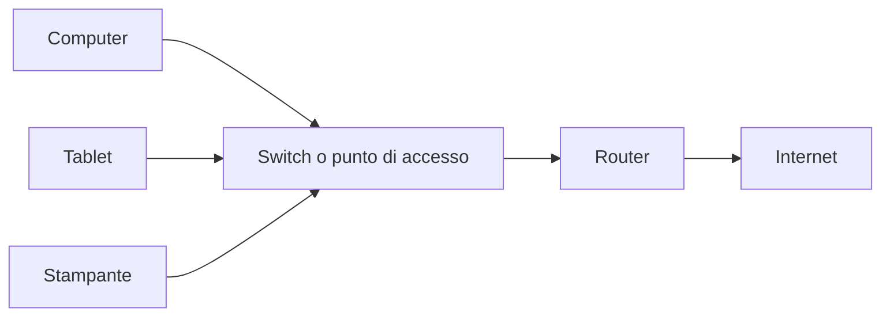
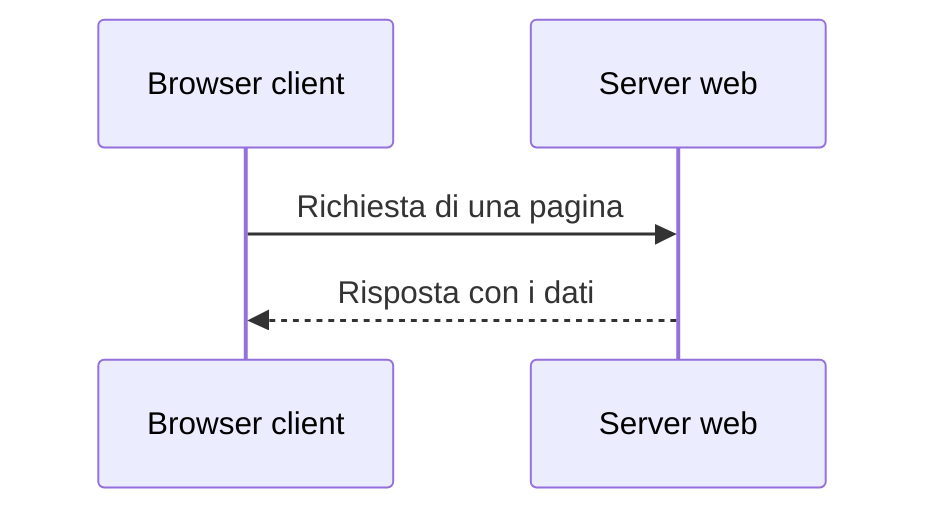
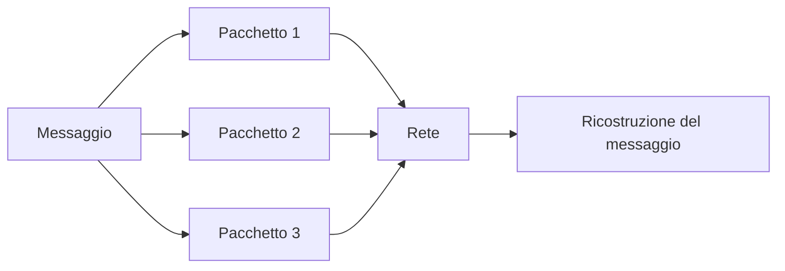
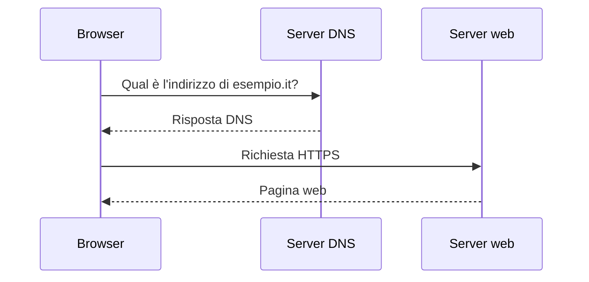

# Telecomunicazioni e reti di comunicazione

## 1. Che cos'è una rete

Una **rete di comunicazione** collega due o più dispositivi e permette loro di scambiare dati. I dispositivi collegati sono chiamati **nodi**.

Una rete può essere molto piccola, come il collegamento Bluetooth tra telefono e cuffie. Può anche essere enorme, come Internet.

Le reti permettono di:

- scambiare messaggi e file;
- condividere stampanti e altri dispositivi;
- usare servizi disponibili su computer lontani;
- lavorare sullo stesso documento;
- accedere a siti e piattaforme online.

```mermaid
flowchart LR
    A["Computer"] --> S["Switch o punto di accesso"]
    B["Tablet"] --> S
    C["Stampante"] --> S
    S --> R["Router"]
    R --> I["Internet"]
```

### Vantaggi e rischi

Una rete rende più semplice comunicare e condividere risorse. Introduce però anche rischi: accessi non autorizzati, perdita di dati, truffe e diffusione rapida di informazioni false.

Per questo una rete deve essere progettata e usata con attenzione. Aggiornamenti, password robuste, copie di sicurezza e permessi corretti riducono i rischi.

## 2. Classificare le reti

Le sigle seguenti descrivono soprattutto l'estensione geografica.

| Tipo | Significato | Estensione tipica | Esempio |
|---|---|---|---|
| PAN | Personal Area Network | pochi metri | telefono e smartwatch |
| LAN | Local Area Network | stanza o edificio | rete della scuola |
| MAN | Metropolitan Area Network | area urbana | sedi comunali collegate |
| WAN | Wide Area Network | regioni o continenti | rete di una società internazionale |

Internet collega molte reti differenti ed è quindi una **rete di reti**. Le dimensioni indicate nella tabella sono orientative: la classificazione dipende anche da proprietà, gestione e tecnologia.

### PAN

Una PAN collega dispositivi personali vicini. Bluetooth è una tecnologia molto usata per cuffie, tastiere, mouse e dispositivi indossabili.

### LAN

Una LAN collega dispositivi in un'area limitata. A scuola può comprendere computer, stampanti, server e punti di accesso Wi-Fi.

Una LAN può usare cavi Ethernet oppure collegamenti senza fili. Essere collegati alla LAN non significa necessariamente avere accesso a Internet.

### MAN e WAN

Una MAN collega reti presenti nella stessa area urbana. Una WAN collega reti molto lontane e può usare infrastrutture di operatori diversi.

Internet non appartiene a un unico soggetto. È formato da reti pubbliche e private che accettano protocolli comuni per comunicare.

## 3. Componenti principali

### Scheda di rete

La **scheda di rete** permette al dispositivo di collegarsi. Può gestire Ethernet, Wi-Fi o altre tecnologie.

### Switch

Lo **switch** collega dispositivi nella stessa rete locale. Invia i dati verso la porta associata al destinatario, invece di copiarli sempre a tutti.

### Router

Il **router** collega reti diverse. Legge l'indirizzo di destinazione e sceglie dove inoltrare il pacchetto. Il dispositivo fornito dall'operatore per la rete domestica spesso contiene router, punto di accesso Wi-Fi e altre funzioni nello stesso apparecchio.

### Punto di accesso

Un **access point**, o punto di accesso, permette ai dispositivi Wi-Fi di entrare nella rete locale.

### Modem

Il **modem** adatta il segnale alla tecnologia usata per raggiungere l'operatore. La funzione precisa cambia tra collegamenti DSL, fibra, rete mobile e satellite.

### Server e client

Un **server** offre un servizio. Un **client** lo richiede. Lo stesso computer può essere client in una comunicazione e server in un'altra.

```mermaid
sequenceDiagram
    participant C as Browser client
    participant S as Server web
    C->>S: Richiesta di una pagina
    S-->>C: Risposta con i dati
```

## 4. Mezzi di trasmissione

### Cavo in rame

I cavi Ethernet trasportano segnali elettrici. Sono affidabili, hanno bassa latenza e risentono meno delle interferenze rispetto al Wi-Fi.

### Fibra ottica

La fibra trasporta impulsi luminosi. Può raggiungere velocità elevate e coprire lunghe distanze con attenuazione ridotta. È però più delicata da installare e richiede apparecchiature adatte.

### Collegamenti senza fili

Wi-Fi, Bluetooth e reti mobili usano onde elettromagnetiche. Sono comodi perché non richiedono un cavo fino al dispositivo. Ostacoli, distanza e altre trasmissioni possono ridurre la qualità del collegamento.

| Mezzo | Vantaggio | Limite |
|---|---|---|
| Ethernet | stabile e veloce | richiede cavi |
| fibra | alta capacità e lunga distanza | installazione specializzata |
| Wi-Fi | mobilità | interferenze e copertura variabile |
| rete mobile | disponibile in movimento | qualità legata alla copertura |

## 5. Protocolli

Un **protocollo** è un insieme di regole condivise. Stabilisce il formato dei messaggi e il comportamento dei dispositivi.

L'analogia con una conversazione è utile: per capirsi, le persone devono usare una lingua comune e rispettare turni e convenzioni.

Alcuni protocolli importanti:

| Protocollo | Funzione |
|---|---|
| IP | identifica sorgente e destinazione dei pacchetti |
| TCP | offre un flusso affidabile e ordinato |
| UDP | invia datagrammi senza garantire consegna e ordine |
| HTTP/HTTPS | trasferisce risorse del Web |
| DNS | associa nomi di dominio e indirizzi IP |
| SMTP | invia messaggi di posta |
| IMAP | consulta e organizza la posta sul server |
| DHCP | assegna automaticamente parametri di rete |

HTTPS è HTTP protetto tramite TLS. La cifratura protegge i dati durante il percorso e il certificato aiuta a verificare l'identità del sito. Non garantisce però che ogni contenuto del sito sia onesto o corretto.

## 6. Come viaggiano i dati

Prima di attraversare Internet, un messaggio viene suddiviso in unità più piccole chiamate **pacchetti**. Ogni pacchetto contiene dati di controllo, tra cui informazioni necessarie per la consegna.

```mermaid
flowchart LR
    M["Messaggio"] --> P1["Pacchetto 1"]
    M --> P2["Pacchetto 2"]
    M --> P3["Pacchetto 3"]
    P1 --> R["Rete"]
    P2 --> R
    P3 --> R
    R --> D["Ricostruzione del messaggio"]
```

Pacchetti dello stesso messaggio possono attraversare percorsi differenti. I protocolli del destinatario li elaborano e, quando previsto, ricostruiscono il flusso originale.

### Indirizzo IP

L'indirizzo IP identifica un'interfaccia all'interno di una rete IP. Un indirizzo IPv4 è formato da 32 bit e viene scritto spesso come quattro numeri, per esempio `192.0.2.10`.

Gli indirizzi IPv6 sono più lunghi. Sono stati introdotti soprattutto per aumentare il numero di indirizzi disponibili.

### Nome di dominio e DNS

Gli esseri umani ricordano più facilmente `esempio.it` che una sequenza numerica. Il DNS permette di ottenere gli indirizzi associati a un nome.

```mermaid
sequenceDiagram
    participant B as Browser
    participant D as Server DNS
    participant W as Server web
    B->>D: Qual è l'indirizzo di esempio.it?
    D-->>B: Risposta DNS
    B->>W: Richiesta HTTPS
    W-->>B: Pagina web
```

## 7. Velocità, banda e latenza

La **larghezza di banda** indica la quantità di dati che il collegamento può trasportare nell'unità di tempo. Si misura spesso in bit al secondo.

La **velocità effettiva** è quella osservata durante l'uso. Può essere inferiore alla capacità teorica a causa di congestione, distanza, qualità del segnale e limiti dei server.

La **latenza** è il tempo necessario perché un dato raggiunga la destinazione e, nelle misure di andata e ritorno, torni alla sorgente. Una videoconferenza richiede soprattutto latenza contenuta e stabilità; scaricare un file molto grande richiede soprattutto una buona capacità di trasferimento.

### Attività

Esegui tre misure della stessa connessione in momenti diversi. Registra download, upload e latenza. Non limitarti a scegliere il numero più alto: spiega perché i risultati cambiano.

## 8. Collegamenti a Internet

Un **ISP**, o fornitore di accesso a Internet, collega la rete dell'utente alle altre reti.

### DSL

Le tecnologie DSL usano il doppino telefonico in rame. Le prestazioni diminuiscono con la distanza e con la qualità del cavo. Oggi sono progressivamente sostituite dalla fibra.

### FTTC e FTTH

- **FTTC**: la fibra arriva a un armadio stradale; l'ultimo tratto usa normalmente il rame.
- **FTTH**: la fibra arriva fino all'abitazione o all'edificio dell'utente.

Dire semplicemente “fibra” non basta quindi a descrivere il collegamento.

### Rete mobile

Le reti cellulari dividono il territorio in celle servite da stazioni radio. Il telefono può passare da una cella all'altra mentre l'utente si sposta.

Le sigle 4G e 5G identificano generazioni di standard. Le prestazioni reali dipendono da copertura, frequenze, ostacoli, numero di utenti e collegamento della stazione radio alla rete.

### Satellite

Il satellite può raggiungere zone prive di infrastrutture terrestri. La latenza e le prestazioni dipendono dal tipo di orbita, dalle condizioni del collegamento e dalla rete del fornitore.

## 9. Internet e World Wide Web

**Internet** è l'infrastruttura di reti e protocolli. Il **World Wide Web** è uno dei servizi che usa Internet.

Altri servizi sono posta elettronica, messaggistica, trasferimento di file, giochi online e videoconferenze.

Un browser:

1. interpreta l'indirizzo;
2. usa il DNS quando necessario;
3. apre una connessione;
4. richiede la risorsa;
5. riceve HTML, CSS, JavaScript e altri file;
6. costruisce la pagina visibile.

## 10. Posta elettronica

Un indirizzo email ha la forma `nome@dominio`.

Quando inviamo un messaggio:

1. il programma o il sito di posta lo consegna al server;
2. SMTP gestisce il trasferimento;
3. il server del destinatario conserva il messaggio;
4. il destinatario lo consulta, spesso tramite IMAP o Webmail.

### Phishing e allegati

Prima di aprire un collegamento o un allegato:

- controlla l'indirizzo completo del mittente;
- diffida delle richieste urgenti di password o denaro;
- verifica la destinazione reale dei link;
- contatta il mittente con un altro canale se la richiesta è insolita;
- non disattivare le protezioni del dispositivo.

## 11. Web pubblico, contenuti non indicizzati e dark web

I motori di ricerca non indicizzano tutto il Web. Pagine private, aree riservate, caselle di posta e banche dati protette fanno parte del Web non indicizzato. Questo viene spesso chiamato **deep web** e non è di per sé illegale o pericoloso.

Con **dark web** si indicano servizi raggiungibili tramite reti e programmi specifici progettati per aumentare l'anonimato. Possono essere usati per scopi legittimi o illeciti. Anonimato non significa sicurezza: truffe, malware e contenuti illegali restano rischi concreti.

Per le attività scolastiche non è necessario accedere a questi servizi. È sufficiente comprenderne la differenza concettuale.

## 12. Laboratorio: progettare la rete di un'aula

Immagina un laboratorio con 24 computer, una stampante di rete, un server e dispositivi Wi-Fi.

Prepara:

1. elenco dei dispositivi;
2. schema dei collegamenti;
3. posizione di switch, router e punto di accesso;
4. distinzione tra collegamenti cablati e senza fili;
5. almeno quattro regole di sicurezza;
6. spiegazione del percorso dei dati dal computer a un sito Web.

## Domande di verifica

1. Qual è la differenza tra LAN e WAN?
2. Che cosa fanno switch e router?
3. Confronta rame, fibra e Wi-Fi.
4. Perché i protocolli sono necessari?
5. Distingui larghezza di banda, velocità effettiva e latenza.
6. Qual è la differenza tra Internet e Web?
7. Perché HTTPS non rende automaticamente affidabile un sito?
8. Spiega il ruolo di DNS usando un esempio.
9. Descrivi due segnali tipici di phishing.
10. Perché il deep web non coincide con il dark web?
