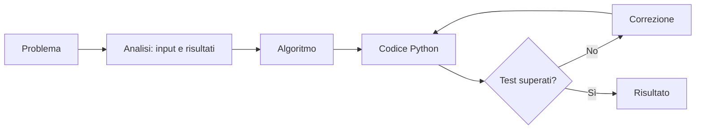
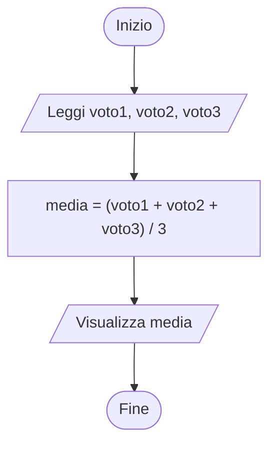
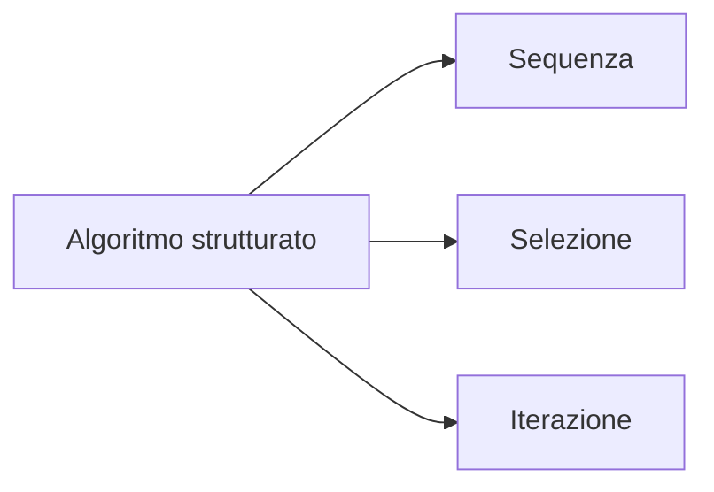

# Problemi, algoritmi e diagrammi di flusso

## Dal problema al programma

Un programma non nasce direttamente dal codice. Prima si chiarisce il problema, poi si progetta una soluzione finita e non ambigua, infine la si traduce in un linguaggio di programmazione.



## Che cos'è un algoritmo

Un **algoritmo** è una sequenza ordinata di istruzioni che permette a un esecutore di risolvere una classe di problemi. Deve essere finito, non ambiguo, effettivo e generale; inoltre deve avere input e output chiaramente definiti.

## Esempio: calcolare la media di tre voti

**Input:** tre voti numerici.  
**Output:** la loro media aritmetica.

```text
LEGGI voto1, voto2, voto3
media <- (voto1 + voto2 + voto3) / 3
SCRIVI media
```



```python
voto1 = float(input("Primo voto: "))
voto2 = float(input("Secondo voto: "))
voto3 = float(input("Terzo voto: "))

media = (voto1 + voto2 + voto3) / 3
print(f"Media: {media:.2f}")
```

## Le tre strutture fondamentali

La programmazione strutturata combina:

1. **sequenza**: istruzioni eseguite nell'ordine in cui sono scritte;
2. **selezione**: scelta tra percorsi alternativi (`if`, `elif`, `else`);
3. **iterazione**: ripetizione di istruzioni (`while`, `for`).



## Verifica dell'algoritmo

| Input | Risultato atteso |
|---|---:|
| 6, 7, 8 | 7.00 |
| 10, 10, 9 | 9.67 |
| 4.5, 6, 7.5 | 6.00 |

Un test serve a trovare errori, non a dimostrare che non ne esistano. Vanno provati casi normali, casi limite e dati non validi.

## Esercizi

1. Progetta pseudocodice e diagramma per area e perimetro di un rettangolo.
2. Individua input e output di un algoritmo che converte i secondi in ore, minuti e secondi.
3. Spiega perché l'istruzione “ripeti per un po'” rende un algoritmo ambiguo.

