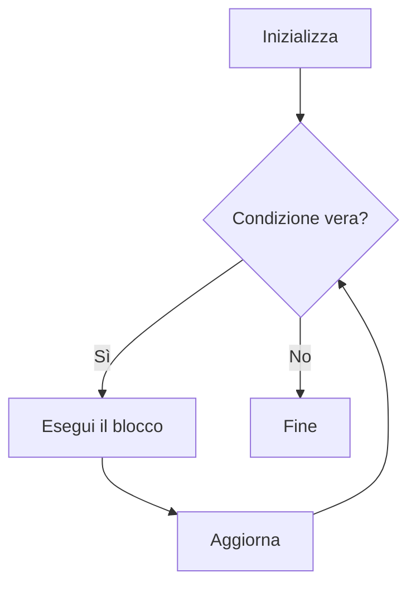

# I cicli

## 1. Perché ripetere

Un ciclo esegue più volte un blocco di istruzioni. Serve quando la stessa operazione deve essere applicata a molti valori.

## 2. Ciclo `while`

`while` ripete finché la condizione è vera.

```python
contatore = 1

while contatore <= 5:
    print(contatore)
    contatore += 1
```

Un ciclo deve modificare almeno un elemento che influisce sulla condizione; altrimenti può non terminare.

### 2.1 Input controllato

```python
voto = float(input("Inserisci un voto da 0 a 10: "))

while voto < 0 or voto > 10:
    print("Valore non valido")
    voto = float(input("Inserisci un voto da 0 a 10: "))

print("Voto accettato")
```

## 3. Ciclo `for`

`for` attraversa una sequenza:

```python
for numero in range(1, 6):
    print(numero)
```

`range(inizio, fine, passo)` non include il valore finale:

```python
for numero in range(10, 0, -2):
    print(numero)
```

## 4. Accumulatori e contatori

```python
somma = 0

for numero in range(1, 6):
    somma += numero

print(somma)
```

Un accumulatore conserva un risultato progressivo. Un contatore registra quante volte si verifica un evento.

## 5. Cicli su stringhe

```python
testo = input("Testo: ")
vocali = 0

for carattere in testo.lower():
    if carattere in "aeiou":
        vocali += 1

print(f"Vocali: {vocali}")
```

## 6. `break` e `continue`

`break` interrompe il ciclo; `continue` passa all'iterazione successiva. Vanno usati quando rendono il codice più chiaro.

```python
for numero in range(1, 11):
    if numero == 7:
        break
    print(numero)
```

## 7. Cicli annidati

```python
for riga in range(1, 4):
    for colonna in range(1, 5):
        print(f"({riga}, {colonna})", end=" ")
    print()
```

Il ciclo interno viene eseguito completamente per ogni iterazione di quello esterno.

## 8. Diagramma



## 9. Esercizi

1. Stampa la tabellina di un numero.
2. Calcola la somma dei numeri da 1 a `n`.
3. Conta quanti valori positivi inserisce l'utente.
4. Disegna un rettangolo di asterischi.
5. Simula lanci di un dado finché esce 6.
6. Trova il massimo tra dieci numeri.
