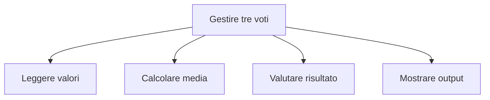
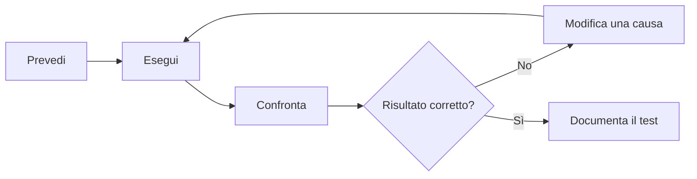

# Funzioni, validazione e test

## 1. Funzioni

Una funzione assegna un nome a un'attività e permette di riutilizzarla.

```python
def area_rettangolo(base, altezza):
    return base * altezza


area = area_rettangolo(5, 3)
print(area)
```

- `base` e `altezza` sono parametri;
- `return` restituisce il risultato;
- il codice indentato forma il corpo.

## 2. Scomporre un problema



Ogni sottoproblema può diventare una funzione.

## 3. Validazione

```python
def voto_valido(voto):
    return 0 <= voto <= 10


voto = float(input("Voto: "))
if voto_valido(voto):
    print("Valore accettato")
else:
    print("Valore non valido")
```

## 4. Gestire input non numerici

```python
try:
    numero = int(input("Numero intero: "))
    print(numero * 2)
except ValueError:
    print("Devi inserire un numero intero")
```

Si cattura un errore specifico. Un `except` generico può nascondere problemi non previsti.

## 5. Test

Un test confronta risultato atteso e risultato ottenuto.

```python
def massimo(a, b):
    if a >= b:
        return a
    return b


assert massimo(8, 3) == 8
assert massimo(-2, -5) == -2
assert massimo(4, 4) == 4
```

Si provano:

- casi normali;
- valori uguali;
- zero e numeri negativi;
- valori ai limiti;
- input non validi, quando previsti.

## 6. Metodo di correzione



## 7. Progetto

Realizza una calcolatrice di figure geometriche. Ogni calcolo deve essere una funzione e avere almeno tre test.
