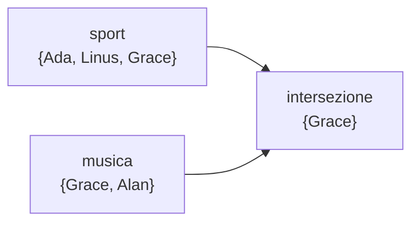

# Gli insiemi

## 1. Che cos'è un insieme

Un insieme conserva valori unici e non garantisce un ordine utile. È adatto quando
conta sapere se un valore è presente, ma non interessa la sua posizione.

```python
materie = {"matematica", "fisica", "informatica"}
materie.add("scienze")
```

Una lista può essere convertita per eliminare duplicati:

```python
valori = [2, 2, 5, 3, 5]
unici = set(valori)
print(unici)
```

L'insieme vuoto si crea con `set()`: le parentesi graffe vuote `{}` creano invece
un dizionario.

```python
insieme_vuoto = set()
```

## 2. Aggiungere e rimuovere

```python
linguaggi = {"Python", "JavaScript"}
linguaggi.add("SQL")
linguaggi.discard("JavaScript")
```

`discard()` non genera errori se il valore manca. `remove()` elimina anch'esso un
valore, ma segnala `KeyError` quando non lo trova.

## 3. Operazioni tra insiemi

```python
sport = {"Ada", "Linus", "Grace"}
musica = {"Grace", "Alan"}

print(sport | musica)
print(sport & musica)
print(sport - musica)
```

| Operatore | Operazione |
|---|---|
| `|` | unione |
| `&` | intersezione |
| `-` | differenza |
| `^` | differenza simmetrica |



L'unione comprende chi appartiene ad almeno un gruppo; l'intersezione chi
appartiene a entrambi; la differenza chi appartiene al primo ma non al secondo.

## 4. Verificare l'appartenenza

```python
if "Ada" in sport:
    print("Ada pratica sport")
```

La verifica di appartenenza è normalmente molto efficiente.

## 5. Confrontare insiemi

```python
obbligatorie = {"matematica", "fisica"}
scelte = {"matematica", "fisica", "informatica"}

print(obbligatorie <= scelte)
print(scelte >= obbligatorie)
print(obbligatorie == scelte)
```

`<=` verifica se il primo insieme è un sottoinsieme del secondo; `>=` verifica il
rapporto opposto.

## 6. Quando non usare un insieme

Un insieme non è adatto se:

- l'ordine dei valori è importante;
- sono ammessi duplicati;
- occorre leggere un elemento tramite indice;
- ogni dato deve essere associato a un'informazione, come nome e voto.

In questi casi sono più adatte liste, tuple o, dal terzo anno, dizionari.

## 7. Attività

Confronta gli insiemi degli studenti iscritti a due attività. Trova iscritti totali, iscritti a entrambe e iscritti soltanto alla prima.

## 8. Esercizi

1. Trova le lettere diverse presenti in una frase, ignorando gli spazi.
2. Confronta due gruppi di numeri e individua valori comuni e valori esclusivi.
3. Verifica se tutti i permessi richiesti sono contenuti nei permessi disponibili.
