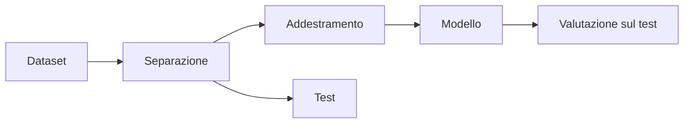

# IA opzionale: dati e classificazione

## 1. Programma di 33 ore

| Unità | Ore |
|---|---:|
| raccogliere e descrivere dati | 5 |
| caratteristiche ed etichette | 4 |
| classificazione con regole | 5 |
| addestramento e test | 5 |
| accuratezza e matrice di confusione | 5 |
| classificatore visuale | 6 |
| progetto finale | 3 |
| **Totale** | **33** |

## 2. Dataset

Un dataset è una raccolta organizzata di esempi. Ogni riga rappresenta normalmente un'osservazione; le colonne descrivono caratteristiche.

Esempio:

| lunghezza petalo | larghezza petalo | specie |
|---:|---:|---|
| 1,4 | 0,2 | A |
| 4,7 | 1,4 | B |

La colonna da prevedere viene chiamata **etichetta**.

## 3. Qualità dei dati

Si controllano:

- valori mancanti;
- unità di misura;
- duplicati;
- errori di inserimento;
- equilibrio tra categorie;
- provenienza e permessi.

## 4. Classificare con regole

Prima del machine learning si prova una regola comprensibile:

```python
def classifica_temperatura(valore):
    if valore < 10:
        return "bassa"
    if valore < 25:
        return "media"
    return "alta"
```

La classe confronta errori e casi limite.

## 5. Addestramento e test



Il test deve contenere esempi non usati per costruire il modello.

## 6. Matrice di confusione

| | previsto positivo | previsto negativo |
|---|---:|---:|
| reale positivo | vero positivo | falso negativo |
| reale negativo | falso positivo | vero negativo |

Gli errori non hanno sempre lo stesso costo.

## 7. Progetto

Con uno strumento visuale o un piccolo programma:

1. raccogli dati autorizzati;
2. definisci etichette;
3. separa addestramento e test;
4. costruisci un classificatore;
5. misura gli errori;
6. discuti limiti e possibili bias.
