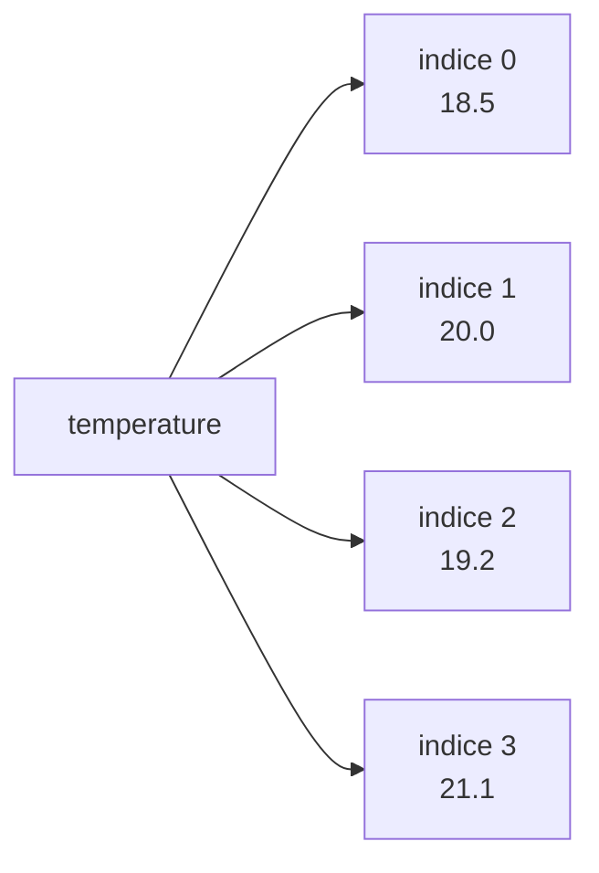
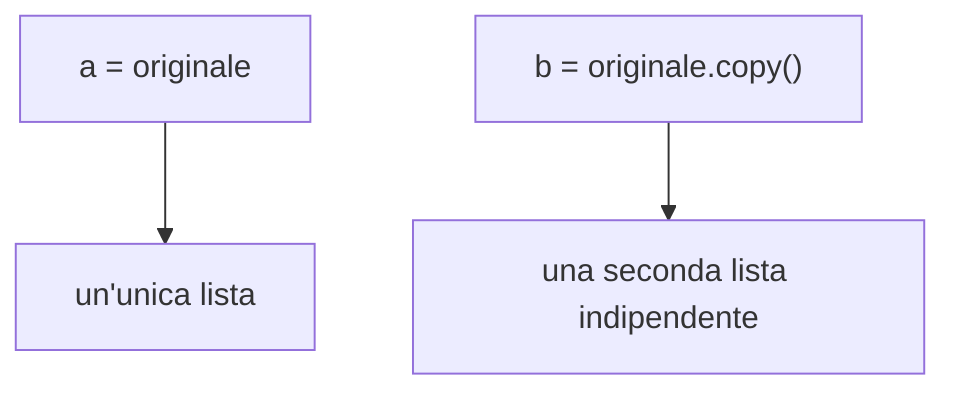

# Le liste

Una lista permette di conservare molti valori sotto un solo nome. È adatta, per
esempio, ai voti di una classe, alle temperature di una settimana o ai nomi dei
partecipanti a un'attività. A differenza di una semplice variabile, può crescere,
ridursi e cambiare durante l'esecuzione del programma.



## 1. Creare e leggere una lista

Una lista conserva più valori in ordine.

```python
temperature = [18.5, 20.0, 19.2, 21.1]
print(temperature[0])
print(temperature[-1])
```

Gli indici partono da zero. Un indice negativo conta dalla fine.

Se si usa un indice che non esiste, Python segnala `IndexError`. Prima di leggere
un elemento è quindi utile conoscere la lunghezza della lista:

```python
temperature = [18.5, 20.0, 19.2, 21.1]
print(len(temperature))

if len(temperature) > 2:
    print(temperature[2])
```

## 2. Modificare una lista

```python
studenti = ["Ada", "Linus"]
studenti.append("Grace")
studenti[1] = "Alan"
studenti.remove("Ada")
print(studenti)
```

Metodi essenziali:

| Metodo | Effetto |
|---|---|
| `append(x)` | aggiunge in fondo |
| `insert(i, x)` | inserisce in una posizione |
| `remove(x)` | rimuove il primo valore uguale |
| `pop()` | rimuove e restituisce un elemento |
| `sort()` | ordina la lista |
| `reverse()` | inverte l'ordine |

`remove()` cerca un valore; `pop()` lavora invece su una posizione. Questa
differenza evita molti errori:

```python
colori = ["rosso", "verde", "blu"]
colori.remove("verde")
ultimo = colori.pop()
print(colori)
print(ultimo)
```

## 3. Attraversare una lista

```python
voti = [7, 8, 6, 9]

for voto in voti:
    print(voto)
```

Con indice:

```python
for indice, voto in enumerate(voti):
    print(indice, voto)
```

## 4. Aggregare valori

```python
misure = [12.2, 11.8, 12.5, 12.0]

media = sum(misure) / len(misure)
print(min(misure))
print(max(misure))
print(media)
```

Prima di dividere per `len()` si controlla che la lista non sia vuota.

## 5. Slicing

```python
numeri = [0, 1, 2, 3, 4, 5]
print(numeri[1:4])
print(numeri[:3])
print(numeri[3:])
```

Lo slicing produce una nuova lista. Il limite finale non viene incluso.

## 6. Comprensioni semplici

```python
quadrati = [numero ** 2 for numero in range(1, 6)]
pari = [numero for numero in range(20) if numero % 2 == 0]
```

Una comprensione è utile quando rimane breve. Per trasformazioni complesse è più leggibile un ciclo normale.

## 7. Cercare, contare e ordinare

```python
voti = [7, 6, 8, 6, 9]

print(6 in voti)
print(voti.count(6))
print(voti.index(8))

ordinati = sorted(voti)
print(ordinati)
print(voti)
```

`sorted()` produce una nuova lista, mentre `sort()` modifica quella esistente.
`index()` va usato solo se il valore è presente, altrimenti genera un errore.

## 8. Copie e riferimenti

```python
originale = [1, 2, 3]
copia = originale.copy()
copia.append(4)

print(originale)
print(copia)
```

Con `copia = originale`, entrambi i nomi indicherebbero la stessa lista.



## 9. Liste annidate

Una lista può contenere altre liste. Si possono così rappresentare tabelle:

```python
temperature = [
    [18.2, 20.1, 19.5],
    [17.8, 21.0, 20.4]
]

print(temperature[0][1])

for riga in temperature:
    for valore in riga:
        print(valore, end=" ")
    print()
```

Il primo indice sceglie la riga, il secondo la colonna.

## 10. Errori frequenti

- dimenticare che il primo indice è `0`;
- modificare una lista mentre la si attraversa;
- dividere per `len(lista)` senza controllare che non sia vuota;
- confondere `append(x)` con `lista = lista + x`;
- creare un alias quando serviva una copia.

## 11. Laboratorio guidato

Realizza un programma che:

1. legge una serie di misure;
2. rifiuta valori non validi;
3. calcola minimo, massimo e media;
4. conta i valori superiori alla media;
5. stampa la lista ordinata.

Procedi in piccoli passi: prima memorizza i valori, poi visualizzali, quindi
aggiungi un calcolo alla volta. Concludi provando anche una lista vuota e una lista
con un solo valore tramite una simulazione manuale.

## 12. Esercizi

1. Memorizza le precipitazioni di sette giorni e trova il giorno più piovoso.
2. Separa i numeri di una lista in due nuove liste: pari e dispari.
3. Elimina i duplicati senza usare gli insiemi.
4. Costruisci una tabella `3 × 3` e calcola la somma di ogni riga.
