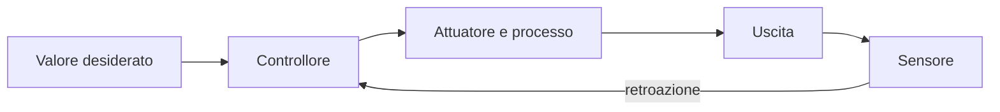
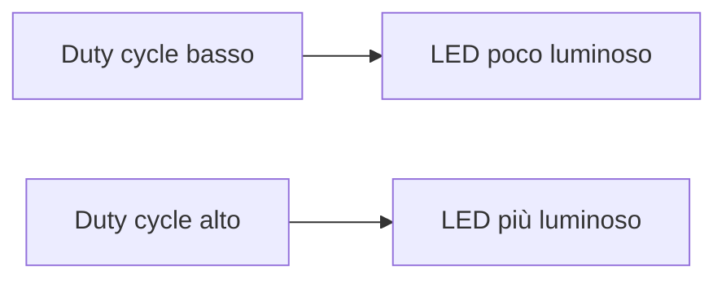
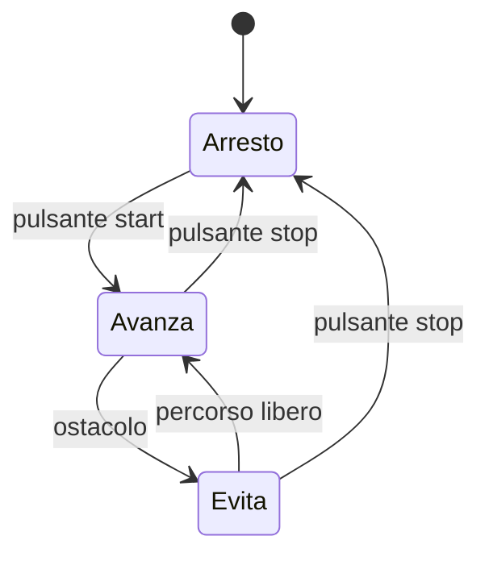
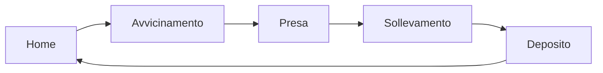

# Automazione e sistemi robotizzati

## Obiettivi del percorso

Il percorso approfondisce il lavoro del primo anno. Lo studente imparerà a:

- collegare sensori e attuatori a una scheda con microcontrollore;
- distinguere segnale analogico, digitale e PWM;
- progettare circuiti semplici e sicuri;
- programmare sistemi reattivi e procedure;
- usare un braccio robotico o un simulatore equivalente;
- definire coordinate, sequenze e condizioni di sicurezza;
- collaudare e documentare un sistema automatizzato.

## Percorso annuale di 33 ore

| Unità | Teoria | Laboratorio | Totale |
|---|---:|---:|---:|
| 1. Automazione, controllo e sicurezza | 3 h | 2 h | 5 h |
| 2. Microcontrollori, ingressi e uscite | 3 h | 5 h | 8 h |
| 3. Sensori, motori e controllo in retroazione | 3 h | 5 h | 8 h |
| 4. Braccio robotico e procedure base | 3 h | 3 h | 6 h |
| 5. Collaudo e progetto finale | 2 h | 4 h | 6 h |
| **Totale** | **14 h** | **19 h** | **33 h** |

## 1. Automazione e controllo

Un sistema automatico esegue un processo con intervento umano ridotto. In un sistema ad **anello aperto**, il comando non dipende dal risultato; in un sistema ad **anello chiuso**, una misura di ritorno modifica il comando.



Un tostapane temporizzato è un esempio semplificato di anello aperto. Un termostato che confronta temperatura misurata e desiderata usa retroazione.

### Attività

Classifica cinque sistemi automatici e disegna per ciascuno input, elaborazione e output.

## 2. La scheda con microcontrollore

Un microcontrollore integra processore, memoria e periferiche di ingresso/uscita. A differenza di un computer general purpose, è progettato per controllare un compito specifico.

Elementi da riconoscere:

- pin di alimentazione e massa;
- ingressi e uscite digitali;
- ingressi analogici;
- uscite PWM;
- collegamento per programmazione;
- limiti elettrici indicati nella documentazione.

### Segnali digitali

Un segnale digitale assume livelli discreti. Un pulsante può richiedere una resistenza di pull-up o pull-down per evitare un ingresso flottante.

### Conversione analogico-digitale

Un convertitore ADC rappresenta una tensione mediante un numero. Con `n` bit sono disponibili `2^n` livelli. Una risoluzione maggiore permette di distinguere variazioni più piccole, ma non elimina rumore ed errori.

### PWM

La modulazione PWM alterna rapidamente acceso e spento. Variando il **duty cycle** si modifica il valore medio fornito a LED o circuiti di pilotaggio.



## 3. Circuiti di base

### LED e resistenza

Un LED richiede polarità corretta e una resistenza per limitare la corrente. I valori vanno scelti rispettando la documentazione della scheda e del componente.

### Pulsante

Il programma deve gestire il **rimbalzo** meccanico: una singola pressione può produrre più transizioni rapide. Si può intervenire con un filtro hardware o software.

### Motori

Un motore richiede spesso un driver e un'alimentazione separata. Non deve essere collegato direttamente a un pin logico se assorbe più corrente di quella consentita. Un diodo o il driver proteggono dai disturbi generati dai carichi induttivi.

### Laboratori

1. Lampeggio di un LED.
2. LED controllato da pulsante.
3. Luminosità regolata con PWM.
4. Lettura di un sensore analogico.
5. Comando di un motore tramite circuito di pilotaggio predisposto.

Ogni laboratorio deve includere schema, tabella dei collegamenti, programma commentato e almeno una prova di errore.

## 4. Sensori e filtraggio

Le misure reali oscillano. Una media mobile semplice riduce variazioni rapide:

```python
def media_mobile(misure, ampiezza):
    if ampiezza <= 0:
        raise ValueError("L'ampiezza deve essere positiva")
    if len(misure) < ampiezza:
        return []

    medie = []
    for i in range(len(misure) - ampiezza + 1):
        finestra = misure[i:i + ampiezza]
        medie.append(sum(finestra) / ampiezza)
    return medie


dati = [40, 41, 39, 80, 42, 41]
print(media_mobile(dati, 3))
```

Filtrare non significa correggere automaticamente una misura errata. Occorre conoscere frequenza di campionamento, precisione e fenomeno osservato.

### Isteresi

Con una sola soglia, un valore oscillante può accendere e spegnere rapidamente un attuatore. L'isteresi usa due soglie:

- accende sotto il limite inferiore;
- spegne sopra il limite superiore;
- tra i due limiti conserva lo stato precedente.

## 5. Procedure e macchina a stati

Dividere il programma in procedure rende il comportamento più leggibile e verificabile.

```python
def decidi_stato(distanza_cm, pulsante_premuto):
    if pulsante_premuto:
        return "ARRESTO"
    if distanza_cm < 20:
        return "EVITA_OSTACOLO"
    return "AVANZA"
```



Lo stato di arresto deve avere priorità quando è coinvolta la sicurezza.

## 6. Braccio robotico

Un braccio robotico è formato da collegamenti rigidi e giunti. Il numero di movimenti indipendenti prende il nome di **gradi di libertà**.

Concetti essenziali:

- giunto rotativo o prismatico;
- base, braccio, polso ed effettore finale;
- spazio di lavoro raggiungibile;
- posizione di riferimento o home;
- velocità e accelerazione;
- coordinate articolari e cartesiane;
- singolarità e limiti di corsa.



### Sicurezza

Prima dell'uso:

1. delimitare l'area di lavoro;
2. verificare il pulsante di arresto;
3. usare velocità ridotta durante le prove;
4. evitare di entrare nello spazio di lavoro;
5. controllare che il carico sia compatibile;
6. raggiungere una posizione sicura prima dello spegnimento.

### Laboratorio pick-and-place

Programma o simula una procedura che:

- parte da home;
- raggiunge un punto di avvicinamento;
- afferra un oggetto;
- lo solleva;
- raggiunge il punto di deposito;
- apre la pinza;
- torna a home.

Registra coordinate, tempi, errori di posizionamento e collisioni evitate.

## 7. Collaudo

Un piano di prova associa requisito, procedura, risultato atteso e risultato osservato.

| Requisito | Procedura | Criterio di successo |
|---|---|---|
| arresto di sicurezza | premere stop durante il moto | movimento interrotto |
| ripetibilità | eseguire dieci cicli | oggetto depositato nell'area |
| rilevamento ostacolo | avvicinare un oggetto noto | arresto prima della soglia |

La **ripetibilità** indica quanto risultati ottenuti nelle stesse condizioni siano vicini tra loro; non coincide con l'accuratezza rispetto al valore vero.

## 8. Progetto finale

Progetta un sistema automatizzato, reale o simulato, scegliendo tra:

- barriera di parcheggio;
- serra con sensore e ventola;
- nastro trasportatore con selezione;
- braccio pick-and-place;
- veicolo che mantiene una distanza di sicurezza.

La relazione deve contenere requisiti, schema funzionale, collegamenti, algoritmo, codice, valutazione dei rischi, piano di collaudo, misure e miglioramenti.

## Verifica conclusiva

1. Distingui anello aperto e chiuso.
2. Spiega ADC e PWM.
3. Perché un motore non va normalmente alimentato da un pin logico?
4. Descrivi rimbalzo e isteresi.
5. Che cosa rappresenta lo stato di un sistema?
6. Definisci gradi di libertà e spazio di lavoro.
7. Progetta una prova di ripetibilità per il braccio robotico.
