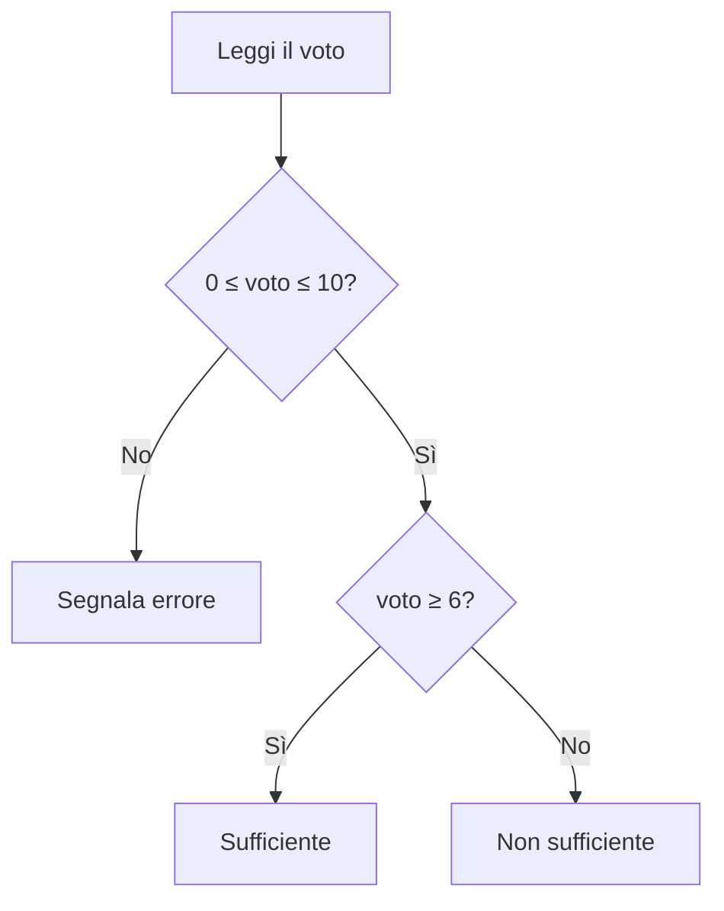

# La selezione

## 1. Valori booleani

Una condizione produce `True` oppure `False`.

```python
eta = 17
print(eta >= 18)
```

Operatori di confronto:

| Operatore | Significato |
|---|---|
| `==` | uguale |
| `!=` | diverso |
| `<` | minore |
| `<=` | minore o uguale |
| `>` | maggiore |
| `>=` | maggiore o uguale |

`=` assegna un valore; `==` confronta due valori.

## 2. Operatori logici

- `and`: entrambe le condizioni devono essere vere;
- `or`: almeno una deve essere vera;
- `not`: nega una condizione.

```python
eta = 16
autorizzazione = True

puo_entrare = eta >= 18 or autorizzazione
print(puo_entrare)
```

## 3. Istruzione `if`

```python
temperatura = float(input("Temperatura: "))

if temperatura < 0:
    print("Possibile ghiaccio")
```

Le istruzioni appartenenti al blocco devono essere indentate nello stesso modo.

## 4. Alternative

```python
numero = int(input("Numero: "))

if numero % 2 == 0:
    print("Pari")
else:
    print("Dispari")
```

Con più casi:

```python
voto = float(input("Voto: "))

if voto < 0 or voto > 10:
    print("Valore non valido")
elif voto < 6:
    print("Non sufficiente")
elif voto < 8:
    print("Buono")
else:
    print("Molto buono")
```

L'ordine è importante: Python esegue soltanto il primo ramo la cui condizione è vera.

## 5. Selezioni annidate

Si possono inserire selezioni dentro altre selezioni, ma troppi livelli rendono il codice difficile da leggere.

```python
utente_corretto = True
password_corretta = False

if utente_corretto:
    if password_corretta:
        print("Accesso consentito")
    else:
        print("Password errata")
else:
    print("Utente sconosciuto")
```

## 6. Diagramma



## 7. Esercizi

1. Trova il maggiore tra due numeri.
2. Verifica se un anno è bisestile.
3. Calcola il prezzo di un biglietto in base all'età.
4. Controlla che tre lati possano formare un triangolo.
5. Classifica una temperatura in intervalli scelti e motivati.
