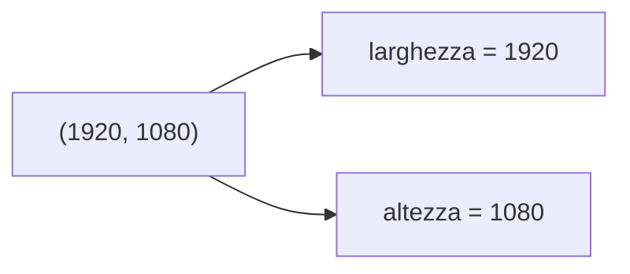

# Le tuple

## 1. Che cos'è una tupla

Una tupla è una sequenza ordinata che non può essere modificata dopo la creazione.
Questa proprietà si chiama **immutabilità**. Non significa che una tupla sia
“migliore” di una lista: indica soltanto che serve a uno scopo diverso.

```python
punto = (3, 5)
print(punto[0])
print(punto[1])
```

Una tupla con un solo elemento richiede la virgola:

```python
una_misura = (18.5,)
print(type(una_misura))
```

Senza la virgola, `(18.5)` è semplicemente un numero tra parentesi.

## 2. Leggere e attraversare

Gli indici e lo slicing funzionano come nelle liste:

```python
colori = ("rosso", "verde", "blu", "giallo")
print(colori[0])
print(colori[-1])
print(colori[1:3])

for colore in colori:
    print(colore)
```

Non sono invece possibili operazioni come `append()` o l'assegnazione
`colori[0] = "nero"`.

## 3. Quando usarla

Una tupla è utile quando i valori formano un'unica informazione e non devono cambiare:

- coordinate;
- colore RGB;
- data;
- dimensioni.

```python
colore = (255, 120, 0)
larghezza, altezza = (1920, 1080)
```

Nel secondo esempio avviene lo **spacchettamento**: i valori della tupla vengono
assegnati, nello stesso ordine, a più variabili.



Lo spacchettamento è comodo anche per scambiare due valori:

```python
a = 5
b = 9
a, b = b, a
```

## 4. Liste di tuple

```python
punti = [(0, 0), (2, 3), (4, 1)]

for x, y in punti:
    print(f"x={x}, y={y}")
```

Qui la lista può cambiare aggiungendo o rimuovendo punti; ogni singolo punto è
invece rappresentato da una coppia stabile.

## 5. Operazioni disponibili

```python
misure = (18.5, 20.0, 18.5, 21.2)

print(len(misure))
print(misure.count(18.5))
print(misure.index(20.0))
print(21.2 in misure)
```

È inoltre possibile convertire una lista in tupla e viceversa:

```python
lista = [1, 2, 3]
tupla = tuple(lista)
nuova_lista = list(tupla)
```

## 6. Scegliere tra lista e tupla

| Domanda | Struttura consigliata |
|---|---|
| i valori devono poter cambiare? | lista |
| il numero di elementi può crescere? | lista |
| i valori formano un dato unico e stabile? | tupla |
| servono metodi come `append()` e `remove()`? | lista |

## 7. Attività

Rappresenta con tuple cinque punti del piano. Per ogni punto calcola la distanza
dall'origine con l'espressione `(x ** 2 + y ** 2) ** 0.5` e conserva le distanze
in una lista.

## 8. Esercizi

1. Rappresenta una data con una tupla `(giorno, mese, anno)` e stampala in forma leggibile.
2. Data una lista di tuple `(nome, voto)`, trova il voto più alto.
3. Spiega perché una coordinata è spesso una tupla, mentre un percorso è una lista.
