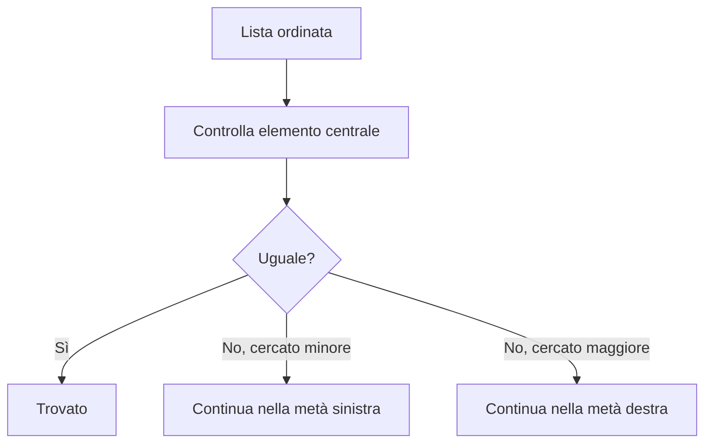

# Ricerca, ordinamento e prestazioni

## 1. Ricerca lineare

La ricerca lineare controlla gli elementi uno alla volta.

```python
def ricerca_lineare(valori, cercato):
    for indice, valore in enumerate(valori):
        if valore == cercato:
            return indice
    return -1
```

Nel caso peggiore visita tutta la lista: il tempo cresce in modo proporzionale a `n`, quindi si indica con `O(n)`.

## 2. Ricerca binaria

La ricerca binaria funziona soltanto su dati ordinati. Confronta il valore centrale ed elimina metà della zona di ricerca.



```python
def ricerca_binaria(valori, cercato):
    sinistra = 0
    destra = len(valori) - 1

    while sinistra <= destra:
        centro = (sinistra + destra) // 2
        if valori[centro] == cercato:
            return centro
        if valori[centro] < cercato:
            sinistra = centro + 1
        else:
            destra = centro - 1

    return -1
```

Ogni passaggio dimezza il problema: `O(log n)`.

## 3. Ordinamento per selezione

```python
def selection_sort(valori):
    risultato = valori.copy()

    for i in range(len(risultato)):
        indice_minimo = i
        for j in range(i + 1, len(risultato)):
            if risultato[j] < risultato[indice_minimo]:
                indice_minimo = j
        risultato[i], risultato[indice_minimo] = (
            risultato[indice_minimo],
            risultato[i]
        )

    return risultato
```

I confronti crescono approssimativamente come il quadrato di `n`: `O(n²)`.

## 4. Complessità intuitiva

| Ordine | Crescita | Esempio |
|---|---|---|
| `O(1)` | costante | leggere un elemento tramite indice |
| `O(log n)` | lenta | ricerca binaria |
| `O(n)` | lineare | ricerca lineare |
| `O(n²)` | rapida | doppio ciclo su tutte le coppie |

La notazione descrive la crescita, non il tempo esatto in secondi.

## 5. Laboratorio

1. Conta i confronti delle due ricerche.
2. Prova liste di dimensione 10, 100 e 1.000.
3. Misura i tempi con `time.perf_counter()`.
4. Confronta `selection_sort()` e `sorted()`.
5. Spiega perché ordinare prima di una sola ricerca potrebbe non convenire.
