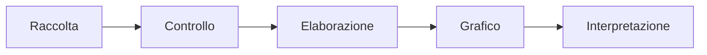

# Analizzare e rappresentare dati con Python

## 1. Dal dato alla conclusione



Un grafico non sostituisce il controllo dei dati.

## 2. Leggere un CSV

```python
import csv

temperature = []

with open("temperature.csv", encoding="utf-8", newline="") as file:
    lettore = csv.DictReader(file)
    for riga in lettore:
        try:
            temperature.append(float(riga["temperatura"]))
        except ValueError:
            print("Valore ignorato:", riga["temperatura"])
```

## 3. Indicatori

```python
from statistics import mean, median

print("Media:", mean(temperature))
print("Mediana:", median(temperature))
print("Minimo:", min(temperature))
print("Massimo:", max(temperature))
```

La media è influenzata dai valori estremi. La mediana descrive il valore centrale dopo l'ordinamento.

## 4. Grafici

```python
import matplotlib.pyplot as plt

giorni = list(range(1, len(temperature) + 1))
plt.plot(giorni, temperature, marker="o")
plt.xlabel("Giorno")
plt.ylabel("Temperatura (°C)")
plt.title("Temperature rilevate")
plt.grid(True)
plt.show()
```

## 5. Correlazione e causalità

Due valori possono variare insieme senza che uno causi l'altro. Prima di formulare una conclusione si cercano spiegazioni alternative e si controlla il metodo di raccolta.

## 6. Scegliere il grafico

| Domanda | Grafico adatto |
|---|---|
| come cambia un valore nel tempo? | linea |
| come si confrontano categorie? | barre |
| come sono distribuite le misure? | istogramma |
| esiste una relazione tra due variabili? | dispersione |

Assi, unità di misura e titolo devono permettere di capire il grafico senza
ricostruire il codice. L'asse verticale non deve essere tagliato in modo da
esagerare differenze piccole.

## 7. Errori frequenti

- calcolare una media senza esaminare valori mancanti o anomali;
- scegliere il grafico per estetica invece che per la domanda;
- confondere correlazione e causalità;
- nascondere punti che non confermano l'ipotesi;
- usare troppe categorie, colori o cifre decimali.

## 8. Progetto

Scegli un piccolo dataset scientifico. Consegna:

- file originale;
- programma;
- descrizione della pulizia;
- almeno tre indicatori;
- due grafici;
- interpretazione;
- limiti dell'analisi.

## 9. Verifica

1. Quali controlli precedono il calcolo degli indicatori?
2. Quando sono adatti linea, barre, istogramma e dispersione?
3. Perché una correlazione non dimostra una causa?
