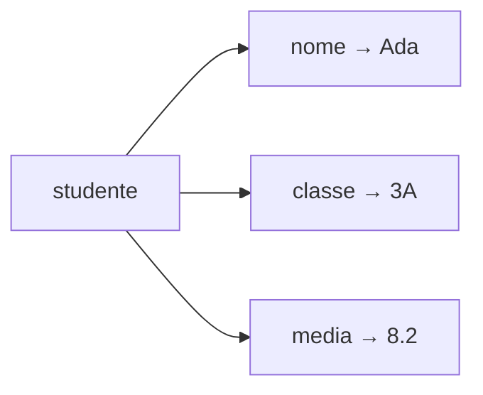

# Dizionari

Liste e tuple individuano un elemento tramite la posizione. Un dizionario usa
invece una **chiave significativa**: per esempio `"nome"`, `"media"` o un codice
di prodotto.



## 1. Coppie chiave-valore

Un dizionario associa una chiave a un valore.

```python
studente = {
    "nome": "Ada",
    "classe": "3A",
    "media": 8.2
}

print(studente["nome"])
```

Le chiavi devono essere uniche.

Una chiave può essere una stringa, un numero o una tupla immutabile. Liste e
dizionari non possono essere chiavi perché possono cambiare.

## 2. Leggere e modificare

```python
studente["media"] = 8.5
studente["email"] = "ada@example.org"

telefono = studente.get("telefono")
print(telefono)
```

`get()` restituisce `None`, o un valore scelto, quando la chiave non esiste:

```python
telefono = studente.get("telefono", "non disponibile")
```

Per eliminare una coppia:

```python
email = studente.pop("email", "non presente")
print(email)
```

Il secondo argomento evita un errore se la chiave non esiste.

## 3. Controllare una chiave

```python
if "media" in studente:
    print(studente["media"])
```

L'operatore `in` controlla le chiavi, non i valori.

## 4. Attraversare

```python
for chiave, valore in studente.items():
    print(chiave, valore)
```

Si possono attraversare anche soltanto le chiavi con `keys()` o i valori con
`values()`.

## 5. Dizionari e liste

```python
classe = [
    {"nome": "Ada", "voti": [8, 9, 7]},
    {"nome": "Alan", "voti": [6, 7, 6]}
]

for studente in classe:
    media = sum(studente["voti"]) / len(studente["voti"])
    print(studente["nome"], media)
```

Questa struttura è comune nei programmi reali: la lista raccoglie più record, il
dizionario descrive i campi di ciascun record.

## 6. Dizionari annidati

```python
laboratorio = {
    "S01": {"tipo": "temperatura", "valore": 21.4},
    "S02": {"tipo": "luce", "valore": 380}
}

print(laboratorio["S01"]["valore"])
```

Per evitare strutture troppo difficili da leggere, è bene limitare i livelli di
annidamento e usare nomi chiari.

## 7. Conteggio delle frequenze

```python
testo = "dati e algoritmi"
frequenze = {}

for carattere in testo:
    if carattere != " ":
        frequenze[carattere] = frequenze.get(carattere, 0) + 1

print(frequenze)
```

## 8. Scegliere la struttura adatta

| Esigenza | Struttura |
|---|---|
| valori ordinati e modificabili | lista |
| gruppo ordinato e stabile | tupla |
| valori unici, senza posizione | insieme |
| associazioni chiave-valore | dizionario |

## 9. Errori frequenti

- leggere con `dizionario[chiave]` una chiave che potrebbe mancare;
- confondere chiavi e indici;
- usare due chiavi uguali pensando di conservare entrambi i valori;
- modificare le dimensioni del dizionario mentre lo si attraversa.

## 10. Attività

Realizza un piccolo catalogo. Ogni elemento deve avere codice, descrizione, quantità e categoria. Il programma deve permettere ricerca e aggiornamento.

## 11. Esercizi

1. Conta quante volte compare ogni parola in una frase.
2. Rappresenta una rubrica indicizzata dal nome e consenti ricerca e aggiornamento.
3. Da una lista di voti crea un dizionario con le frequenze da 1 a 10.
4. Modella tre sensori usando un dizionario annidato e individua il valore massimo.
