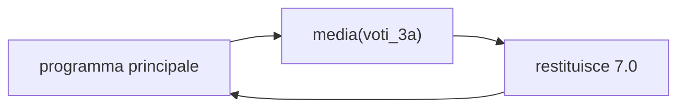
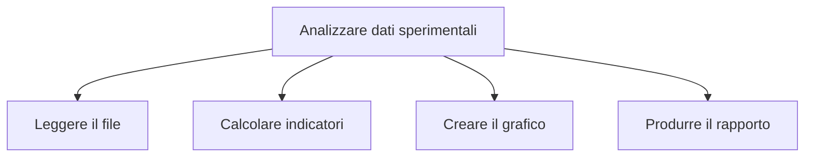

# Funzioni e progettazione top-down

## 1. Perché usare funzioni

Nel secondo anno abbiamo scritto programmi come sequenze di istruzioni. Quando un
programma cresce, diventa utile dividerlo in blocchi con un nome. Questi blocchi
sono le **funzioni**.

Una funzione:

- assegna un nome a un'operazione;
- evita ripetizioni;
- divide un problema in parti;
- può essere provata separatamente.

```python
def media(valori):
    if not valori:
        raise ValueError("La lista non può essere vuota")
    return sum(valori) / len(valori)
```

La funzione viene definita una volta e poi chiamata quando serve:

```python
voti_3a = [7, 8, 6]
voti_3b = [8, 9, 7]

print(media(voti_3a))
print(media(voti_3b))
```



## 2. Parametri e argomenti

I **parametri** sono i nomi scritti nella definizione; gli **argomenti** sono i
valori forniti durante la chiamata.

```python
def potenza(base, esponente=2):
    return base ** esponente


print(potenza(5))
print(potenza(2, 3))
```

Il valore predefinito viene usato quando l'argomento non viene fornito.

## 3. Valori restituiti

`return` conclude la funzione e consegna un risultato al chiamante. `print()`
mostra invece un testo sullo schermo. Confondere le due operazioni rende una
funzione poco riutilizzabile.

```python
def doppio(numero):
    return numero * 2


risultato = doppio(6)
print(risultato)
```

```python
def minimo_massimo(valori):
    return min(valori), max(valori)


minimo, massimo = minimo_massimo([7, 2, 9])
```

Python restituisce in questo caso una tupla.

Una funzione senza `return` esplicito restituisce `None`.

## 4. Parametri mutabili

Le liste passate a una funzione possono essere modificate:

```python
def aggiungi_misura(misure, valore):
    misure.append(valore)


dati = [18.2, 19.0]
aggiungi_misura(dati, 20.1)
print(dati)
```

Se non si vuole modificare la lista originale, si può costruire e restituire una
nuova lista. Il comportamento deve essere dichiarato chiaramente.

## 5. Variabili locali

```python
def area_cerchio(raggio):
    pi = 3.14159
    return pi * raggio ** 2
```

`pi` è locale: esiste all'interno della funzione. Le variabili globali modificabili rendono più difficile capire e provare il programma; vanno evitate quando non sono necessarie.

## 6. Documentare

```python
def celsius_fahrenheit(celsius):
    """Converte una temperatura da Celsius a Fahrenheit."""
    return celsius * 9 / 5 + 32
```

Nome, parametri, risultato ed eventuali errori devono essere comprensibili.

Una breve documentazione può indicare anche tipo e significato:

```python
def velocita_media(spazio, tempo):
    """Restituisce la velocità media; spazio e tempo devono essere positivi."""
    if spazio < 0 or tempo <= 0:
        raise ValueError("Dati non validi")
    return spazio / tempo
```

## 7. Progettazione top-down

Si parte dal problema generale e lo si divide in sottoproblemi.



Possibile struttura:

```python
def leggi_dati(percorso):
    pass


def calcola_indicatori(dati):
    pass


def crea_rapporto(indicatori):
    pass


def main():
    dati = leggi_dati("misure.csv")
    indicatori = calcola_indicatori(dati)
    crea_rapporto(indicatori)


if __name__ == "__main__":
    main()
```

`pass` indica qui funzioni ancora da completare durante la progettazione.

## 8. Validazione ed eccezioni

Una funzione dovrebbe rifiutare dati che non rispettano il suo contratto:

```python
def voto_valido(voto):
    return 0 <= voto <= 10


def leggi_voto():
    try:
        voto = float(input("Voto: "))
    except ValueError:
        raise ValueError("Il voto deve essere numerico")

    if not voto_valido(voto):
        raise ValueError("Il voto deve essere compreso tra 0 e 10")
    return voto
```

Si cattura soltanto l'errore che si sa gestire. Un `except` generico può nascondere
un difetto del programma.

## 9. Prime prove automatiche

```python
def area_rettangolo(base, altezza):
    if base < 0 or altezza < 0:
        raise ValueError("Le misure non possono essere negative")
    return base * altezza


assert area_rettangolo(5, 3) == 15
assert area_rettangolo(0, 4) == 0
```

Queste prove introducono il capitolo successivo, dedicato in modo sistematico a
test e debugging.

## 10. Ricorsione: cenno

Una funzione ricorsiva chiama sé stessa e deve avere un caso base.

```python
def fattoriale(n):
    if n < 0:
        raise ValueError("n deve essere non negativo")
    if n == 0:
        return 1
    return n * fattoriale(n - 1)
```

Per molti problemi un ciclo è più semplice. La ricorsione viene introdotta soprattutto per comprendere il concetto.

## 11. Errori frequenti

- dimenticare di chiamare la funzione dopo averla definita;
- confondere `print()` e `return`;
- usare una variabile locale fuori dalla funzione;
- modificare una lista ricevuta senza averlo previsto;
- creare funzioni troppo lunghe o con troppi compiti;
- usare nomi generici come `f1` o `calcola`.

## 12. Laboratorio guidato

Realizza un programma per analizzare temperature. Prevedi almeno queste funzioni:

1. `leggi_temperature()` per acquisire i dati;
2. `temperatura_valida()` per controllare un valore;
3. `calcola_indicatori()` per minimo, massimo e media;
4. `mostra_rapporto()` per presentare i risultati;
5. `main()` per coordinare il programma.

Disegna prima l'albero dei sottoproblemi e stabilisci, per ogni funzione, parametri
e valore restituito.

## 13. Progetto

Scomponi in funzioni un programma che legga misure, controlli i dati, calcoli indicatori e produca un rapporto.
