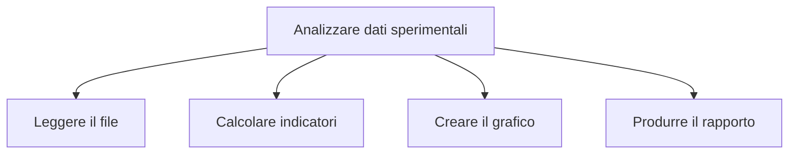

# Funzioni e progettazione top-down

## 1. Perché usare funzioni

Una funzione:

- assegna un nome a un'operazione;
- evita ripetizioni;
- divide un problema in parti;
- può essere provata separatamente.

```python
def media(valori):
    if not valori:
        raise ValueError("La lista non può essere vuota")
    return sum(valori) / len(valori)
```

## 2. Parametri e argomenti

```python
def potenza(base, esponente=2):
    return base ** esponente


print(potenza(5))
print(potenza(2, 3))
```

Il valore predefinito viene usato quando l'argomento non viene fornito.

## 3. Valori restituiti

```python
def minimo_massimo(valori):
    return min(valori), max(valori)


minimo, massimo = minimo_massimo([7, 2, 9])
```

Python restituisce in questo caso una tupla.

## 4. Variabili locali

```python
def area_cerchio(raggio):
    pi = 3.14159
    return pi * raggio ** 2
```

`pi` è locale: esiste all'interno della funzione. Le variabili globali modificabili rendono più difficile capire e provare il programma; vanno evitate quando non sono necessarie.

## 5. Documentare

```python
def celsius_fahrenheit(celsius):
    """Converte una temperatura da Celsius a Fahrenheit."""
    return celsius * 9 / 5 + 32
```

Nome, parametri, risultato ed eventuali errori devono essere comprensibili.

## 6. Progettazione top-down

Si parte dal problema generale e lo si divide in sottoproblemi.



Possibile struttura:

```python
def leggi_dati(percorso):
    pass


def calcola_indicatori(dati):
    pass


def crea_rapporto(indicatori):
    pass


def main():
    dati = leggi_dati("misure.csv")
    indicatori = calcola_indicatori(dati)
    crea_rapporto(indicatori)


if __name__ == "__main__":
    main()
```

`pass` indica qui funzioni ancora da completare durante la progettazione.

## 7. Test

```python
def area_rettangolo(base, altezza):
    if base < 0 or altezza < 0:
        raise ValueError("Le misure non possono essere negative")
    return base * altezza


assert area_rettangolo(5, 3) == 15
assert area_rettangolo(0, 4) == 0
```

## 8. Ricorsione: cenno

Una funzione ricorsiva chiama sé stessa e deve avere un caso base.

```python
def fattoriale(n):
    if n < 0:
        raise ValueError("n deve essere non negativo")
    if n == 0:
        return 1
    return n * fattoriale(n - 1)
```

Per molti problemi un ciclo è più semplice. La ricorsione viene introdotta soprattutto per comprendere il concetto.

## 9. Progetto

Scomponi in funzioni un programma che legga misure, controlli i dati, calcoli indicatori e produca un rapporto.
