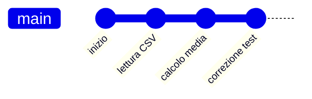
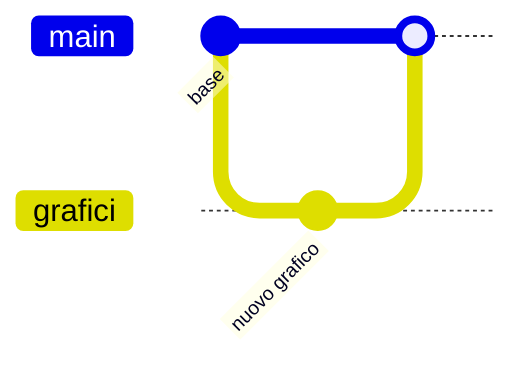

# Controllo di versione con Git

## 1. Perché registrare le versioni

Salvare `progetto_finale_vero_3.py` non è un buon sistema. Git registra modifiche, autore e messaggio in una cronologia.



## 2. Repository e commit

Un **repository** contiene progetto e cronologia. Un **commit** è una versione descritta da un messaggio.

Flusso:

```text
modifica → controllo → selezione dei file → commit
```

Comandi essenziali:

```text
git status
git add nomefile.py
git commit -m "Aggiunge il calcolo della media"
git log --oneline
git diff
```

Il messaggio deve descrivere la modifica, non dire soltanto “aggiornamento”.

## 3. Ripristinare con cautela

Prima di annullare modifiche si controllano file e stato. Git non sostituisce un backup: file mai registrati possono andare persi.

## 4. Branch

Un branch permette di sviluppare una modifica senza cambiare subito la versione principale.



## 5. Collaborazione

Regole:

- sincronizzarsi prima di iniziare;
- lavorare su compiti separati;
- fare commit piccoli;
- non registrare password o chiavi;
- controllare le differenze;
- risolvere i conflitti confrontando entrambe le versioni.

## 6. Laboratorio

1. Crea un repository per un progetto.
2. Registra la versione iniziale.
3. Aggiungi una funzione e fai un secondo commit.
4. Correggi un errore e confronta le versioni.
5. Crea un branch per un grafico.
6. Unisci il lavoro e mostra la cronologia.

## 7. Leggere le differenze

Prima di creare un commit si controllano i file modificati e le righe aggiunte o
rimosse. Non si registrano automaticamente file temporanei, password, ambienti
virtuali o grandi dati generati: un file `.gitignore` dichiara ciò che non deve
entrare nella cronologia.

Un buon messaggio completa la frase “Questa versione…”, per esempio “aggiunge il
controllo dei voti” o “corregge il calcolo della media”. “Modifiche” non permette
di capire lo scopo.

## 8. Conflitti

Un conflitto compare quando due versioni modificano la stessa parte in modi che
Git non può unire automaticamente. Si leggono entrambe le proposte, si costruisce
la versione corretta, si prova il programma e soltanto dopo si registra la
risoluzione. Non si sceglie una parte a caso per eliminare il messaggio.

## 9. Verifica

1. Qual è la differenza tra repository e commit?
2. Perché sono preferibili commit piccoli e significativi?
3. Quando è utile un branch?
4. Come si risolve responsabilmente un conflitto?
