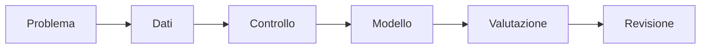
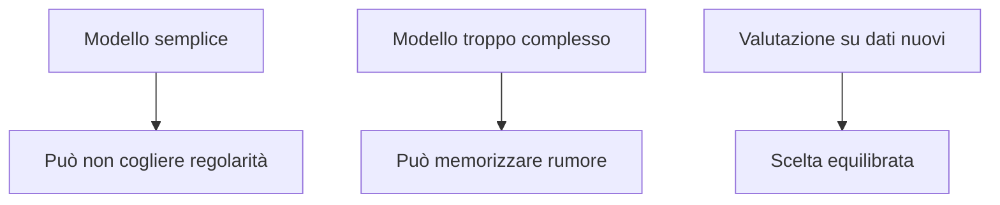

# IA opzionale: machine learning con Python

Il percorso applica le competenze Python del terzo anno a piccoli problemi basati
sui dati. L'obiettivo non è usare molti modelli, ma imparare a costruire un
esperimento riproducibile e a interpretarne i risultati.

## 1. Programma di 33 ore

| Unità | Ore |
|---|---:|
| preparazione dei dati | 5 |
| regressione | 5 |
| classificazione | 6 |
| addestramento, validazione e test | 5 |
| overfitting | 3 |
| metriche e grafici | 4 |
| progetto finale | 5 |
| **Totale** | **33** |

## 2. Flusso di lavoro

Al termine del percorso saprai preparare un dataset, distinguere regressione e
classificazione, separare correttamente i dati e valutare un modello semplice.



## 3. Regressione

La regressione prevede un valore numerico, per esempio temperatura o consumo.

```python
from sklearn.linear_model import LinearRegression

X = [[1], [2], [3], [4]]
y = [2.1, 4.0, 6.2, 7.9]

modello = LinearRegression()
modello.fit(X, y)
print(modello.predict([[5]])[0])
```

Il modello non spiega automaticamente un rapporto di causa.

### 3.1 Laboratorio

Raccogli coppie di valori, per esempio tempo di studio e risultato di una prova
simulata oppure temperatura e consumo energetico. Rappresenta i punti, addestra il
modello e confronta valori osservati e previsti. Non usare dati personali reali.

Calcola anche l'errore assoluto medio:

```python
from sklearn.metrics import mean_absolute_error

previsioni = modello.predict(X)
print(mean_absolute_error(y, previsioni))
```

Un errore più piccolo indica previsioni mediamente più vicine, ma deve essere
interpretato usando l'unità di misura del problema.

## 4. Classificazione

La classificazione prevede una categoria. Le caratteristiche devono essere pertinenti e raccolte in modo corretto.

```python
from sklearn.tree import DecisionTreeClassifier

X = [[18, 80], [20, 70], [27, 35], [30, 25], [16, 90], [29, 30]]
y = ["coperto", "coperto", "sereno", "sereno", "coperto", "sereno"]

modello = DecisionTreeClassifier(max_depth=2, random_state=42)
modello.fit(X, y)
print(modello.predict([[25, 40]])[0])
```

Le due caratteristiche rappresentano qui temperatura e umidità. Il dataset è
soltanto didattico: è troppo piccolo per previsioni meteorologiche reali.

## 5. Separare i dati

```python
from sklearn.model_selection import train_test_split

X_train, X_test, y_train, y_test = train_test_split(
    X,
    y,
    test_size=0.25,
    random_state=42
)
```

`random_state` rende ripetibile la divisione.

La divisione va eseguita prima di prendere decisioni basate sui dati di test. Se
gli stessi esempi guidano sia l'addestramento sia la valutazione, il risultato è
troppo ottimistico.

## 6. Overfitting

Un modello in overfitting descrive molto bene i dati di addestramento ma generalizza male.



### 6.1 Confronto sperimentale

Addestra due alberi di decisione: uno con `max_depth=2` e uno senza limite. Confronta
l'accuratezza su addestramento e test. Se il secondo è quasi perfetto sui dati già
visti ma peggiore su quelli nuovi, osservi un possibile overfitting.

## 7. Metriche e lettura degli errori

L'accuratezza indica la frazione di previsioni corrette, ma non racconta tutto.
Una matrice di confusione mostra quali categorie vengono scambiate:

```python
from sklearn.metrics import ConfusionMatrixDisplay

ConfusionMatrixDisplay.from_predictions(y_test, modello.predict(X_test))
```

Per ogni errore chiediti se il dato è ambiguo, se la categoria è corretta e se nel
training erano presenti esempi simili. Questa analisi è spesso più utile di una
sola percentuale.

## 8. Diario di laboratorio

Per ogni esperimento registra:

- domanda e ipotesi;
- provenienza e licenza dei dati;
- trasformazioni effettuate;
- modello e parametri;
- divisione dei dati;
- metrica ottenuta;
- errori interessanti;
- limite principale dell'esperimento.

## 9. Progetto finale

Consegna:

- domanda;
- dataset e licenza;
- pulizia;
- modello di base;
- metrica;
- grafici;
- errori significativi;
- limiti e possibili bias.

Il lavoro si conclude con una dimostrazione di cinque minuti e una breve scheda in
cui si distingue ciò che i dati permettono di sostenere da ciò che rimane incerto.

## 10. Verifica

1. Qual è la differenza tra regressione e classificazione?
2. Perché i dati di test devono restare separati?
3. Come si riconosce un possibile overfitting?
4. Perché una buona accuratezza può non essere sufficiente?
