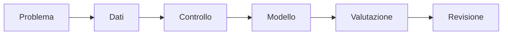
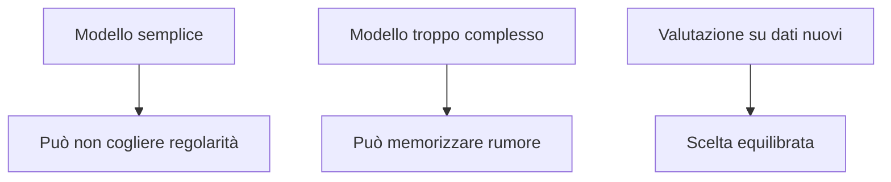

# IA opzionale: machine learning con Python

## 1. Programma di 33 ore

| Unità | Ore |
|---|---:|
| preparazione dei dati | 5 |
| regressione | 5 |
| classificazione | 6 |
| addestramento, validazione e test | 5 |
| overfitting | 3 |
| metriche e grafici | 4 |
| progetto finale | 5 |
| **Totale** | **33** |

## 2. Flusso di lavoro



## 3. Regressione

La regressione prevede un valore numerico, per esempio temperatura o consumo.

```python
from sklearn.linear_model import LinearRegression

X = [[1], [2], [3], [4]]
y = [2.1, 4.0, 6.2, 7.9]

modello = LinearRegression()
modello.fit(X, y)
print(modello.predict([[5]])[0])
```

Il modello non spiega automaticamente un rapporto di causa.

## 4. Classificazione

La classificazione prevede una categoria. Le caratteristiche devono essere pertinenti e raccolte in modo corretto.

## 5. Separare i dati

```python
from sklearn.model_selection import train_test_split

X_train, X_test, y_train, y_test = train_test_split(
    X,
    y,
    test_size=0.25,
    random_state=42
)
```

`random_state` rende ripetibile la divisione.

## 6. Overfitting

Un modello in overfitting descrive molto bene i dati di addestramento ma generalizza male.



## 7. Progetto

Consegna:

- domanda;
- dataset e licenza;
- pulizia;
- modello di base;
- metrica;
- grafici;
- errori significativi;
- limiti e possibili bias.
