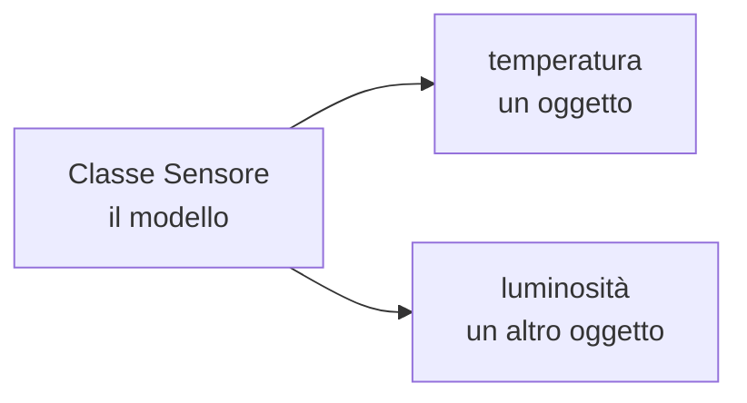
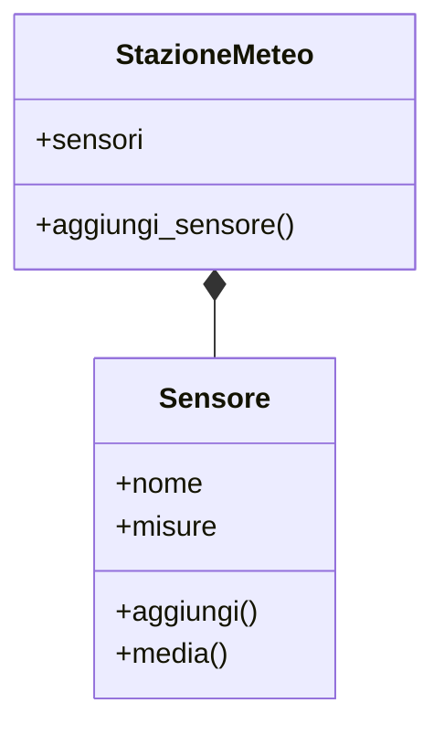
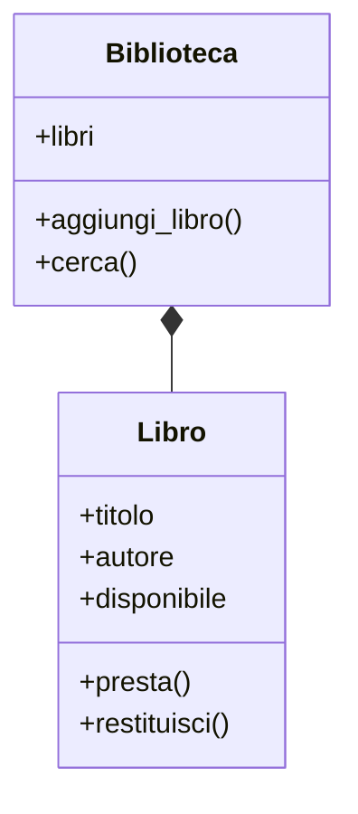

# Programmazione orientata agli oggetti in Python

## 1. Oggetti e classi

Finora abbiamo organizzato i programmi soprattutto con funzioni e strutture dati.
La programmazione orientata agli oggetti, abbreviata **OOP**, riunisce dati e
operazioni in una stessa unità.

Una **classe** è un modello; un **oggetto** è un elemento concreto costruito
seguendo quel modello. Se `Sensore` è la classe, il sensore di temperatura del
laboratorio è un oggetto.



```python
class Sensore:
    def __init__(self, nome, unita):
        self.nome = nome
        self.unita = unita
        self.misure = []

    def aggiungi(self, valore):
        self.misure.append(valore)

    def media(self):
        if not self.misure:
            raise ValueError("Non sono presenti misure")
        return sum(self.misure) / len(self.misure)
```

```python
temperatura = Sensore("Temperatura", "°C")
temperatura.aggiungi(20.5)
temperatura.aggiungi(21.0)
print(temperatura.media())
```

La classe è il modello; `temperatura` è un'istanza.

Il metodo speciale `__init__` viene eseguito alla creazione dell'oggetto.
Il parametro `self` indica l'oggetto sul quale si sta lavorando e consente di
leggere o modificare i suoi attributi.

## 2. Attributi e metodi

- gli **attributi** descrivono lo stato;
- i **metodi** descrivono le operazioni.

Un oggetto dovrebbe proteggere le proprie regole:

```python
class Conto:
    def __init__(self, titolare):
        self.titolare = titolare
        self._saldo = 0

    def deposita(self, importo):
        if importo <= 0:
            raise ValueError("L'importo deve essere positivo")
        self._saldo += importo

    def saldo(self):
        return self._saldo
```

Il trattino basso indica che `_saldo` è un dettaglio interno per convenzione.

## 3. Stato e identità

Due oggetti della stessa classe hanno la stessa struttura, ma uno stato
indipendente:

```python
conto_ada = Conto("Ada")
conto_alan = Conto("Alan")

conto_ada.deposita(50)
conto_alan.deposita(20)

print(conto_ada.saldo())
print(conto_alan.saldo())
```

Modificare `conto_ada` non cambia `conto_alan`.

## 4. Rappresentare un oggetto

Il metodo `__str__` stabilisce come presentare l'oggetto all'utente:

```python
class Libro:
    def __init__(self, titolo, autore):
        self.titolo = titolo
        self.autore = autore

    def __str__(self):
        return f"{self.titolo} — {self.autore}"


libro = Libro("Il sistema periodico", "Primo Levi")
print(libro)
```

## 5. Composizione

Un oggetto può contenere altri oggetti.

```python
class StazioneMeteo:
    def __init__(self):
        self.sensori = []

    def aggiungi_sensore(self, sensore):
        self.sensori.append(sensore)
```



La composizione è spesso più semplice dell'ereditarietà.

Un criterio pratico è chiedersi: “ha un” oppure “è un”? Una stazione **ha
sensori**, quindi si usa la composizione. Un sensore di temperatura **è un**
dispositivo, quindi può essere sensata l'ereditarietà.

## 6. Ereditarietà semplice

```python
class Dispositivo:
    def __init__(self, nome):
        self.nome = nome

    def descrizione(self):
        return self.nome


class SensoreTemperatura(Dispositivo):
    def __init__(self, nome, precisione):
        super().__init__(nome)
        self.precisione = precisione

    def descrizione(self):
        return f"{self.nome}, precisione {self.precisione} °C"
```

L'ereditarietà è adatta quando la sottoclasse è realmente un tipo più specifico della classe base.

## 7. Polimorfismo

Oggetti diversi possono rispondere allo stesso metodo:

```python
dispositivi = [
    Dispositivo("generico"),
    SensoreTemperatura("T1", 0.1)
]

for dispositivo in dispositivi:
    print(dispositivo.descrizione())
```

Il ciclo non deve conoscere il tipo preciso di ciascun oggetto: gli basta sapere
che tutti offrono il metodo `descrizione()`.

## 8. Progettare prima di scrivere codice

Per trasformare un problema in classi:

1. individua le entità importanti;
2. assegna a ciascuna soltanto i dati di cui è responsabile;
3. elenca le operazioni che modificano o leggono quei dati;
4. definisci le relazioni tra gli oggetti;
5. evita classi che svolgono troppi compiti.



Il diagramma descrive la struttura prima dell'implementazione. Non deve mostrare
ogni dettaglio, ma aiutare a discutere le responsabilità.

## 9. Testare una classe

```python
sensore = Sensore("Luce", "lux")
sensore.aggiungi(100)
sensore.aggiungi(200)

assert sensore.media() == 150
assert sensore.nome == "Luce"
```

Occorre verificare anche i cambiamenti di stato e i comportamenti non validi:

```python
conto = Conto("Grace")
conto.deposita(40)
assert conto.saldo() == 40

try:
    conto.deposita(-5)
    assert False
except ValueError:
    pass

assert conto.saldo() == 40
```

L'ultima asserzione controlla che l'operazione rifiutata non abbia modificato il
saldo.

## 10. Errori frequenti

- dimenticare `self` nella definizione o nella lettura di un attributo;
- usare una classe come semplice contenitore senza metodi utili;
- rendere ogni attributo modificabile dall'esterno;
- creare gerarchie di ereditarietà profonde e difficili da capire;
- inserire in una sola classe interfaccia, dati e tutte le regole del programma;
- condividere per errore una lista tra più oggetti.

Quest'ultimo errore si evita creando le liste di istanza dentro `__init__`, come
nel caso di `self.misure = []`.

## 11. Laboratorio guidato: biblioteca

Realizza il progetto in tre passi:

1. crea `Libro` con titolo, autore e stato di disponibilità;
2. aggiungi i metodi `presta()` e `restituisci()`, impedendo operazioni incoerenti;
3. crea `Biblioteca`, che contiene più libri e consente una ricerca per autore.

Prepara almeno una prova per la creazione, il prestito, la restituzione e il
tentativo di prestare un libro già occupato.

## 12. Progetto

Modella uno dei seguenti sistemi:

- biblioteca;
- laboratorio scientifico;
- registro di misure;
- catalogo di dispositivi.

Usa composizione, validazione e test. L'ereditarietà va usata soltanto se rende il modello più chiaro.

Consegna:

- un diagramma delle classi;
- il codice diviso in classi con responsabilità chiare;
- una raccolta di test;
- un breve esempio d'uso;
- una riflessione sulle scelte di composizione o ereditarietà.
