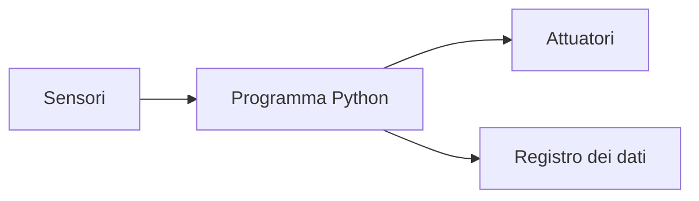
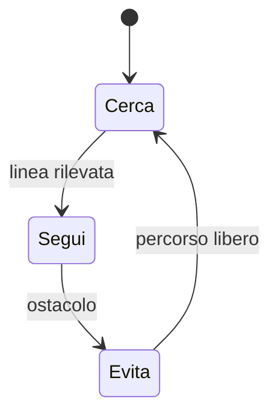

# Robotica opzionale: controllo con Python

## 1. Programma di 33 ore

| Unità | Ore |
|---|---:|
| Python e interfaccia del robot | 5 |
| procedure e moduli | 4 |
| calibrazione dei sensori | 5 |
| macchine a stati | 5 |
| movimento e odometria | 5 |
| raccolta dati | 4 |
| progetto finale | 5 |
| **Totale** | **33** |

## 2. Architettura



L'interfaccia dipende dal kit. Il programma deve tenere separata la logica dai comandi specifici dell'hardware.

## 3. Calibrare

Una calibrazione confronta valore letto e valore noto. Si ripetono le misure e si registra l'incertezza.

```python
def media_mobile(valori, ampiezza):
    if ampiezza <= 0:
        raise ValueError("Ampiezza non valida")
    return [
        sum(valori[i:i + ampiezza]) / ampiezza
        for i in range(len(valori) - ampiezza + 1)
    ]
```

## 4. Macchina a stati



Gli stati rendono comprensibili comportamenti che dipendono dalla memoria.

## 5. Odometria

Encoder e dimensioni delle ruote permettono di stimare distanza e rotazione. Slittamento e irregolarità producono errore: la posizione è una stima, non una certezza.

## 6. Progetto

Robot antirimbalzo, inseguitore di linea o stazione mobile. Consegna calibrazione, macchina a stati, dati, test e analisi degli errori.
