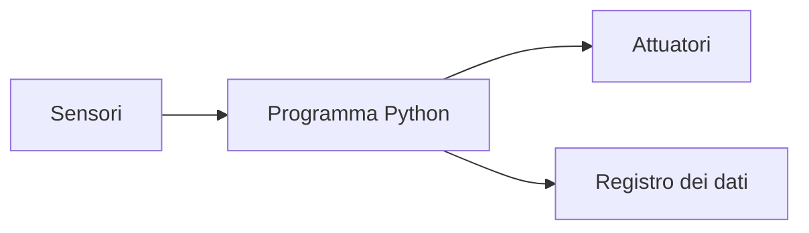
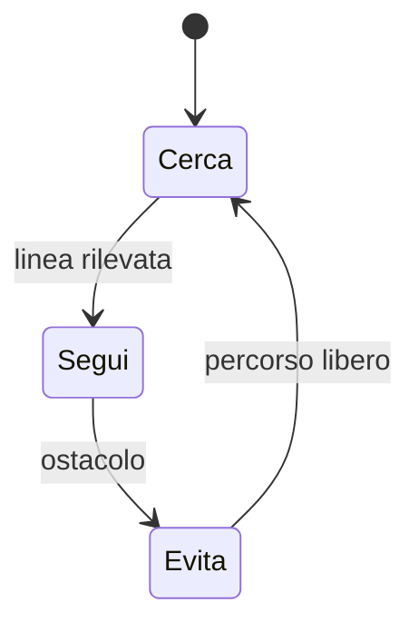

# Robotica opzionale: controllo con Python

Il percorso collega programmazione, misure e movimento. Il robot viene considerato
un sistema che osserva l'ambiente, decide e agisce; ogni comportamento deve poter
essere provato anche senza conoscere i dettagli interni del kit utilizzato.

## 1. Programma di 33 ore

| Unità | Ore |
|---|---:|
| Python e interfaccia del robot | 5 |
| procedure e moduli | 4 |
| calibrazione dei sensori | 5 |
| macchine a stati | 5 |
| movimento e odometria | 5 |
| raccolta dati | 4 |
| progetto finale | 5 |
| **Totale** | **33** |

## 2. Architettura



L'interfaccia dipende dal kit. Il programma deve tenere separata la logica dai comandi specifici dell'hardware.

Al termine del percorso saprai acquisire misure, calibrare un sensore, descrivere
un comportamento con stati, registrare dati e valutare la ripetibilità del moto.

Una semplice interfaccia può nascondere i dettagli dell'hardware:

```python
class Robot:
    def leggi_distanza(self):
        raise NotImplementedError

    def avanti(self, velocita):
        raise NotImplementedError

    def ferma(self):
        raise NotImplementedError
```

Durante le prime esercitazioni questi metodi possono essere simulati; in seguito
vengono collegati alle librerie del kit.

## 3. Calibrare

Una calibrazione confronta valore letto e valore noto. Si ripetono le misure e si registra l'incertezza.

```python
def media_mobile(valori, ampiezza):
    if ampiezza <= 0:
        raise ValueError("Ampiezza non valida")
    return [
        sum(valori[i:i + ampiezza]) / ampiezza
        for i in range(len(valori) - ampiezza + 1)
    ]
```

### 3.1 Procedura di calibrazione

1. scegli almeno cinque valori noti;
2. ripeti ogni misura almeno cinque volte;
3. calcola media e dispersione;
4. costruisci un grafico valore noto–valore letto;
5. individua intervallo utile e soglie affidabili;
6. annota condizioni di luce, superficie e alimentazione.

Una soglia non deve essere scelta osservando una sola lettura.

## 4. Macchina a stati



Gli stati rendono comprensibili comportamenti che dipendono dalla memoria.

```python
stato = "CERCA"

while True:
    distanza = robot.leggi_distanza()

    if stato == "CERCA" and distanza < 20:
        stato = "EVITA"
    elif stato == "EVITA" and distanza > 30:
        stato = "CERCA"

    if stato == "CERCA":
        robot.avanti(40)
    else:
        robot.ferma()
```

Le due soglie diverse introducono isteresi e impediscono passaggi continui tra
stati quando la misura oscilla vicino al limite.

## 5. Odometria

Encoder e dimensioni delle ruote permettono di stimare distanza e rotazione. Slittamento e irregolarità producono errore: la posizione è una stima, non una certezza.

### 5.1 Laboratorio di ripetibilità

Comanda dieci volte lo stesso spostamento. Misura la distanza finale e calcola
media, minimo, massimo e scarto rispetto all'obiettivo. Ripeti su due superfici e
confronta i risultati. Non correggere il programma dopo ogni singola prova: prima
raccogli una serie sufficiente di dati.

## 6. Registrare gli eventi

Un registro permette di ricostruire ciò che è accaduto:

```python
import csv
import time

with open("registro.csv", "a", newline="", encoding="utf-8") as file:
    scrittore = csv.writer(file)
    scrittore.writerow([time.time(), stato, distanza])
```

Il file può essere analizzato con gli strumenti per CSV e grafici studiati nel
corso generale.

## 7. Sicurezza e metodo di lavoro

- prova inizialmente con ruote sollevate o velocità ridotta;
- mantieni accessibile il comando di arresto;
- controlla cavi e batterie prima del movimento;
- modifica una sola parte alla volta;
- conserva versioni funzionanti del programma;
- registra anche i tentativi falliti.

## 8. Progetto finale

Robot antirimbalzo, inseguitore di linea o stazione mobile. Consegna calibrazione, macchina a stati, dati, test e analisi degli errori.

Il progetto si sviluppa attraverso quattro revisioni: requisiti, primo movimento,
comportamento completo e collaudo. Il prodotto finale deve includere schema dei
collegamenti, codice commentato, diagramma degli stati e risultati di almeno dieci
prove ripetute.

## 9. Verifica

1. Perché conviene separare logica e comandi hardware?
2. Che cosa rende attendibile una calibrazione?
3. A che cosa serve l'isteresi?
4. Perché l'odometria produce una stima e non una posizione certa?
