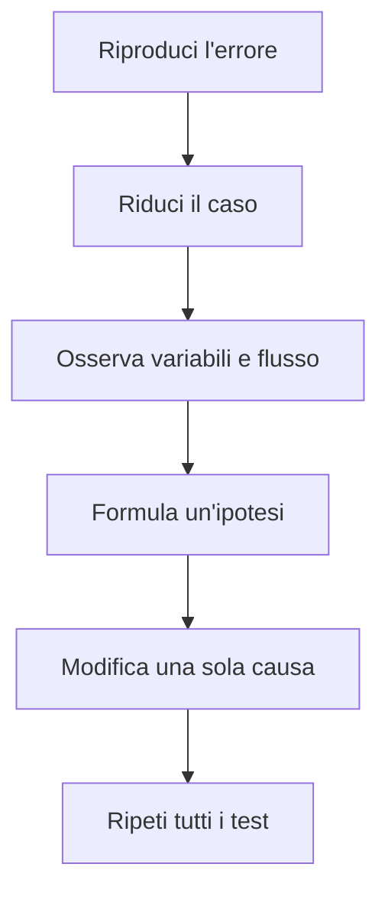

# Test e correzione dei programmi

## 1. Specificare il comportamento

Prima del codice si scrivono:

- input;
- risultato atteso;
- casi non validi;
- eventuali limiti.

Esempio: una funzione che calcola la media deve decidere che cosa fare con una lista vuota.

## 2. Test con `assert`

```python
def pari(numero):
    return numero % 2 == 0


assert pari(4)
assert pari(0)
assert not pari(7)
assert pari(-2)
```

## 3. Eccezioni attese

```python
def media(valori):
    if not valori:
        raise ValueError("Servono almeno un valore")
    return sum(valori) / len(valori)
```

Il test verifica anche l'errore previsto:

```python
try:
    media([])
    assert False
except ValueError:
    pass
```

## 4. Procedura di debugging



Stampare valori può aiutare:

```python
print(f"DEBUG indice={indice}, totale={totale}")
```

Le stampe temporanee vanno poi eliminate o sostituite da strumenti appropriati.

## 5. Organizzare i test

Per ogni funzione prepara una tabella:

| Caso | Input | Atteso | Ottenuto |
|---|---|---|---|
| normale | `[6, 8]` | `7` |  |
| un valore | `[5]` | `5` |  |
| vuoto | `[]` | errore |  |

## 6. Attività

Ricevi un programma con almeno cinque errori. Riproduci ogni problema, prepara un test che lo evidenzi e documenta la correzione.
