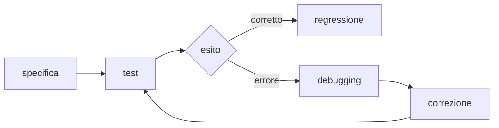
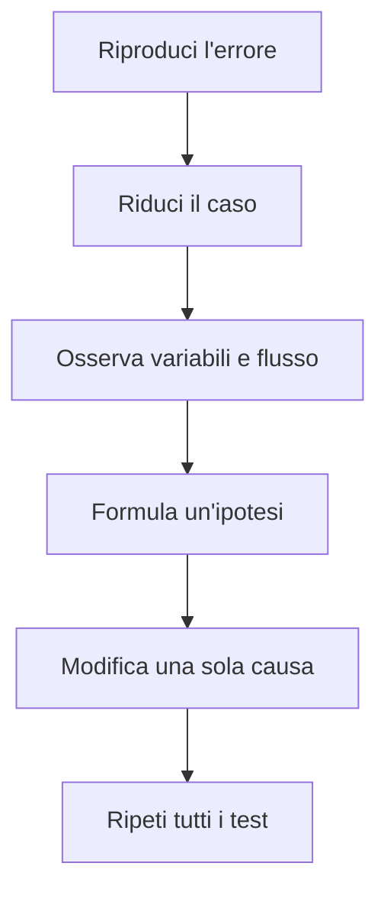

# Test e correzione dei programmi

Provare un programma significa cercare in modo organizzato situazioni in cui non
si comporta come previsto. Il **testing** evidenzia il problema; il **debugging**
serve a individuarne la causa e correggerla.



## 1. Specificare il comportamento

Prima del codice si scrivono:

- input;
- risultato atteso;
- casi non validi;
- eventuali limiti.

Esempio: una funzione che calcola la media deve decidere che cosa fare con una lista vuota.

## 2. Scegliere casi significativi

Per una funzione non basta un solo esempio. Si distinguono:

- **casi normali**, rappresentativi dell'uso comune;
- **casi limite**, vicini ai confini ammessi;
- **casi non validi**, che devono produrre un errore controllato;
- **casi particolari**, come lista vuota, zero o valori ripetuti.

Per una funzione che accetta voti da 0 a 10, `6` è normale, `0` e `10` sono
limiti, mentre `-1` e `11` non sono validi.

## 3. Test con `assert`

```python
def pari(numero):
    return numero % 2 == 0


assert pari(4)
assert pari(0)
assert not pari(7)
assert pari(-2)
```

Se un'asserzione è falsa, Python interrompe il programma e segnala la riga. Gli
`assert` sono utili per esercitarsi, ma non vanno usati per controllare l'input
dell'utente.

## 4. Eccezioni attese

```python
def media(valori):
    if not valori:
        raise ValueError("Servono almeno un valore")
    return sum(valori) / len(valori)
```

Il test verifica anche l'errore previsto:

```python
try:
    media([])
    assert False
except ValueError:
    pass
```

Una forma più chiara separa il codice da provare:

```python
errore_rilevato = False

try:
    media([])
except ValueError:
    errore_rilevato = True

assert errore_rilevato
```

## 5. Test unitari con `unittest`

La libreria standard offre uno strumento per organizzare le prove:

```python
import unittest


def massimo(valori):
    if not valori:
        raise ValueError("La lista non può essere vuota")
    return max(valori)


class TestMassimo(unittest.TestCase):
    def test_valori_positivi(self):
        self.assertEqual(massimo([2, 8, 4]), 8)

    def test_valori_negativi(self):
        self.assertEqual(massimo([-5, -2]), -2)

    def test_lista_vuota(self):
        with self.assertRaises(ValueError):
            massimo([])


if __name__ == "__main__":
    unittest.main()
```

Ogni metodo `test_...` descrive un comportamento. Un nome preciso aiuta a capire
subito che cosa non funziona.

## 6. Procedura di debugging



Stampare valori può aiutare:

```python
print(f"DEBUG indice={indice}, totale={totale}")
```

Le stampe temporanee vanno poi eliminate o sostituite da strumenti appropriati.

## 7. Tipi comuni di errore

| Tipo | Esempio | Strategia |
|---|---|---|
| sintassi | parentesi mancante | leggere il messaggio e la riga |
| esecuzione | indice inesistente | riprodurre con lo stesso input |
| logica | media calcolata male | confrontare valori intermedi |
| dato | testo al posto di un numero | validare e gestire l'eccezione |

Il messaggio di errore non è un giudizio: è un'informazione tecnica da leggere
dall'ultima riga verso l'alto.

## 8. Organizzare i test

Per ogni funzione prepara una tabella:

| Caso | Input | Atteso | Ottenuto |
|---|---|---|---|
| normale | `[6, 8]` | `7` |  |
| un valore | `[5]` | `5` |  |
| vuoto | `[]` | errore |  |

## 9. Regressione

Dopo una correzione si eseguono di nuovo tutte le prove, non soltanto quella che
falliva. Una modifica può infatti risolvere un problema e introdurne un altro.
Questo controllo si chiama **test di regressione**.

## 10. Errori frequenti nel testing

- scegliere solo dati che confermano il risultato desiderato;
- scrivere il test dopo aver osservato l'output sbagliato e adattare l'atteso;
- mettere molte verifiche diverse in un'unica prova;
- correggere più parti insieme senza sapere quale modifica è stata efficace;
- ignorare i casi limite.

## 11. Laboratorio

Costruisci e prova una funzione `prezzo_biglietto(eta, studente)`:

1. definisci le regole in una tabella;
2. scegli almeno sei casi, compresi i limiti;
3. implementa la funzione;
4. automatizza le prove con `unittest`;
5. introduci volontariamente un errore e documenta come lo hai trovato.

## 12. Attività

Ricevi un programma con almeno cinque errori. Riproduci ogni problema, prepara un test che lo evidenzi e documenta la correzione.
