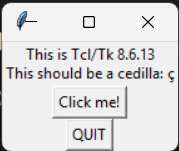
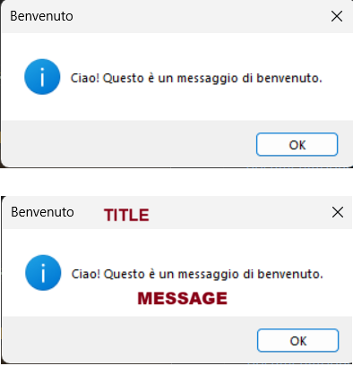

# Capitolo 1: Introduzione alle GUI e a Tkinter

## Che cosa sono le GUI?

GUI è l'acronimo di **Graphical User Interface**, cioè **Interfaccia Grafica per l'Uso dell'Utente**.  
A differenza dei programmi che usano solo il terminale (dove si scrive e si legge testo), una GUI permette di **interagire con il programma attraverso finestre, pulsanti, caselle di testo**, e molto altro.

Esempi di GUI che usi ogni giorno:

- La calcolatrice del tuo computer o smartphone
- Le finestre con cui salvi o apri file
- I messaggi che compaiono sullo schermo per chiederti conferma

## Perché usare Tkinter?

Python mette a disposizione diverse librerie per creare GUI.  
**Tkinter** è una delle più semplici e fa già parte della libreria standard di Python: non serve installarla!  
È perfetta per imparare le basi della programmazione grafica.

---

## Come iniziare con Tkinter

Per iniziare, apri il tuo editor Python preferito (ad esempio Visual Studio Code o IDLE) e scrivi questo:

```python
import tkinter
tkinter._test()
```



Questa funzione apre una finestra di prova. Se la vedi comparire, significa che tutto funziona correttamente!

---

## Interagire con l'utente: simpledialog e messagebox

In Tkinter possiamo **chiedere informazioni all'utente** e **mostrare messaggi** in modo semplice, grazie a due moduli:

### `tkinter.messagebox`

Questo modulo serve a **mostrare messaggi** all’utente.

Il modulo messagebox mette a disposizione la funzione showinfo che accetta due parametri:

```python
messagebox.showinfo(title=None, message=None)
```

Dove `title` e `message` parametri opzionali per impostare il titolo della finestra e il messaggio da mostrare.

Esempio:

```python
from tkinter import messagebox

messagebox.showinfo(title="Benvenuto", message="Ciao! Questo è un messaggio di benvenuto.")
```



Puoi anche usare altri tipi di messaggi, ad esempio:

- `messagebox.showwarning()` – per avvisi
- `messagebox.showerror()` – per errori

---

### `tkinter.simpledialog`

Questo modulo permette di chiedere qualcosa all'utente tramite una **finestra di input**.

Per richiedere di inserire una stringa possiamo usare la funzione

```python
simpledialog.askstring(title, prompt)
```

che ritorna la stringa inserita dall'utente.
Vediamo come utilizzarla con un esempio.

Esempio:

```python
from tkinter import simpledialog
nome = simpledialog.askstring("Domanda", "Come ti chiami?")
messagebox.showinfo("Risposta", f"Piacere di conoscerti, {nome}!")
```

> In questo programma, **non usiamo `print`**: tutto avviene con finestre grafiche!

Puoi anche usare altri metodo specifici per richiedere valori interi o float, ad esempio:

- `simpledialog.askint()` – per valori interi
- `simpledialog.askfloat()` – per valori float

---

## Esercizi (tracce)

1. Chiedi all'utente il suo colore preferito e mostra una finestra con un messaggio che lo include.
2. Chiedi due numeri all'utente e mostra la loro somma usando una `messagebox`.
3. Chiedi all'utente la sua età e mostra un messaggio diverso a seconda che abbia più o meno di 18 anni.
4. Chiedi all'utente il nome di una città e mostra un messaggio che la saluta ("Ciao, Roma!").

---
