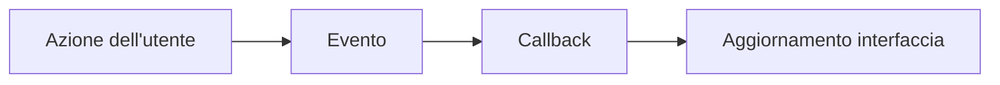

# Interfacce grafiche con Tkinter

## 1. Finestra

Tkinter è incluso normalmente in Python e permette di creare semplici interfacce grafiche.

```python
import tkinter as tk

finestra = tk.Tk()
finestra.title("Prima applicazione")
finestra.geometry("400x200")
finestra.mainloop()
```

`mainloop()` mantiene attiva l'interfaccia e gestisce gli eventi.

## 2. Etichette, campi e pulsanti

```python
import tkinter as tk


def saluta():
    nome = campo_nome.get().strip()
    risultato.config(text=f"Ciao, {nome}!")


finestra = tk.Tk()
finestra.title("Saluto")

tk.Label(finestra, text="Nome:").grid(row=0, column=0, padx=8, pady=8)
campo_nome = tk.Entry(finestra)
campo_nome.grid(row=0, column=1, padx=8, pady=8)

tk.Button(finestra, text="Saluta", command=saluta).grid(
    row=1, column=0, columnspan=2, pady=8
)

risultato = tk.Label(finestra, text="")
risultato.grid(row=2, column=0, columnspan=2)

finestra.mainloop()
```

## 3. Eventi

Quando l'utente preme il pulsante, Tkinter richiama la funzione associata. Questa funzione è detta **callback**.


```mermaid
flowchart LR
    U["Azione dell'utente"] --> E["Evento"]
    E --> C["Callback"]
    C --> I["Aggiornamento interfaccia"]
```

## 4. Separare logica e interfaccia

```python
def celsius_fahrenheit(celsius):
    return celsius * 9 / 5 + 32
```

La funzione di calcolo non dipende da Tkinter e può essere provata facilmente. La callback legge il campo, chiama la funzione e mostra il risultato.

## 5. Validazione

```python
from tkinter import messagebox


def converti():
    try:
        valore = float(campo.get())
        risultato.config(text=f"{celsius_fahrenheit(valore):.1f} °F")
    except ValueError:
        messagebox.showerror("Errore", "Inserisci un numero")
```

## 6. Progetto

Costruisci una piccola interfaccia per uno dei programmi sviluppati durante l'anno. Deve contenere:

- almeno un campo;
- un pulsante;
- validazione;
- messaggio di errore;
- funzione di calcolo separata;
- almeno tre test della funzione.

## 7. Organizzare l'interfaccia

Per applicazioni con più elementi si usa un contenitore `Frame` e il gestore
`grid()`. Etichette associate ai campi, ordine logico del focus e messaggi testuali
rendono l'interfaccia utilizzabile anche senza precisione nel mouse.

```python
contenitore = tk.Frame(finestra, padx=12, pady=12)
contenitore.grid()

etichetta = tk.Label(contenitore, text="Temperatura")
etichetta.grid(row=0, column=0, sticky="w")
campo.grid(row=0, column=1)
```

Non si mescolano `pack()` e `grid()` nello stesso contenitore.

## 8. Errori frequenti

- chiamare una funzione invece di passarla a `command`;
- inserire calcoli e controlli direttamente in molti gestori;
- bloccare il ciclo dell'interfaccia con operazioni lunghe;
- mostrare l'errore soltanto tramite colore;
- creare variabili globali per ogni elemento.

## 9. Verifica

1. Che cosa fa `mainloop()`?
2. Perché logica e interfaccia devono restare separate?
3. Come si gestisce un input non valido?
4. Perché un'operazione lunga può bloccare la finestra?
