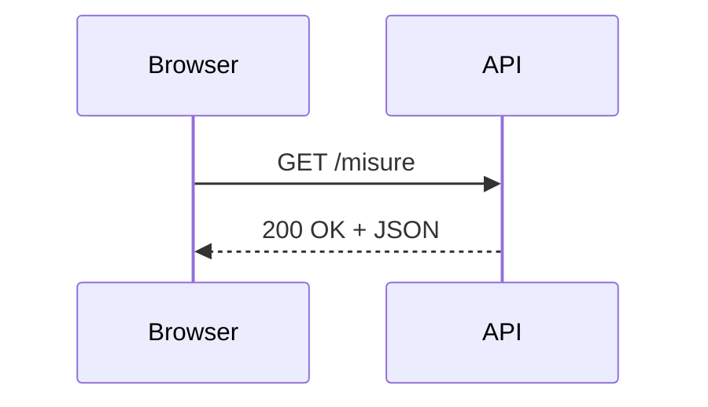
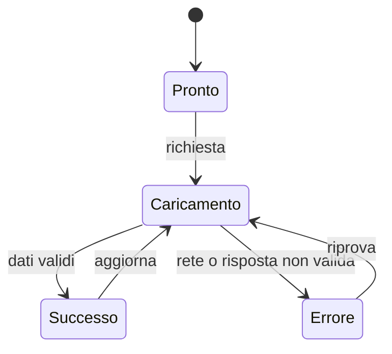

# API, HTTP e JSON

Le API permettono a programmi diversi di collaborare attraverso regole pubbliche.
In questo capitolo useremo il browser come client e JSON come formato per i dati.

## 1. Obiettivi

Al termine del capitolo saprai leggere una richiesta e una risposta HTTP,
interpretare JSON, usare `fetch()` e gestire caricamento, errori e dati inattesi.

## 2. Che cos'è un'API

Un'API definisce come un programma può richiedere dati o operazioni a un altro servizio.



## 3. Richiesta e risposta HTTP

Una richiesta contiene:

- metodo;
- indirizzo;
- intestazioni;
- eventuale corpo.

Codici comuni:

| Codice | Significato |
|---:|---|
| 200 | richiesta riuscita |
| 201 | risorsa creata |
| 400 | richiesta non valida |
| 404 | risorsa non trovata |
| 500 | errore del server |

I metodi più comuni esprimono l'operazione richiesta:

| Metodo | Uso tipico |
|---|---|
| `GET` | leggere una risorsa |
| `POST` | creare o avviare un'elaborazione |
| `PUT` | sostituire una risorsa |
| `PATCH` | modificare alcuni campi |
| `DELETE` | eliminare una risorsa |

Il significato preciso dipende dalla documentazione dell'API.

## 4. JSON

```json
[
  {"giorno": "2026-03-01", "temperatura": 18.4},
  {"giorno": "2026-03-02", "temperatura": 19.1}
]
```

JSON è testo strutturato. Non è un database.

Può rappresentare oggetti, array, stringhe, numeri, booleani e `null`. Non ammette
commenti e richiede doppi apici per nomi e stringhe. Dopo la conversione, il codice
deve comunque controllare che i campi attesi siano presenti e del tipo corretto.

## 5. `fetch()`

```javascript
async function caricaMisure() {
  const risposta = await fetch("dati/misure.json");

  if (!risposta.ok) {
    throw new Error(`Errore HTTP ${risposta.status}`);
  }

  return risposta.json();
}
```

Uso:

```javascript
async function avvia() {
  const messaggio = document.querySelector("#messaggio");

  try {
    const misure = await caricaMisure();
    messaggio.textContent = `Misure caricate: ${misure.length}`;
  } catch (errore) {
    messaggio.textContent = "Impossibile caricare i dati";
    console.error(errore);
  }
}

avvia();
```

`fetch()` restituisce una promessa. `await` sospende quella funzione asincrona
finché arriva il risultato, senza bloccare l'intera pagina. Una risposta HTTP con
codice `404` non genera automaticamente un'eccezione: per questo si controlla
`risposta.ok`.

## 6. Stati dell'interfaccia

Una buona interfaccia distingue almeno:



Durante il caricamento si mostra un messaggio; in caso di errore si offre una
possibilità sensata di riprovare. Una lista vuota è diversa da una richiesta fallita.

## 7. Sicurezza

- non inserire chiavi segrete nel JavaScript pubblico;
- non fidarsi dei dati ricevuti;
- controllare codici di stato;
- rispettare condizioni d'uso e limiti;
- usare HTTPS;
- non raccogliere dati personali non necessari.

Le limitazioni CORS stabiliscono quali origini possono leggere una risposta dal
browser. Non sono un sistema di autenticazione e non rendono pubblica o privata
un'API.

## 8. Errori frequenti

- supporre che ogni risposta contenga JSON valido;
- ignorare il codice di stato;
- mostrare all'utente soltanto l'errore tecnico della console;
- inserire una chiave privata nel file JavaScript;
- costruire HTML con dati esterni non controllati;
- effettuare richieste continue senza necessità.

## 9. Progetto

Visualizza in una pagina un piccolo dataset JSON. Aggiungi filtro, messaggio di caricamento e gestione degli errori.

Prepara anche una modalità dimostrativa che simuli dati mancanti, file non trovato
e risposta lenta. Documenta l'API con un esempio di richiesta e uno di risposta.

## 10. Verifica

1. Qual è la differenza tra API e database?
2. Che cosa comunicano metodo e codice di stato?
3. Perché `risposta.ok` deve essere controllato?
4. Quali stati dovrebbe mostrare l'interfaccia durante una richiesta?
