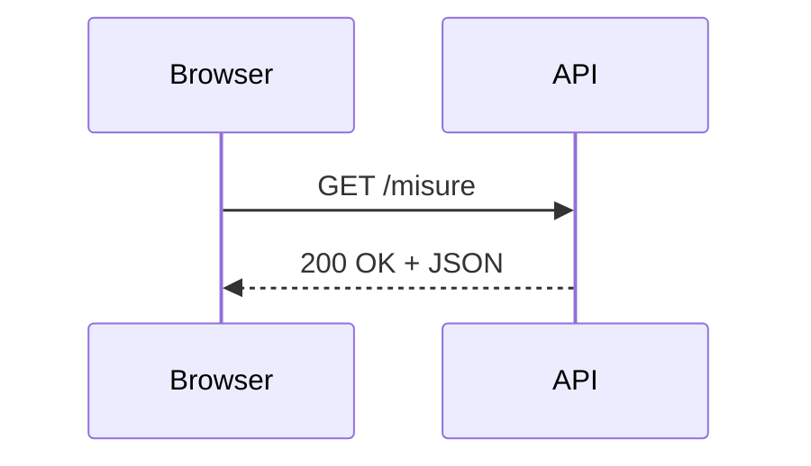

# API, HTTP e JSON

## 1. Che cos'è un'API

Un'API definisce come un programma può richiedere dati o operazioni a un altro servizio.



## 2. Richiesta e risposta HTTP

Una richiesta contiene:

- metodo;
- indirizzo;
- intestazioni;
- eventuale corpo.

Codici comuni:

| Codice | Significato |
|---:|---|
| 200 | richiesta riuscita |
| 201 | risorsa creata |
| 400 | richiesta non valida |
| 404 | risorsa non trovata |
| 500 | errore del server |

## 3. JSON

```json
[
  {"giorno": "2026-03-01", "temperatura": 18.4},
  {"giorno": "2026-03-02", "temperatura": 19.1}
]
```

JSON è testo strutturato. Non è un database.

## 4. `fetch()`

```javascript
async function caricaMisure() {
  const risposta = await fetch("dati/misure.json");

  if (!risposta.ok) {
    throw new Error(`Errore HTTP ${risposta.status}`);
  }

  return risposta.json();
}
```

Uso:

```javascript
async function avvia() {
  const messaggio = document.querySelector("#messaggio");

  try {
    const misure = await caricaMisure();
    messaggio.textContent = `Misure caricate: ${misure.length}`;
  } catch (errore) {
    messaggio.textContent = "Impossibile caricare i dati";
    console.error(errore);
  }
}

avvia();
```

## 5. Sicurezza

- non inserire chiavi segrete nel JavaScript pubblico;
- non fidarsi dei dati ricevuti;
- controllare codici di stato;
- rispettare condizioni d'uso e limiti;
- usare HTTPS;
- non raccogliere dati personali non necessari.

## 6. Progetto

Visualizza in una pagina un piccolo dataset JSON. Aggiungi filtro, messaggio di caricamento e gestione degli errori.
