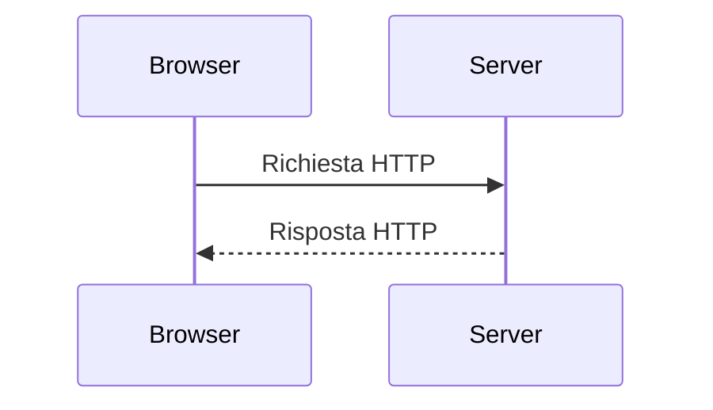
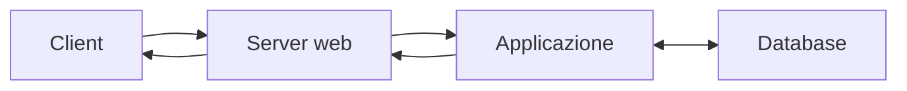

# Architettura client-server

Una pagina Web non vive isolata: spesso comunica con servizi e basi di dati.
Comprendere i ruoli dei componenti aiuta a progettare applicazioni più chiare e a
individuare dove può verificarsi un errore.

## 1. Obiettivi

Al termine del capitolo saprai distinguere client e server, confrontare sito
statico e applicazione dinamica, descrivere il percorso di una richiesta e
riconoscere dove viene conservato lo stato.

## 2. Ruoli

Un **client** richiede un servizio; un **server** riceve richieste e produce risposte. Sono ruoli software, non categorie rigide di computer.

## 3. Dal nome al server

1. l'utente inserisce un indirizzo;
2. il DNS associa il nome a un indirizzo IP;
3. il browser apre una connessione;
4. invia una richiesta HTTP;
5. il server restituisce una risposta;
6. il browser interpreta le risorse.

Ogni passaggio può fallire in modo diverso. Un problema DNS impedisce di trovare
il server; una risposta `404` indica invece che il server è stato raggiunto ma non
ha trovato la risorsa richiesta.

## 4. Sito statico

Un server statico invia file già esistenti: HTML, CSS, JavaScript e immagini.

Vantaggi:

- architettura semplice;
- caricamento rapido;
- superficie di attacco ridotta;
- distribuzione economica.

Limiti:

- nessuna elaborazione personale sul server;
- dati dinamici affidati a servizi esterni o JavaScript;
- autenticazione e salvataggio richiedono altri componenti.

Un sito statico può comunque essere interattivo nel browser: JavaScript può
filtrare dati o modificare la pagina. “Statico” significa che il server invia file
già preparati, non che la pagina sia immobile.

## 5. Applicazione dinamica

Il server esegue codice, consulta dati e costruisce una risposta. Il client non riceve normalmente il codice sorgente eseguito sul server.

### 5.1 Separare le responsabilità

| Componente | Responsabilità tipica |
|---|---|
| browser | interfaccia e controllo iniziale dell'input |
| server | regole applicative, autorizzazione e risposta |
| database | conservazione e interrogazione dei dati |

Il controllo nel browser migliora l'esperienza, ma non sostituisce quello sul
server: una richiesta può essere costruita senza usare l'interfaccia prevista.

## 6. Stato

HTTP è progettato come protocollo senza memoria automatica tra richieste. Sessioni, cookie o token permettono di associare più richieste allo stesso utente.

Lo stato introduce responsabilità:

- proteggere identificatori di sessione;
- limitare la durata;
- usare HTTPS;
- non inserire dati sensibili nei cookie;
- invalidare la sessione al logout.

Esempio: il carrello di un negozio può essere conservato nel browser, sul server o
in entrambi. La scelta influenza persistenza, privacy e comportamento su dispositivi
diversi.

## 7. Errori frequenti

- pensare che client significhi sempre “computer debole” e server “computer potente”;
- confondere il server Web con il database;
- affidare al solo JavaScript del browser controlli di sicurezza;
- conservare informazioni sensibili in cookie leggibili dallo script;
- non prevedere ritardi, assenza di rete o risposte non valide.

## 8. Laboratorio

1. Apri gli strumenti di sviluppo del browser.
2. Osserva richiesta, metodo, stato e tipo di risposta.
3. Confronta una pagina statica e una richiesta API.
4. Disegna l'architettura di una piccola applicazione scolastica.

Per ogni richiesta annota indirizzo, metodo, codice di stato, tipo di contenuto,
dimensione e tempo. Spiega poi quale componente potrebbe essere responsabile di
tre errori osservati o simulati.

## 9. Verifica

1. Perché client e server sono ruoli?
2. Che cosa distingue un sito statico da un'applicazione dinamica?
3. Quali controlli devono essere ripetuti sul server?
4. Perché HTTP richiede strumenti aggiuntivi per mantenere lo stato?
