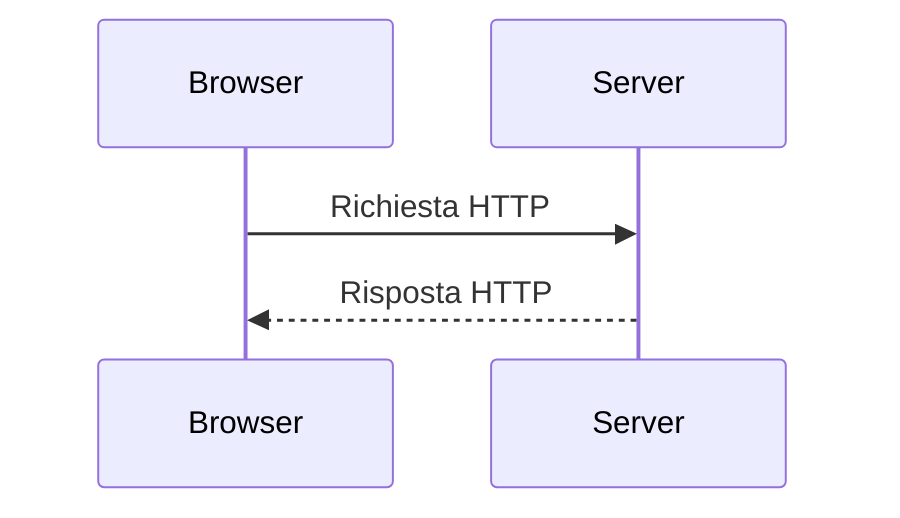
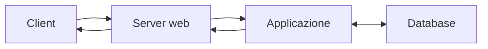

# Architettura client-server

## 1. Ruoli

Un **client** richiede un servizio; un **server** riceve richieste e produce risposte. Sono ruoli software, non categorie rigide di computer.

## 2. Dal nome al server

1. l'utente inserisce un indirizzo;
2. il DNS associa il nome a un indirizzo IP;
3. il browser apre una connessione;
4. invia una richiesta HTTP;
5. il server restituisce una risposta;
6. il browser interpreta le risorse.

## 3. Sito statico

Un server statico invia file già esistenti: HTML, CSS, JavaScript e immagini.

Vantaggi:

- architettura semplice;
- caricamento rapido;
- superficie di attacco ridotta;
- distribuzione economica.

Limiti:

- nessuna elaborazione personale sul server;
- dati dinamici affidati a servizi esterni o JavaScript;
- autenticazione e salvataggio richiedono altri componenti.

## 4. Applicazione dinamica

Il server esegue codice, consulta dati e costruisce una risposta. Il client non riceve normalmente il codice sorgente eseguito sul server.

## 5. Stato

HTTP è progettato come protocollo senza memoria automatica tra richieste. Sessioni, cookie o token permettono di associare più richieste allo stesso utente.

Lo stato introduce responsabilità:

- proteggere identificatori di sessione;
- limitare la durata;
- usare HTTPS;
- non inserire dati sensibili nei cookie;
- invalidare la sessione al logout.

## 6. Laboratorio

1. Apri gli strumenti di sviluppo del browser.
2. Osserva richiesta, metodo, stato e tipo di risposta.
3. Confronta una pagina statica e una richiesta API.
4. Disegna l'architettura di una piccola applicazione scolastica.
