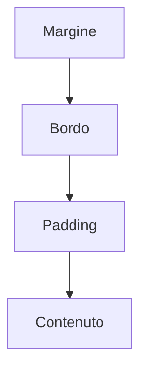

# CSS e layout responsivo

## 1. Collegare il foglio di stile

```html
<link rel="stylesheet" href="stile.css">
```

```css
body {
  font-family: system-ui, sans-serif;
  line-height: 1.6;
  margin: 0;
}
```

## 2. Selettori

```css
p {
  color: #222;
}

.avviso {
  border-left: 4px solid #b00020;
  padding: 1rem;
}

#risultati {
  background: #f4f6f8;
}
```

Si preferiscono classi riutilizzabili. Gli identificatori devono essere unici.

## 3. Box model

Ogni elemento occupa uno spazio formato da contenuto, padding, bordo e margine.



```css
* {
  box-sizing: border-box;
}
```

Con `border-box`, la larghezza dichiarata comprende padding e bordo.

## 4. Colori e leggibilità

```css
body {
  color: #1d1d1d;
  background: #ffffff;
}

a:focus-visible {
  outline: 3px solid #005fcc;
  outline-offset: 3px;
}
```

Il contrasto deve permettere la lettura. Lo stato di focus rende visibile l'elemento selezionato con la tastiera.

## 5. Flexbox

```css
.schede {
  display: flex;
  flex-wrap: wrap;
  gap: 1rem;
}

.scheda {
  flex: 1 1 16rem;
}
```

Flexbox è adatto a disporre elementi lungo una direzione e a farli andare a capo.

## 6. Grid: introduzione

```css
.griglia {
  display: grid;
  grid-template-columns: repeat(auto-fit, minmax(16rem, 1fr));
  gap: 1rem;
}
```

Grid è utile per layout a righe e colonne. Nel corso base non è necessario studiarne ogni proprietà.

## 7. Responsive design

Un layout responsivo si adatta allo spazio disponibile.

```css
main {
  width: min(70rem, 100% - 2rem);
  margin-inline: auto;
}

img {
  max-width: 100%;
  height: auto;
}

@media (min-width: 48rem) {
  .contenitore {
    display: grid;
    grid-template-columns: 2fr 1fr;
    gap: 2rem;
  }
}
```

Si parte da una versione semplice per schermi piccoli e si aggiungono layout quando lo spazio aumenta.

## 8. Variabili CSS

```css
:root {
  --colore-principale: #174a7e;
  --spazio: 1rem;
}

h1 {
  color: var(--colore-principale);
  margin-bottom: var(--spazio);
}
```

## 9. Laboratorio

Applica uno stile alla pagina HTML dell'esperimento. Verifica:

1. telefono e desktop;
2. ingrandimento al 200%;
3. navigazione da tastiera;
4. contrasto;
5. assenza di scorrimento orizzontale non necessario.
