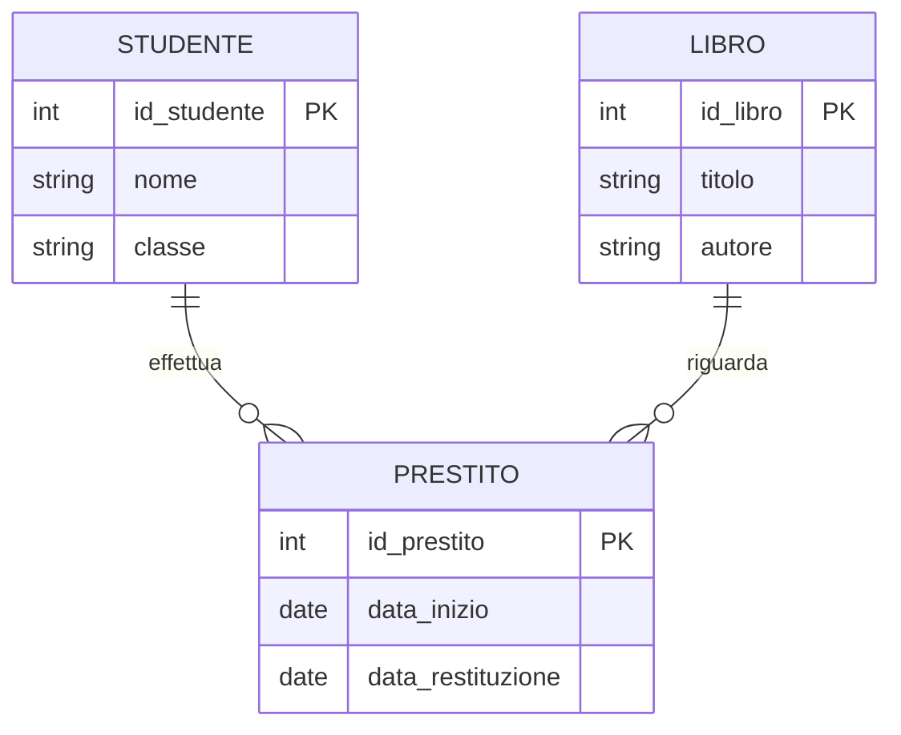

# Progettare una base di dati

## 1. Dati e informazioni

Un **sistema informativo** comprende persone, procedure e dati. Un **sistema informatico** è la parte realizzata con strumenti digitali.

Una base di dati organizza informazioni in modo controllato. Un DBMS permette di creare, interrogare e aggiornare il database.

## 2. Perché non basta un foglio

Un unico foglio può produrre:

- dati ripetuti;
- valori scritti in modi diversi;
- aggiornamenti incoerenti;
- difficoltà nel rappresentare relazioni;
- cancellazioni che eliminano informazioni utili.

## 3. Modello Entità-Relazione

Un'**entità** rappresenta un tipo di oggetto. Un **attributo** ne descrive una proprietà. Un'**associazione** collega entità.

## 4. Cardinalità

- `1:1`: un elemento corrisponde al massimo a uno;
- `1:N`: un elemento può essere collegato a molti;
- `N:M`: molti elementi possono collegarsi a molti.

Una relazione `N:M` diventa normalmente una tabella associativa.

## 5. Dal modello alle tabelle

Procedura:

1. ogni entità principale diventa una tabella;
2. gli attributi diventano colonne;
3. si sceglie una chiave primaria;
4. una relazione `1:N` introduce una chiave esterna sul lato `N`;
5. una relazione `N:M` introduce una nuova tabella.

## 6. Chiavi e vincoli

- **chiave primaria**: identifica una riga;
- **chiave esterna**: fa riferimento a un'altra tabella;
- `NOT NULL`: valore obbligatorio;
- `UNIQUE`: valore non ripetuto;
- `CHECK`: regola sul valore.

I vincoli proteggono la qualità dei dati.

## 7. Normalizzazione pratica

Tabella problematica:

| studente | classe | libro1 | libro2 |
|---|---|---|---|
| Ada | 4A | 101 | 205 |

Problemi:

- numero variabile di libri;
- colonne ripetute;
- difficoltà nelle ricerche;
- dati dello studente duplicati.

Soluzione:

- tabella `studenti`;
- tabella `libri`;
- tabella `prestiti`.

### 7.1 Prima forma normale

Ogni cella contiene un solo valore e non esistono gruppi ripetuti.

### 7.2 Seconda forma normale

In una tabella con chiave composta, gli attributi dipendono dall'intera chiave.

### 7.3 Terza forma normale

Gli attributi non chiave dipendono dalla chiave, non da altri attributi non chiave.

Nel percorso base conta soprattutto riconoscere duplicazioni e anomalie.

## 8. Progetto

Progetta una base di dati per una biblioteca, un laboratorio o una competizione. Consegna requisiti, modello E-R, schema relazionale e motivazione delle chiavi.
