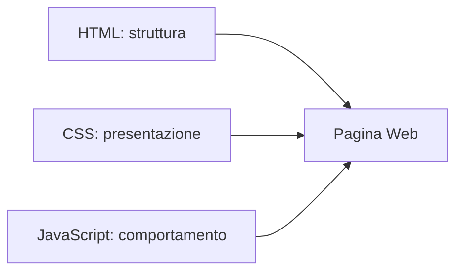

# HTML semantico e accessibile

## 1. Ruolo di HTML

HTML descrive la struttura e il significato di una pagina. CSS ne cura l'aspetto; JavaScript aggiunge comportamento.



## 2. Documento minimo

```html
<!doctype html>
<html lang="it">
<head>
  <meta charset="utf-8">
  <meta name="viewport" content="width=device-width, initial-scale=1">
  <title>Esperimento</title>
</head>
<body>
  <h1>Esperimento sul pendolo</h1>
  <p>In questa pagina raccogliamo i risultati.</p>
</body>
</html>
```

`lang`, `charset`, `viewport` e `title` aiutano browser, motori di ricerca e tecnologie assistive.

## 3. Struttura semantica

```html
<header>
  <h1>Laboratorio di fisica</h1>
</header>

<nav aria-label="Navigazione principale">
  <a href="#metodo">Metodo</a>
  <a href="#risultati">Risultati</a>
</nav>

<main>
  <section id="metodo">
    <h2>Metodo</h2>
    <p>Descrizione della procedura.</p>
  </section>
</main>

<footer>
  <p>Classe 4A</p>
</footer>
```

Gli elementi semantici comunicano il ruolo del contenuto. Non servono soltanto per ottenere un aspetto grafico.

## 4. Testo, liste e collegamenti

```html
<h2>Materiali</h2>
<ul>
  <li>filo</li>
  <li>massa</li>
  <li>cronometro</li>
</ul>

<p>
  Consulta la
  <a href="https://example.org/metodo">descrizione del metodo</a>.
</p>
```

Il testo del collegamento deve descrivere la destinazione. “Clicca qui” è poco informativo.

## 5. Immagini

```html
<figure>
  
  <figcaption>Schema dell'apparato sperimentale.</figcaption>
</figure>
```

`alt` descrive l'informazione importante. Se l'immagine è puramente decorativa, si usa `alt=""`.

## 6. Tabelle

```html
<table>
  <caption>Periodo misurato al variare della lunghezza</caption>
  <thead>
    <tr>
      <th scope="col">Lunghezza (m)</th>
      <th scope="col">Periodo (s)</th>
    </tr>
  </thead>
  <tbody>
    <tr>
      <td>0,40</td>
      <td>1,27</td>
    </tr>
  </tbody>
</table>
```

Le tabelle servono per dati, non per costruire il layout.

## 7. Moduli

```html
<form>
  <label for="temperatura">Temperatura in °C</label>
  <input
    id="temperatura"
    name="temperatura"
    type="number"
    step="0.1"
    required>

  <button type="submit">Registra</button>
</form>
```

Ogni campo deve avere un'etichetta. Il placeholder non sostituisce `label`.

## 8. Controllo di accessibilità

- titoli in ordine logico;
- pagina utilizzabile da tastiera;
- testo alternativo corretto;
- etichette dei campi;
- lingua dichiarata;
- collegamenti comprensibili;
- contrasto sufficiente;
- messaggi di errore testuali, non soltanto colorati.

## 9. Progetto

Costruisci una pagina per documentare un esperimento. Deve includere struttura semantica, immagine, tabella, form, fonti e controllo da tastiera.
