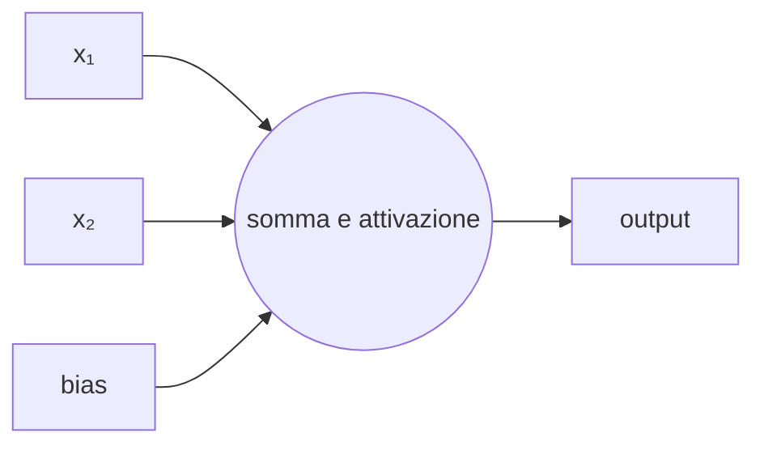
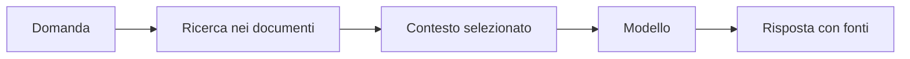

# IA opzionale: reti neurali e IA generativa

## 1. Programma di 33 ore

| Unità | Ore |
|---|---:|
| percettrone e rete neurale | 6 |
| addestramento ed errore | 5 |
| immagini o testi come numeri | 5 |
| modelli linguistici | 5 |
| recupero di informazioni da fonti | 4 |
| bias, spiegabilità e sicurezza | 4 |
| progetto finale | 4 |
| **Totale** | **33** |

## 2. Dal neurone alla rete

Un'unità artificiale combina input e pesi, aggiunge un termine e applica una funzione.

Una rete contiene molti parametri. Addestrarla significa modificarli per ridurre una funzione di errore.

## 3. Dati numerici

Immagini e testi devono essere trasformati in numeri:

- pixel per immagini;
- token per testi;
- vettori per caratteristiche.

La trasformazione influenza ciò che il modello può apprendere.

## 4. Modelli linguistici

Un modello linguistico stima continuazioni probabili. Non conserva automaticamente un archivio di fatti verificati e può produrre informazioni false.

## 5. Recupero da fonti

Fornire documenti riduce alcuni errori, ma non elimina il bisogno di verificare.

## 6. Sicurezza

- non inserire dati riservati;
- trattare l'output come non verificato;
- controllare prompt e documenti provenienti dall'esterno;
- limitare strumenti e permessi;
- registrare le fonti;
- prevedere controllo umano.

## 7. Progetto

Realizza un prototipo circoscritto: classificatore di immagini, analisi di testi o assistente basato su documenti. Documenta dati, metriche, errori e rischi.
